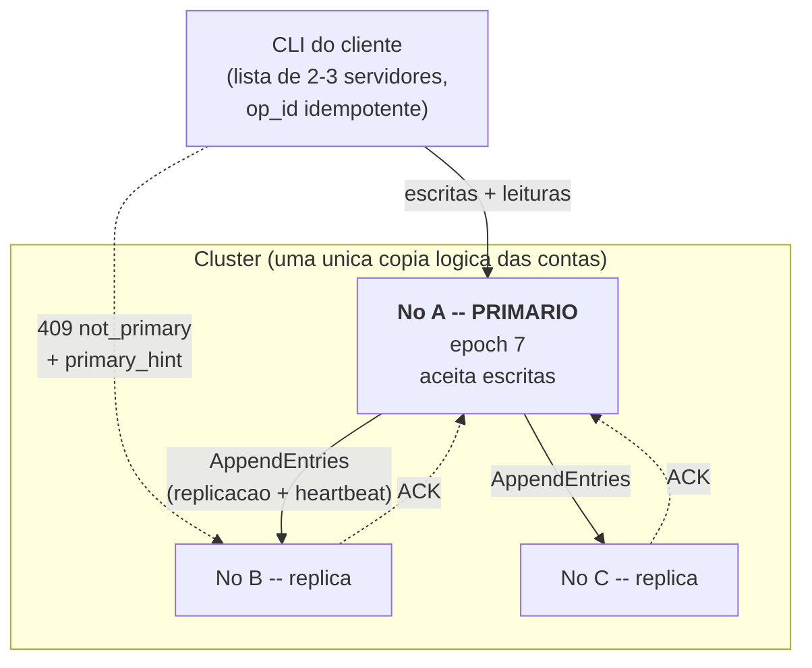
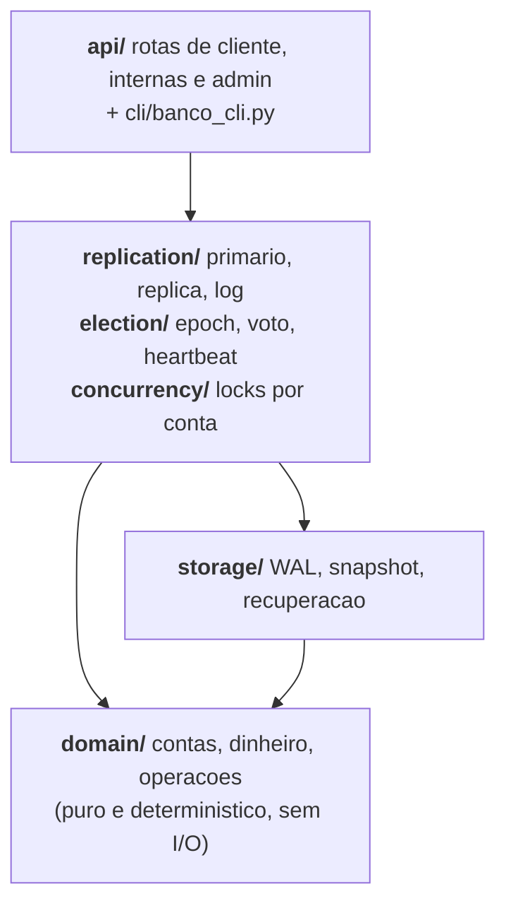
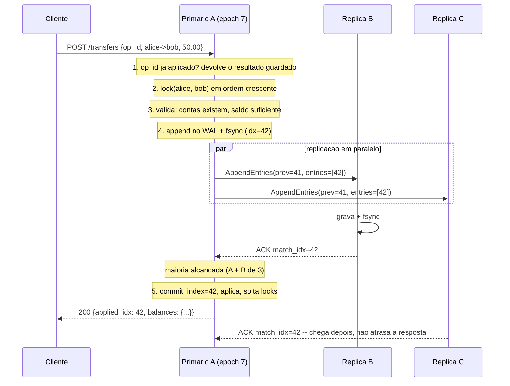
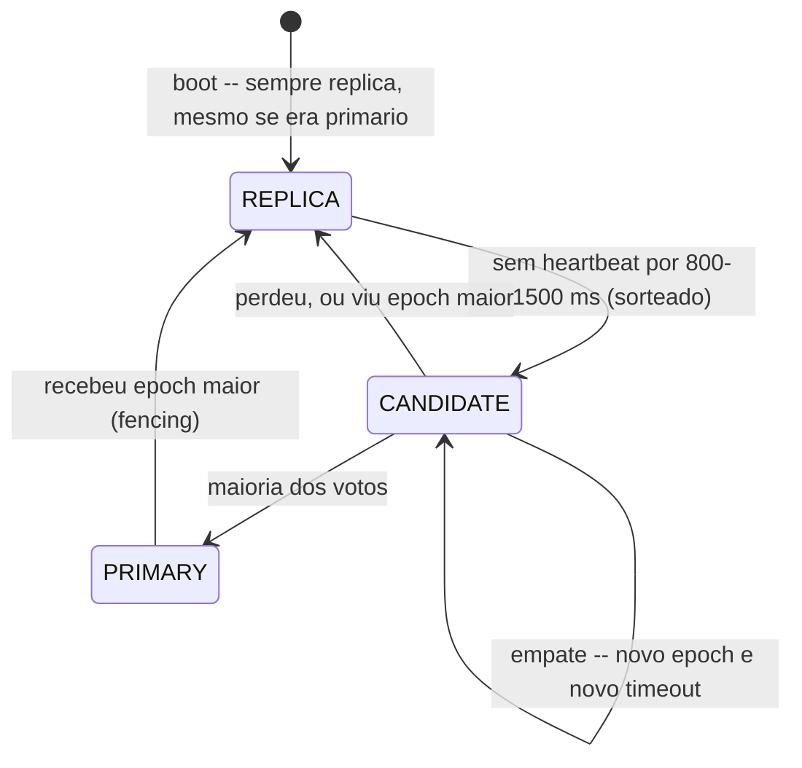

# Arquitetura -- Banco Distribuido Tolerante a Falhas

Universidade de Sao Paulo -- ICMC, campus Sao Carlos
Sistemas Distribuidos / Computacao Distribuida

| Numero USP | Nome | Componentes |
|---|---|---|
| 18404636 | Jefferson Daniel Flores Montenegro | `domain/`, `storage/` |
| 18514632 | Cristhian Jesus Maylle Briceno | `replication/`, `election/`, `concurrency/` |
| 17819748 | Paulo Sebastian Rojo Pinedo | `api/`, `cli/`, `observability/`, `faults.py` |

Documento de arquitetura da proposta em
[`proposta_banco_distribuido_simples.md`](proposta_banco_distribuido_simples.md).

---

## 1. O problema em uma frase

Um banco com 2 ou 3 servidores que mantem **uma unica copia logica** das contas e
que, mesmo com um servidor caindo no meio de uma transferencia, **nunca cria nem
destroi dinheiro**.

Toda decisao deste documento sai dessa frase. Quando disponibilidade e corretude
entram em conflito, a corretude ganha: e melhor recusar uma operacao do que
aceita-la e perder o dinheiro depois.

## 2. Desvios da proposta original e por que

A proposta pedia primario/replica com failover "o proximo da lista assume", sem
protocolo de consenso. Ao detalhar o desenho, apareceram tres regras que nao
podem valer ao mesmo tempo:

| Regra da proposta | Conflito |
|---|---|
| RF-10 / RNF-02: so confirmar apos replicar em outro servidor | Exige pelo menos 2 nos vivos |
| RNF-11: seguir atendendo com **um** servidor vivo | Com 1 no vivo nao ha em quem replicar |
| RF-09: promocao por posicao na lista, sem votacao | Um primario apenas **lento** continua se achando primario |

O terceiro e o mais grave. Se o primario A so esta lento (GC, rede congestionada,
disco travado) e B assume por timeout, passam a existir dois primarios. Um cliente
deposita em A, outro em B, e os dois logs divergem. Quando A volta, ou se perde uma
das operacoes ou se somam saldos incompativeis. E exatamente a falha que o projeto
existe para impedir.

**Decisao adotada:** promocao por **maioria de votos** e **fencing por epoch**.

- Cada mandato de primario tem um numero (`epoch`), que so cresce.
- Para virar primario e preciso o voto da maioria (2 de 3, ou 2 de 2).
- Como cada no vota uma unica vez por epoch e a maioria de um conjunto sempre
  intersecta outra maioria, **nao existem dois primarios no mesmo epoch**.
- Toda mensagem carrega o epoch. Um primario antigo que volta a si tem epoch
  menor, e rejeitado por todos e se rebaixa a replica sem confirmar nada.

**Consequencia sobre RNF-11:** com 3 servidores toleramos 1 queda com escritas
normais. Com 2 caidos, o unico no vivo passa a **somente leitura** -- responde
saldo, extrato e auditoria, e recusa escritas com 503. E o preco honesto de
RNF-02: nao ha como confirmar uma escrita duravel sozinho. RNF-11 e cumprido no
sentido de continuar respondendo; a parte de escrita fica documentada como
impossivel sob essa combinacao de requisitos.

O resultado e um Raft simplificado. Mantemos a parte que da a garantia (epoch,
voto por maioria, log matching, restricao de voto) e deixamos de fora o que nao e
necessario aqui: mudanca dinamica de membros, compactacao distribuida de log e
leituras por lease.

## 3. Visao geral



Cada no guarda a base inteira de contas -- nao ha divisao de clientes entre
servidores. Por isso **toda transferencia e local ao primario**: debito e credito
acontecem na mesma maquina, na mesma entrada de log. Nao existe commit em duas
fases neste projeto, e essa e a maior simplificacao do desenho.

### Camadas



O `domain/` nao conhece rede nem disco: a mesma sequencia de entradas produz o
mesmo estado em qualquer no. E essa pureza que faz replicacao por log e
recuperacao por replay funcionarem.

## 4. Modelo de dados

### Dinheiro

Todo valor e um **inteiro de centavos**. Nunca `float`. A soma dos saldos e uma
invariante verificada em teste (RNF-01); com ponto flutuante ela quebraria por
arredondamento e o bug seria confundido com um bug de replicacao.

### Entrada de log

E a unidade de replicacao, de durabilidade e do extrato. Uma linha JSON no WAL:

```json
{"idx": 42, "epoch": 7, "op_id": "3f1c...", "type": "transfer",
 "payload": {"from_account": "alice", "to_account": "bob", "amount_cents": 5000},
 "ts": 1756742400.12}
```

| Campo | Papel |
|---|---|
| `idx` | Indice global, 1-based e contiguo |
| `epoch` | Mandato do primario que a criou; base do log matching |
| `op_id` | UUID gerado **pelo cliente**, chave de idempotencia |
| `type` | `create_account`, `deposit`, `withdraw`, `transfer`, `noop` |

A transferencia e **uma unica entrada**, aplicada por uma unica funcao. Dai sai a
atomicidade de RF-05 de graca: nao ha estado intermediario em que o dinheiro saiu
de uma conta e ainda nao entrou na outra.

### Estado por no

| Onde | O que | Durabilidade |
|---|---|---|
| `data/<id>/wal.jsonl` | log de entradas | fsync antes de confirmar |
| `data/<id>/snapshot.json` | estado das contas em um `idx` | gravacao atomica (`tmp` + `replace`) |
| `data/<id>/state.json` | `epoch` e `voted_for` | fsync **antes** de usar em mensagem |
| memoria | saldos, extrato, dedupe por `op_id`, `commit_index` | reconstruido no boot |
| `data/<id>/server.log` | eventos JSONL | append |

`epoch` e `voted_for` sao persistidos antes de qualquer resposta porque um no que
vota, cai e esquece o voto poderia votar de novo no mesmo epoch -- e ai dois
candidatos teriam maioria.

## 5. Caminho de escrita



Pontos que nao podem ser trocados de ordem:

- **A validacao vem antes do log.** Nao se replica uma operacao que sera rejeitada.
- **O fsync vem antes do ACK**, no primario e na replica. Confirmar antes de estar
  duravel quebraria RNF-02 justamente no cenario que os testes exercitam.
- **A resposta ao cliente vem depois da maioria.** E isso, e so isso, que faz uma
  operacao confirmada sobreviver a queda imediata do primario.
- **Os locks so sao soltos depois de aplicar**, para que duas operacoes sobre a
  mesma conta nunca se sobreponham (RF-08).

### Sem quorum

Se a maioria nao responde dentro de `replication_timeout_ms`, a resposta e **503
`no_quorum`**. A entrada fica gravada porem **nao confirmada** -- pode ou nao vir
a existir. O cliente repete com o mesmo `op_id`; o proximo primario ou confirma
aquela entrada (se ela chegou a maioria) ou a trunca, e a deduplicacao garante que
o dinheiro se mova exatamente uma vez (RF-13).

Se a maioria dos nos esta inalcancavel ha mais de um timeout de eleicao, o
primario para de aceitar escritas de imediato (**`read_only`**, 503) em vez de
enfileirar operacoes que jamais serao confirmadas.

## 6. Concorrencia

Dois niveis:

1. **Entre nos** -- resolvido por construcao: so o primario escreve, e ele ordena
   as operacoes ao atribuir `idx`. Nao ha escrita concorrente entre servidores.
2. **Entre clientes no mesmo primario** -- resolvido com **locks por conta**.

Um lock global serializaria o banco inteiro e inviabilizaria RNF-04. Locks por
conta deixam transferencias sobre contas distintas correrem em paralelo. O risco
que isso cria e deadlock: `alice->bob` e `bob->alice` ao mesmo tempo, cada uma
segurando um lock e esperando o outro. A solucao e **ordem total**: os locks sao
sempre tomados em ordem crescente de id de conta (`Operation.touched_accounts()`
ja devolve a tupla ordenada), o que torna o ciclo impossivel.

Ha ainda um terceiro nivel, descoberto ao testar concorrencia de verdade: os locks por
conta dizem **quais** operacoes podem correr em paralelo, mas a aplicacao ao
`AccountStore` mexe em estruturas compartilhadas (`last_applied_idx`, `history`,
`applied`). Duas threads segurando contas diferentes aplicariam ao mesmo tempo e
corromperiam a ordem do log. Por isso existe um **`store_lock`** unico por no, que
serializa toda aplicacao -- e tambem toda leitura, senao uma consulta feita entre o
debito e o credito de uma transferencia veria dinheiro sumido (RF-07).

Leituras sao servidas pelo primario por padrao. Uma replica so aceita leitura com
`?stale=true` explicito, e a resposta traz `stale: true` e o `applied_idx`, para o
cliente saber o quanto o dado pode estar atrasado.

## 7. Falha e eleicao



### Deteccao

O heartbeat e um `AppendEntries` com `entries` vazio, a cada 150 ms. Reaproveitar
o RPC de replicacao garante que o heartbeat sempre carregue `epoch` e
`leader_commit` corretos, sem um segundo caminho de codigo para divergir.

O timeout de eleicao e **sorteado** em `[800, 1500] ms` a cada rodada. Sem a
aleatoriedade, as duas replicas viram candidatas ao mesmo tempo, dividem os votos
e a eleicao nao converge.

A semente do sorteio e **derivada por no** (`semente global + crc32(id do no)`), nunca a
global pura. Este detalhe custou caro: com a mesma semente nos tres, todos sorteiam o
**mesmo** timeout, viram candidatos juntos e dividem os votos indefinidamente -- o teste
de integracao chegou ao epoch 41 sem eleger ninguem. Derivar de forma estavel preserva
RNF-06: a mesma semente ainda reproduz a mesma execucao.

A relacao `heartbeat << timeout_min` precisa ser respeitada: se forem proximos,
uma lentidao momentanea derruba um primario saudavel e o cluster fica trocando de
lider sem parar. A validacao dessa restricao esta em `ClusterConfig.load`.

### Concessao de voto

O eleitor so vota se **todas** valerem:

1. o `epoch` do candidato e maior ou igual ao seu;
2. ele ainda nao votou neste epoch (ou ja votou neste mesmo candidato);
3. o log do candidato esta **pelo menos tao atualizado** quanto o seu -- compara
   `last_epoch` e, em empate, `last_idx`.

A condicao 3 e o que garante que nenhuma operacao confirmada se perca:

> Toda operacao confirmada esta gravada na maioria dos nos.
> Todo vencedor de eleicao precisa do voto da maioria.
> Duas maiorias sempre tem um no em comum.
> Esse no so votaria em quem tem log ao menos tao atualizado quanto o dele.
> Logo, **o novo primario tem todas as operacoes confirmadas**.

### Ao assumir

O novo primario envia um heartbeat imediato (para calar candidatos concorrentes) e
grava uma entrada **NOOP no seu proprio epoch** antes de aceitar escritas.

O motivo e sutil e vale registrar: uma entrada herdada do primario anterior, mesmo
presente na maioria, **nao pode ser confirmada por contagem de replicas**. Existe
um cenario classico em que ela e depois sobrescrita por outro lider, e uma operacao
ja dada como confirmada desapareceria. Confirmando primeiro o NOOP do epoch atual,
tudo que vem antes e confirmado por arraste, com seguranca.

### Reintegracao (RF-12)

Um no que reinicia carrega snapshot + replay do WAL e sobe como **replica**, com o
epoch lido do disco -- mesmo que fosse primario antes de cair. Quem manda e decidido
pela eleicao, nunca pelo que o no lembra de si mesmo.

O log matching entao acerta as contas: o primario envia `prev_idx`/`prev_epoch`, e
se nao baterem, retrocede ate achar o ponto comum e reenvia dali. As entradas
divergentes e **nao confirmadas** do no reiniciado sao truncadas. Nunca se trunca
abaixo do `commit_index`.

## 8. API

### Cliente

| Rota | Metodo | Requisito |
|---|---|---|
| `/accounts` | POST | RF-01 criar conta |
| `/accounts/{id}` | GET | RF-02 saldo |
| `/accounts/{id}/deposit` | POST | RF-03 |
| `/accounts/{id}/withdraw` | POST | RF-03 |
| `/transfers` | POST | RF-04, RF-05 |
| `/accounts/{id}/statement` | GET | RF-05 extrato |
| `/audit` | GET | RF-14 total em circulacao |

Toda escrita exige `op_id`. Uma replica recusa escritas com:

```json
{"error": "not_primary", "primary_hint": "http://127.0.0.1:8002"}
```

### Interna (entre servidores)

`POST /internal/append_entries`, `POST /internal/request_vote`,
`GET /internal/snapshot`, `GET /internal/status`.

Autenticacao e criptografia estao fora de escopo, como diz a proposta. O modelo de
falha e **parada (crash-stop) e lentidao**, nunca comportamento malicioso: um no
pode morrer ou atrasar, mas nao mente.

### Admin

`GET /admin/status` (painel da historia de usuario 11), `GET /admin/metrics`
(RF-15), `POST /admin/fault` (RF-16).

### Cliente de linha de comando

Guarda a lista dos 2 ou 3 servidores e tenta o ultimo primario conhecido. Com 409
segue o `primary_hint`; sem resposta, tenta o proximo. Durante uma eleicao todos
podem recusar por alguns segundos -- ai espera com backoff e repete.

O `op_id` e gerado **uma vez por operacao logica** e reutilizado em todas as
retentativas. Gerar um novo a cada tentativa transformaria uma transferencia
repetida em duas -- e o bug que o projeto inteiro existe para evitar.

## 9. Desempenho -- o que foi medido

RNF-04 pede 500 TPS e RNF-05 pede p99 abaixo de 200 ms no ambiente local.

Medido com `scripts/bench.py`, transferencias entre 200 contas, os **tres nos e o
gerador de carga na mesma maquina** (8 nucleos):

| Concorrencia | TPS | p50 | p99 |
|---|---|---|---|
| 1 | 41 | 24 ms | 33 ms |
| 4 | 148 | 25 ms | -- |
| 8 | 229 | 33 ms | **53 ms** |
| 16 | 270 | 55 ms | **91 ms** |
| 32 | 266 | 99 ms | 272 ms |
| 64 | 268 | 202 ms | -- |

**RNF-05 e cumprido** ate 16 clientes simultaneos (p99 de 91 ms). **RNF-04 nao e
cumprido**: a vazao satura em torno de **270 TPS**, e acrescentar concorrencia so
aumenta a fila -- a latencia cresce proporcionalmente enquanto o TPS fica parado.

### Por que 270, e o que **nao** e a causa

Quatro hipoteses foram testadas e descartadas:

| Hipotese | Teste | Resultado |
|---|---|---|
| O fsync domina | rodar com `--fsync always`, `batch` e `off` | 253 / 246 / 195 TPS -- **sem diferenca util**; `off` nao e mais rapido |
| Contencao dos locks por conta | 200 contas vs 2000 contas | 256 vs 274 TPS -- praticamente igual |
| Serializacao JSON e escrita do WAL | medicao isolada | 0,027 ms por entrada, teto de ~36.000/s |
| CPU saturada | `ps` durante a carga | primario a 30%, replicas a 18%, 8 nucleos ociosos |

O round-trip de replicacao medido dentro do primario e de **11 ms** (p50) e **nao cresce**
sob carga, enquanto o `submit` completo vai a 47-99 ms. Ou seja: o tempo esta em espera,
nao em trabalho. O gargalo e o modelo de uma thread por requisicao do uvicorn disputando
o GIL com as threads de replicacao -- o custo de coordenacao do CPython, nao a
durabilidade nem o desenho do protocolo.

Duas otimizacoes ja feitas, com efeito medido:

- **Replicacao em segundo plano** (uma thread por replica, em vez de um pool por
  operacao): agrupa N escritas concorrentes em um unico AppendEntries.
- **fsync fora do lock de ordenacao** (`append_buffered` + `wait_durable`): antes, 32
  threads enfileiravam 32 fsyncs; agora dividem um. Sozinha, essa mudanca levou de
  **136 para 256 TPS** e cortou a latencia pela metade.

Para chegar a 500 TPS seria preciso trocar o transporte entre nos por I/O assincrono
(evitando a disputa de threads pelo GIL) ou distribuir os nos em maquinas separadas.
Nenhuma das duas altera o protocolo, e por isso ficam registradas como trabalho futuro
em vez de mudanca de desenho.

O benchmark termina sempre com uma **auditoria**: se a soma dos saldos nao bate com a
inicial, o numero de TPS e irrelevante. Em todas as execucoes acima o total ficou
inalterado e identico nos tres nos.

## 10. Observabilidade

Log estruturado JSONL, uma linha por evento, com `node_id`, `role` e `epoch` em
**todos** os eventos -- sem esses tres campos, o log de um failover com tres
servidores e ilegivel.

```json
{"ts": 1756742400.12, "node_id": "B", "role": "candidate", "epoch": 8,
 "event": "election_started", "reason": "heartbeat_missed", "last_idx": 42}
```

Eventos que os testes correlacionam: `op_received`, `entry_appended`,
`replicate_sent`, `ack_received`, `commit`, `op_applied`, `heartbeat_missed`,
`election_started`, `vote_granted`, `vote_denied`, `became_primary`,
`stepped_down`, `log_truncated`, `recovered`, `fault_injected`.

## 11. Testes

| Nivel | O que cobre |
|---|---|
| Unitario (`tests/unit/`) | Invariante da soma, saldo nao negativo, replay do WAL, log matching, regra de confirmacao, restricao de voto, deadlock de locks |
| Integracao (`tests/integration/`) | Cluster de 3 processos reais: caminho feliz, SIGKILL no primario, concorrencia, reintegracao, split-brain |
| Falhas (`faults.py`) | Perda de replicacao, atraso, congelamento, recusa de voto -- tudo sorteado com semente fixa (RNF-06) |

O teste mais importante da entrega: carga de transferencias concorrentes, SIGKILL
no primario no meio, e ao final **a soma dos saldos tem de ser exatamente a
inicial** -- nem um centavo a mais ou a menos, conferida nos tres nos.

O `freeze` merece destaque: ele simula o primario **lento mas vivo**, que e o
unico cenario capaz de produzir split-brain e o motivo de existir o fencing por
epoch. Um teste que so mata processos nunca exercita esse caminho.

## 12. Como executar

```bash
pip install -e ".[dev]"

# sobe 3 servidores locais
./scripts/run_cluster.sh --clean

# quem e o primario?
python cli/banco_cli.py status

python cli/banco_cli.py criar-conta alice --saldo 100.00
python cli/banco_cli.py criar-conta bob --saldo 0.00
python cli/banco_cli.py transferir alice bob 25.00
python cli/banco_cli.py auditoria

# derruba o primario e confere que outro assume
./scripts/kill_primary.sh

python cli/banco_cli.py transferir alice bob 10.00   # continua funcionando
python cli/banco_cli.py auditoria                    # total inalterado

pytest -q                                            # 59 passam, 3 pendentes
python scripts/bench.py --ops 2000 --concurrency 16  # TPS e p99

./scripts/stop_cluster.sh                            # para tudo
```

Para rodar em **duas maquinas** na mesma rede, siga
[`teste_em_duas_maquinas.md`](teste_em_duas_maquinas.md).

## 13. Rastreabilidade dos requisitos

| Requisito | Onde e atendido |
|---|---|
| RF-01..RF-04 | `api/client_routes.py` + `domain/accounts.py` |
| RF-05 atomicidade | Transferencia e **uma** entrada de log; `AccountStore.apply` |
| RF-06 saldo nao negativo | `AccountStore.check` antes do append |
| RF-07 leitura consistente | Leitura no primario; replica so com `?stale=true` |
| RF-08 concorrencia | `concurrency/locks.py`, locks por conta em ordem total |
| RF-09 eleicao | `election/election.py`, maioria + restricao de log |
| RF-10 replicar antes de confirmar | `replication/primary.py`, resposta apos quorum |
| RF-11 seguir com um no fora | Maioria de 2 em 3; com 2 fora, somente leitura (secao 2) |
| RF-12 recuperacao e reintegracao | `storage/recovery.py` + log matching |
| RF-13 operacoes interrompidas | `op_id` idempotente + dedupe em `AccountStore.applied` |
| RF-14 auditoria | `GET /audit`, `AccountStore.total_cents` |
| RF-15 metricas | `GET /admin/metrics`, `observability/metrics.py` |
| RF-16 injecao de falhas | `POST /admin/fault`, `faults.py` |
| RF-17 CLI completo | `cli/banco_cli.py` |
| RF-18 configuracao do cluster | `config.py` + `config/cluster.json` |
| RNF-01 corretude | Auditoria em todos os testes de falha |
| RNF-02 durabilidade | fsync antes do ACK, quorum antes da resposta |
| RNF-03 disponibilidade | Timeout de eleicao 800-1500 ms |
| RNF-04 desempenho | **nao cumprido**: satura em ~270 TPS -- ver secao 9 |
| RNF-05 latencia | cumprido ate 16 clientes (p99 91 ms); ver secao 9 |
| RNF-06 reprodutibilidade | Semente unica em timeouts e injecao de falhas |
| RNF-07 observabilidade | `observability/logging.py`, JSONL |
| RNF-08 modularidade | Um dono por pacote (tabela do inicio) |
| RF-07 leitura consistente | `store_lock` tambem nas leituras; `test_leitura_ve_estado_consistente` |
| RNF-09 portabilidade | `pip install -e .` + `run_cluster.sh` |
| RNF-10 documentacao | Este documento + docstrings por modulo |
| RNF-11 disponibilidade | Leitura enquanto houver 1 no; escrita enquanto houver maioria |

## 14. Estado da implementacao

| Fase | Escopo | Situacao |
|---|---|---|
| 1 | Arquitetura, estrutura de modulos, interfaces | **concluida** |
| 2 | No unico: dominio, WAL, API de cliente, CLI | **concluida** |
| 3 | Replicacao com quorum, idempotencia | **concluida** |
| 4 | Heartbeat, eleicao, failover, reintegracao | **concluida** |
| 5 | Injecao de falhas, metricas, benchmark, suite completa | **parcial** |

O prototipo esta funcional: replica, elege, faz failover e se recupera. A suite tem
**59 testes passando e 3 marcados como pendentes** -- os de injecao de falhas
(`tests/integration/test_faults.py`) e o de split-brain com no congelado, que dependem
de exercitar `POST /admin/fault` ponta a ponta e ficam para a proxima rodada.

Diagramas UML em [`uml.md`](uml.md) (Mermaid, renderiza no GitHub) e em
[`uml/`](uml/) (PlantUML, para exportar). Guia de execucao em duas maquinas em
[`teste_em_duas_maquinas.md`](teste_em_duas_maquinas.md).
