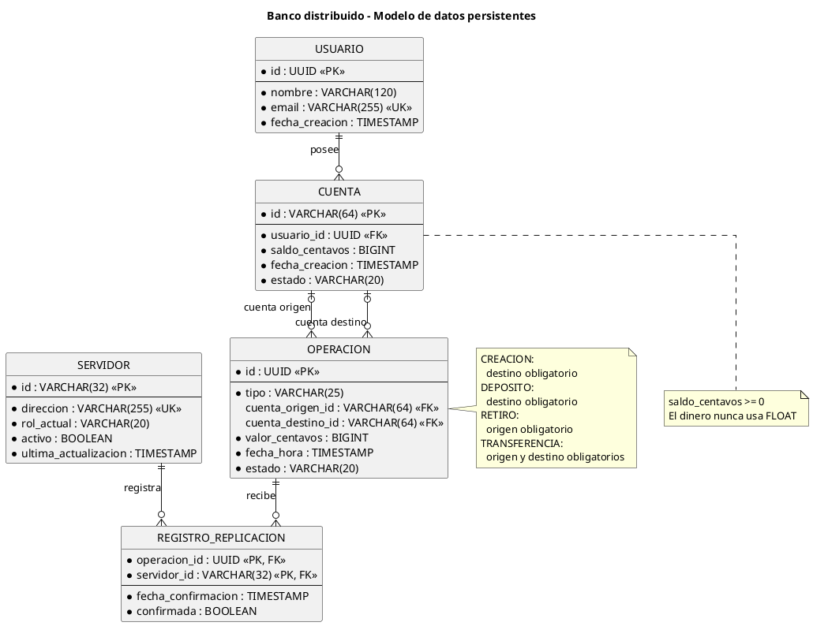
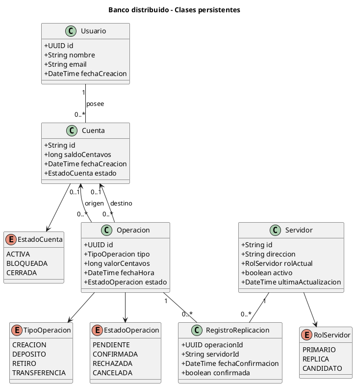
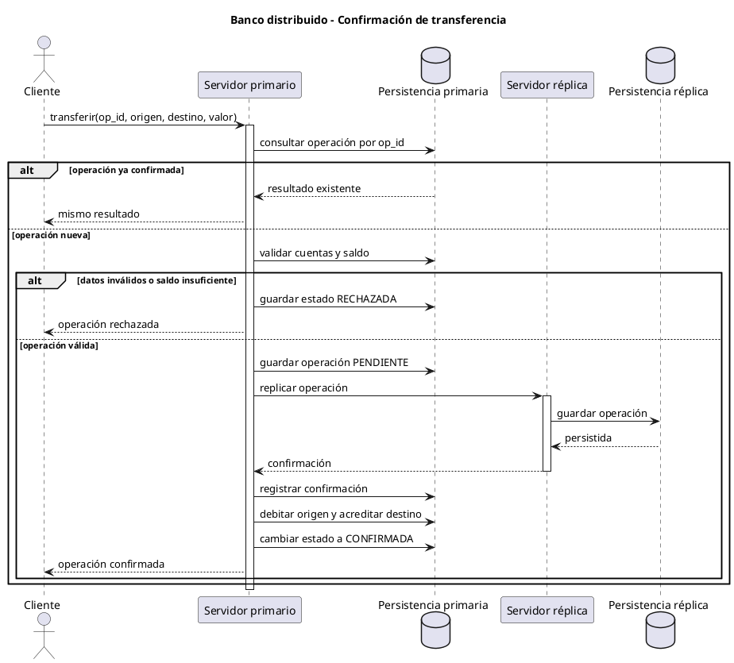
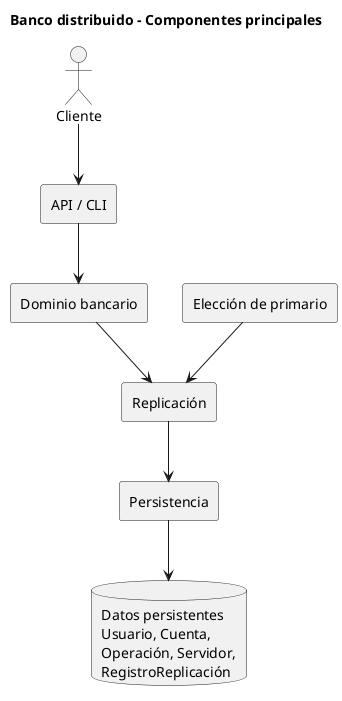

# Diagramas PlantUML

Este archivo contiene los diagramas del modelo de datos y del flujo principal en
formato PlantUML. Cada bloque puede copiarse en:

- [PlantUML Web Server](https://www.plantuml.com/plantuml/uml/);
- [PlantText](https://www.planttext.com/);
- Visual Studio Code o Cursor con una extensión compatible con PlantUML;
- Visual Paradigm mediante importación o reproducción del modelo.

Para renderizar localmente se necesita Java y PlantUML:

```bash
plantuml archivo.puml
```

## 1. Diagrama entidad-relación



## 2. Diagrama UML de clases persistentes



## 3. Diagrama de secuencia de una transferencia



## 4. Diagrama de componentes simplificado



## 5. Convenciones

| Símbolo | Significado |
|---|---|
| `PK` | Clave primaria |
| `FK` | Clave foránea |
| `UK` | Clave única |
| `1` / `||` | Exactamente uno |
| `0..1` / `o|` | Cero o uno |
| `0..*` / `o{` | Cero o muchos |

Los diagramas deben actualizarse junto con el modelo de datos en
[`entregables/05-modelo-de-datos/`](entregables/05-modelo-de-datos/) si cambia
alguna entidad, relación o regla de negocio.
