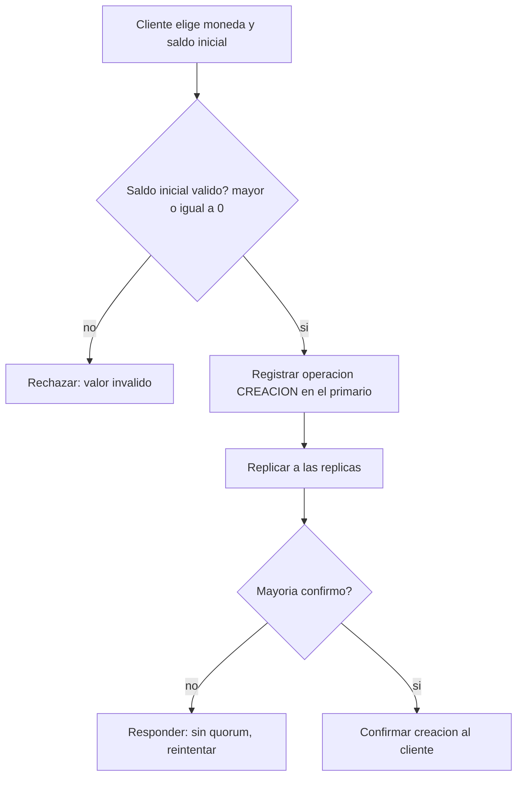

# CU-01 — Crear cuenta

| Campo | Valor |
|---|---|
| Actor principal | Cliente |
| Actores secundarios | — |
| Requisitos relacionados | RF-01, RF-19 |
| Casos de prueba relacionados | [`plan-de-pruebas.md`](../08-pruebas-y-despliegue/plan-de-pruebas.md#cu-01) |
| Pantalla | [`mockups/cu-01-crear-cuenta.html`](mockups/cu-01-crear-cuenta.html) |

## Descripción

El cliente crea una cuenta nueva, eligiendo su moneda (BRL, USD o PEN) y un
saldo inicial. La cuenta queda asociada al usuario que la crea.

## Precondición

El cliente tiene un usuario registrado en el sistema.

## Postcondición

Existe una cuenta nueva, con saldo inicial correcto, asociada al usuario, y
la operación de creación queda en el log de operaciones.

## Flujo principal

| # | Acción del actor | Respuesta del sistema |
|---|---|---|
| 1 | El cliente elige moneda y define el saldo inicial | Muestra el formulario con las tres monedas soportadas |
| 2 | El cliente confirma la creación | Valida que el saldo inicial no sea negativo y que la moneda sea una de las soportadas |
| 3 | — | El primario registra la operación `CREACION`, replica y espera mayoría |
| 4 | — | Confirma al cliente con el identificador de la nueva cuenta |

## Flujos alternativos

| # | Condición | Respuesta del sistema |
|---|---|---|
| 2a | El cliente no indica saldo inicial | Se asume saldo inicial 0 |

## Excepciones

| # | Condición | Respuesta del sistema |
|---|---|---|
| E1 | Saldo inicial negativo | Rechaza con error de valor inválido |
| E2 | No hay mayoría de nodos disponibles | No confirma la creación; responde que debe reintentarse |

## Reglas de negocio asociadas

Ver tabla completa en [`../01-requisitos/reglas-de-negocio.md`](../01-requisitos/reglas-de-negocio.md).

| ID regla | Descripción breve |
|---|---|
| RN-01 | El saldo de una cuenta nunca puede quedar negativo |
| RN-05 | Un usuario puede poseer varias cuentas, en la misma o distinta moneda |

## Diagrama de actividades

Muestra la validación del saldo inicial antes de registrar la cuenta.

## Notas de trazabilidad

Corresponde a la historia de usuario 1 del PDF de la propuesta, ampliada con
la elección de moneda (RF-19).
