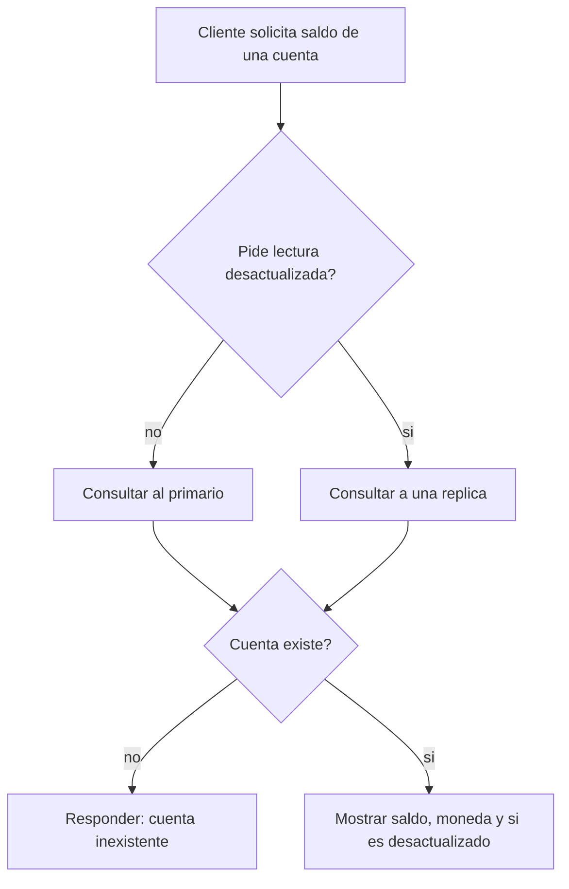

# CU-02 — Consultar saldo

| Campo | Valor |
|---|---|
| Actor principal | Cliente |
| Actores secundarios | — |
| Requisitos relacionados | RF-02, RF-07 |
| Casos de prueba relacionados | [`plan-de-pruebas.md`](../08-pruebas-y-despliegue/plan-de-pruebas.md#cu-02) |
| Pantalla | [`mockups/cu-02-consultar-saldo.html`](mockups/cu-02-consultar-saldo.html) |

## Descripción

El cliente consulta el saldo actual de una de sus cuentas. La lectura se
sirve del primario para garantizar que refleja el último estado confirmado
(RF-07); solo se acepta una lectura de una réplica si el cliente pide
explícitamente un dato posiblemente desactualizado.

## Precondición

La cuenta existe y pertenece (o es visible) al cliente.

## Postcondición

El cliente ve el saldo vigente al momento de la consulta.

## Flujo principal

| # | Acción del actor | Respuesta del sistema |
|---|---|---|
| 1 | El cliente abre la pantalla de inicio o elige una cuenta | El sistema consulta el saldo en el primario |
| 2 | — | Muestra el saldo y la moneda de la cuenta |

## Flujos alternativos

| # | Condición | Respuesta del sistema |
|---|---|---|
| 1a | El cliente pide explícitamente un dato "posiblemente desactualizado" | Se sirve desde una réplica, marcando la respuesta como desactualizada y con el índice aplicado |

## Excepciones

| # | Condición | Respuesta del sistema |
|---|---|---|
| E1 | La cuenta no existe | Responde con error de cuenta inexistente |
| E2 | Ningún nodo primario disponible | Responde con error de servicio no disponible |

## Reglas de negocio asociadas

| ID regla | Descripción breve |
|---|---|
| RN-07 | Una escritura solo se confirma tras la mayoría — por eso una lectura al primario nunca muestra dinero "a medias" de una transferencia en curso |

## Diagrama de actividades

Muestra la diferencia entre una lectura normal (al primario) y una lectura
explícitamente marcada como posiblemente desactualizada (a una réplica).

## Notas de trazabilidad

Corresponde a la historia de usuario 2 del PDF de la propuesta.
