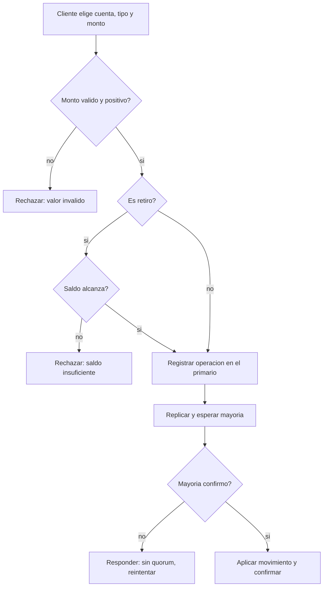

# CU-03 — Depositar y retirar

| Campo | Valor |
|---|---|
| Actor principal | Cliente |
| Actores secundarios | Nodo primario, nodos réplica |
| Requisitos relacionados | RF-03, RF-06, RF-10 |
| Casos de prueba relacionados | [`plan-de-pruebas.md`](../08-pruebas-y-despliegue/plan-de-pruebas.md#cu-03) |
| Pantalla | [`mockups/cu-03-depositar-y-retirar.html`](mockups/cu-03-depositar-y-retirar.html) |

## Descripción

El cliente deposita o retira un monto de una cuenta. Un retiro que dejaría el
saldo negativo se rechaza antes de tocar el log (RN-01).

## Precondición

La cuenta existe.

## Postcondición

El saldo de la cuenta refleja el depósito o retiro, y la operación queda
confirmada solo tras la mayoría.

## Flujo principal

| # | Acción del actor | Respuesta del sistema |
|---|---|---|
| 1 | El cliente elige la cuenta, el tipo de operación (depósito o retiro) y el monto | Muestra el saldo actual como referencia |
| 2 | El cliente confirma | Si es retiro, valida que el saldo alcance |
| 3 | — | El primario registra la operación, replica y espera mayoría |
| 4 | — | Aplica el movimiento y confirma al cliente con el nuevo saldo |

## Flujos alternativos

Ninguno adicional a las excepciones.

## Excepciones

| # | Condición | Respuesta del sistema |
|---|---|---|
| E1 | Retiro deja saldo negativo | Rechaza con "saldo insuficiente"; el saldo no cambia |
| E2 | Monto no positivo o mal formado | Rechaza con error de valor inválido |
| E3 | No hay mayoría de nodos disponibles | No confirma la operación; responde que debe reintentarse |

## Reglas de negocio asociadas

| ID regla | Descripción breve |
|---|---|
| RN-01 | El saldo de una cuenta nunca puede quedar negativo |
| RN-02 | El dinero nunca se crea ni se destruye en una operación dentro de la misma moneda |
| RN-07 | Una escritura solo se confirma tras la mayoría |

## Diagrama de actividades

Muestra el punto donde un retiro se rechaza si dejaría el saldo negativo,
antes de llegar a registrar nada en el log.

## Notas de trazabilidad

Corresponde a la historia de usuario 3 del PDF de la propuesta.
