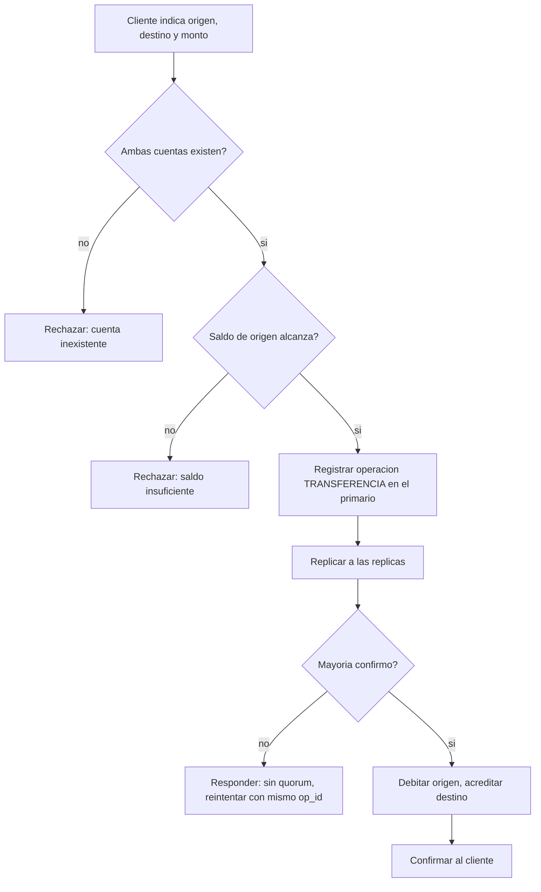
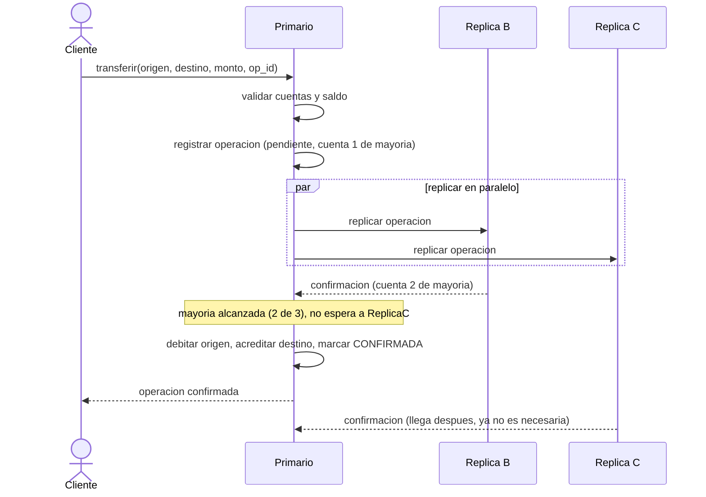

# CU-04 — Transferir entre cuentas de la misma moneda

| Campo | Valor |
|---|---|
| Actor principal | Cliente |
| Actores secundarios | Nodo primario, nodos réplica |
| Requisitos relacionados | RF-04, RF-05, RF-06, RF-07, RF-08, RF-10, RF-13 |
| Casos de prueba relacionados | [`plan-de-pruebas.md`](../08-pruebas-y-despliegue/plan-de-pruebas.md#cu-04) |
| Pantalla | [`mockups/cu-04-transferir-misma-moneda.html`](mockups/cu-04-transferir-misma-moneda.html) |

## Descripción

El cliente transfiere dinero a otra cuenta en su misma moneda, incluso si el
servidor primario cambia a mitad de camino (el cliente reintenta con el mismo
identificador de operación contra el nuevo primario).

## Precondición

Ambas cuentas existen y comparten moneda.

## Postcondición

El débito y el crédito se aplicaron juntos, o ninguno se aplicó; la suma de
saldos del sistema no cambió.

## Flujo principal

| # | Acción del actor | Respuesta del sistema |
|---|---|---|
| 1 | El cliente indica cuenta origen, cuenta destino y monto | Muestra los saldos actuales de referencia |
| 2 | El cliente confirma | Valida que ambas cuentas existan y que el saldo de origen alcance |
| 3 | — | El primario registra la operación `TRANSFERENCIA` |
| 4 | — | El primario replica la operación y espera confirmación de la mayoría |
| 5 | — | Debita origen, acredita destino, y confirma al cliente |

## Flujos alternativos

| # | Condición | Respuesta del sistema |
|---|---|---|
| 3a | El servidor contactado no es el primario | Responde con la dirección del primario probable; el cliente reintenta ahí con el mismo `op_id` |
| 4a | El primario cae después del paso 4 pero antes de responder | El cliente reintenta con el mismo `op_id` contra el nuevo primario; la deduplicación evita mover el dinero dos veces |

## Excepciones

| # | Condición | Respuesta del sistema |
|---|---|---|
| E1 | Saldo insuficiente | Rechaza; ninguna cuenta cambia |
| E2 | No hay mayoría de nodos disponibles | No confirma; responde `503` y el cliente reintenta |

## Reglas de negocio asociadas

| ID regla | Descripción breve |
|---|---|
| RN-02 | El dinero nunca se crea ni se destruye en una operación dentro de la misma moneda |
| RN-03 | Una transferencia es atómica: se aplican las dos puntas, o ninguna |
| RN-07 | Una escritura solo se confirma tras la mayoría |
| RN-08 | El `op_id` es único; una operación repetida no se vuelve a aplicar |

## Diagrama de actividades

Igual estructura de validación que CU-03, pero involucrando dos cuentas a la
vez y el paso de replicación por mayoría antes de aplicar el movimiento.

## Diagrama de secuencia (nivel de protocolo)

A diferencia del diagrama de CU-05, este muestra el detalle del conteo de
mayoría entre el primario y **dos** réplicas — es la versión de referencia
para el protocolo de confirmación que reutilizan el resto de los casos de uso
de escritura.

## Notas de trazabilidad

Corresponde a las historias de usuario 4 y 8 del PDF de la propuesta (la
segunda es la que exige seguir funcionando aunque el primario cambie a mitad
de camino — ver también CU-09).
