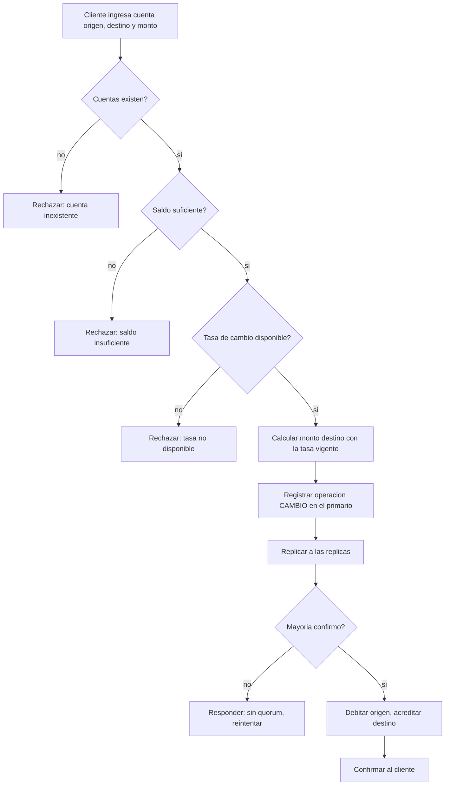
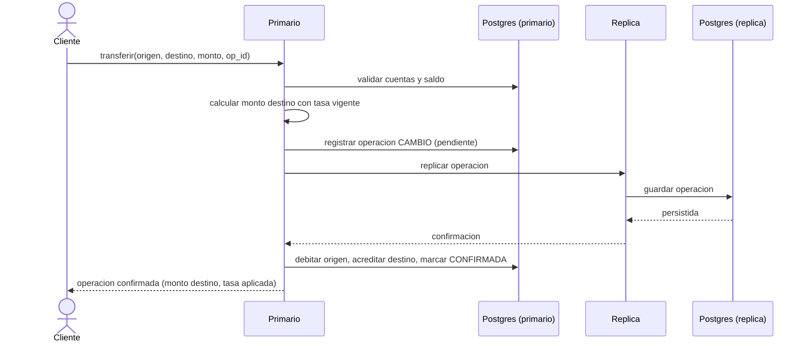

# CU-05 — Transferir entre cuentas de distinta moneda

| Campo | Valor |
|---|---|
| Actor principal | Cliente |
| Actores secundarios | Nodo primario, nodos réplica |
| Requisitos relacionados | RF-04, RF-05, RF-06, RF-10, RNF-01 |
| Casos de prueba relacionados | [`plan-de-pruebas.md`](../08-pruebas-y-despliegue/plan-de-pruebas.md#cu-05) |
| Pantalla | [`mockups/cu-05-transferir-con-conversion.html`](mockups/cu-05-transferir-con-conversion.html) |

## Descripción

El cliente transfiere dinero desde una cuenta en una moneda (por ejemplo, BRL)
hacia una cuenta destino en otra moneda (por ejemplo, USD). El sistema aplica
la tasa de cambio vigente en el momento de la operación y registra esa tasa
junto con la operación, para que quede fija en el historial aunque la tasa
cambie después.

## Precondición

- La cuenta origen y la cuenta destino existen y tienen monedas distintas.
- Existe una tasa de cambio configurada para el par de monedas involucrado.

## Postcondición

- El valor debitado de la cuenta origen y el valor acreditado en la cuenta
  destino corresponden a la tasa aplicada, registrada en la operación.
- La operación queda confirmada solo después de estar replicada en la mayoría
  de los nodos.

## Flujo principal

| # | Acción del actor | Respuesta del sistema |
|---|---|---|
| 1 | El cliente indica cuenta origen, cuenta destino y monto en la moneda de origen | Muestra los campos con los saldos y monedas actuales de ambas cuentas |
| 2 | — | Valida que ambas cuentas existen y que el saldo de origen alcanza |
| 3 | — | Busca la tasa de cambio vigente para el par de monedas |
| 4 | — | Calcula el monto equivalente en la moneda destino y lo muestra antes de confirmar |
| 5 | El cliente confirma la operación | El primario registra la operación (tipo `CAMBIO`) con: monto origen, moneda origen, tasa aplicada, monto destino, moneda destino |
| 6 | — | El primario replica la operación y espera confirmación de la mayoría |
| 7 | — | El primario debita la cuenta origen, acredita la cuenta destino, y confirma al cliente |

## Flujos alternativos

| # | Condición | Respuesta del sistema |
|---|---|---|
| 4a | No existe tasa configurada para el par de monedas | Rechaza la operación con "tasa no disponible"; ninguna cuenta cambia |
| 6a | El primario cae antes de confirmar al cliente | El cliente reintenta con el mismo identificador de operación; la deduplicación evita aplicar la conversión dos veces (igual que en CU-04) |

## Excepciones

| # | Condición | Respuesta del sistema |
|---|---|---|
| E1 | Saldo insuficiente en la cuenta origen | Rechaza; ninguna cuenta cambia |
| E2 | No hay mayoría de nodos disponibles | No confirma la operación; responde que debe reintentarse |

## Reglas de negocio asociadas

Referencian la tabla general en
[`../01-requisitos/reglas-de-negocio.md`](../01-requisitos/reglas-de-negocio.md):

| ID regla | Descripción breve |
|---|---|
| RN-01 | El saldo de una cuenta nunca puede quedar negativo |
| RN-02 | El dinero nunca se crea ni se destruye en una operación |
| RN-06 | Una conversión de moneda registra la tasa aplicada en el momento; no se recalcula después |
| RN-07 | Una escrita solo se confirma al cliente después de replicarse en la mayoría de los nodos |

## Diagrama de actividades

Muestra el camino de decisión de la operación: validación de cuentas, saldo y
tasa, antes de calcular el monto convertido y esperar la confirmación por
mayoría.

## Diagrama de secuencia

Muestra la interacción entre el cliente, el nodo primario y una réplica,
señalando el punto exacto en que la operación se confirma: después de recibir
la confirmación de la réplica, nunca antes.

## Notas de trazabilidad

Este caso de uso proviene de la historia de usuario original *"Como cliente,
quiero transferir dinero para outra conta..."* del PDF de la propuesta,
ampliada para cubrir el requisito de múltiples monedas agregado después. Ver
[`matriz-actor-caso-de-uso.md`](matriz-actor-caso-de-uso.md) y
[`../01-requisitos/requisitos-funcionales.md`](../01-requisitos/requisitos-funcionales.md).
