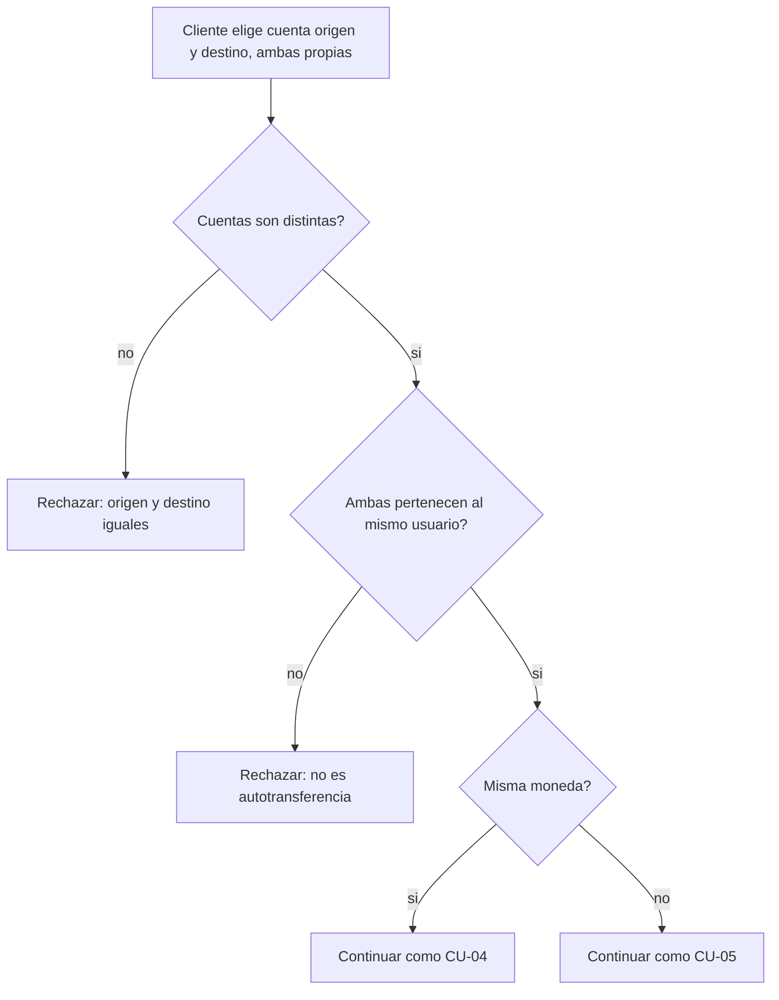

# CU-06 — Autotransferencia entre cuentas propias

| Campo | Valor |
|---|---|
| Actor principal | Cliente |
| Actores secundarios | Nodo primario, nodos réplica |
| Requisitos relacionados | RF-04, RF-05, RF-06, RF-08, RF-10, RF-13, RF-21 |
| Casos de prueba relacionados | [`plan-de-pruebas.md`](../08-pruebas-y-despliegue/plan-de-pruebas.md#cu-06) |
| Pantalla | [`mockups/cu-06-autotransferencia.html`](mockups/cu-06-autotransferencia.html) |

## Descripción

El cliente mueve dinero entre dos cuentas propias — por ejemplo, de su cuenta
en BRL a su propia cuenta en USD. Es un caso particular de CU-04 (misma
moneda) o CU-05 (con conversión), pero con la restricción adicional de que
ambas cuentas deben pertenecer al mismo usuario.

## Precondición

El cliente posee al menos dos cuentas propias, distintas entre sí.

## Postcondición

El dinero se movió entre las dos cuentas del mismo usuario, con o sin
conversión de moneda según corresponda.

## Flujo principal

| # | Acción del actor | Respuesta del sistema |
|---|---|---|
| 1 | El cliente elige, entre sus propias cuentas, la de origen y la de destino | Muestra solo las cuentas del propio usuario en ambos selectores |
| 2 | El cliente indica el monto y confirma | Valida que las dos cuentas sean distintas y pertenezcan al mismo usuario |
| 3 | — | Sigue el mismo flujo de CU-04 (misma moneda) o CU-05 (con conversión), según corresponda |

## Flujos alternativos

| # | Condición | Respuesta del sistema |
|---|---|---|
| 2a | Las monedas de origen y destino difieren | Se aplica el flujo de conversión de CU-05 |

## Excepciones

| # | Condición | Respuesta del sistema |
|---|---|---|
| E1 | Origen y destino son la misma cuenta | Rechaza: una autotransferencia exige cuentas distintas |
| E2 | La cuenta destino no pertenece al mismo usuario | Rechaza: no es una autotransferencia (usar CU-04/CU-05) |

## Reglas de negocio asociadas

| ID regla | Descripción breve |
|---|---|
| RN-05 | Un usuario puede poseer varias cuentas |
| RN-11 | Una autotransferencia exige que ambas cuentas existan y sean distintas entre sí |

## Diagrama de actividades

Se centra en la validación específica de este caso de uso (mismo dueño,
cuentas distintas); el resto del flujo delega en CU-04/CU-05.

## Notas de trazabilidad

No proviene de una historia de usuario del PDF original — se agregó junto con
RF-21 al ampliar el alcance a multi-cuenta por usuario.
