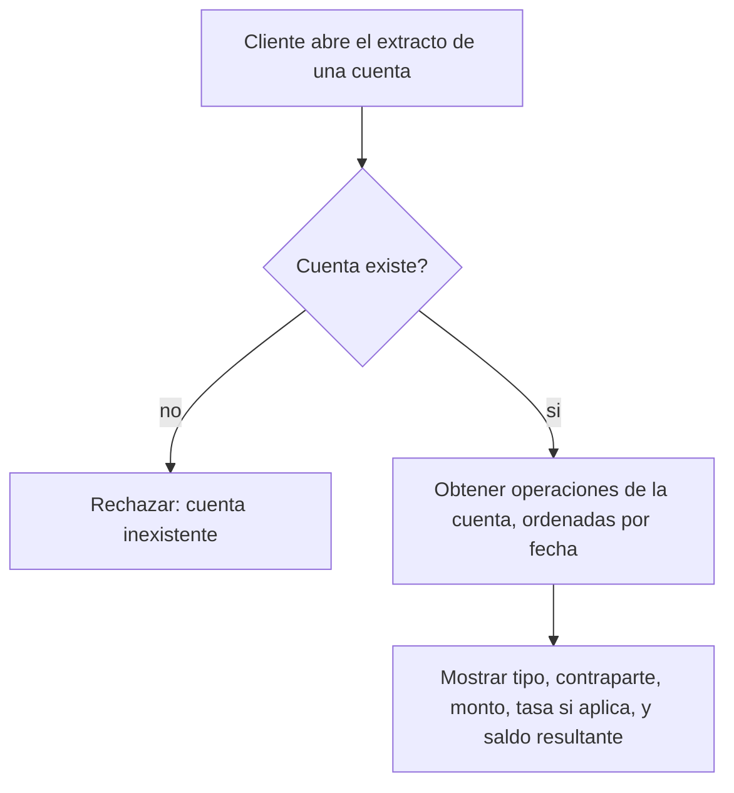

# CU-07 — Consultar extracto

| Campo | Valor |
|---|---|
| Actor principal | Cliente |
| Actores secundarios | — |
| Requisitos relacionados | RF-22 (ver nota) |
| Casos de prueba relacionados | [`plan-de-pruebas.md`](../08-pruebas-y-despliegue/plan-de-pruebas.md#cu-07) |
| Pantalla | [`mockups/cu-07-consultar-extracto.html`](mockups/cu-07-consultar-extracto.html) |

## Descripción

El cliente consulta el historial de operaciones de una cuenta: depósitos,
retiros, transferencias enviadas y recibidas, y conversiones de moneda, en
orden cronológico con el saldo resultante después de cada una.

## Precondición

La cuenta existe y pertenece al cliente.

## Postcondición

El cliente ve la lista de operaciones de la cuenta.

## Flujo principal

| # | Acción del actor | Respuesta del sistema |
|---|---|---|
| 1 | El cliente elige una cuenta y abre su extracto | Consulta las operaciones registradas para esa cuenta, en el primario |
| 2 | — | Muestra cada operación con tipo, contraparte (si aplica), monto y saldo resultante |

## Flujos alternativos

| # | Condición | Respuesta del sistema |
|---|---|---|
| 2a | La operación es una conversión de moneda | Se muestra también la tasa aplicada, junto al monto |

## Excepciones

| # | Condición | Respuesta del sistema |
|---|---|---|
| E1 | La cuenta no existe | Responde con error de cuenta inexistente |

## Reglas de negocio asociadas

| ID regla | Descripción breve |
|---|---|
| RN-06 | La tasa aplicada en una conversión queda fija en el registro de esa operación |

## Diagrama de actividades

## Nota sobre el requisito

El PDF de la propuesta lista el extracto como funcionalidad (F-05 en
`docs/proposta.md`) pero no le asigna un RF propio en la tabla de requisitos
funcionales — es un vacío del documento original, no un olvido de este caso
de uso. Se agregó **RF-22** en
[`../01-requisitos/requisitos-funcionales.md`](../01-requisitos/requisitos-funcionales.md)
para cerrarlo.

## Notas de trazabilidad

Corresponde a la historia de usuario 5 del PDF de la propuesta.
