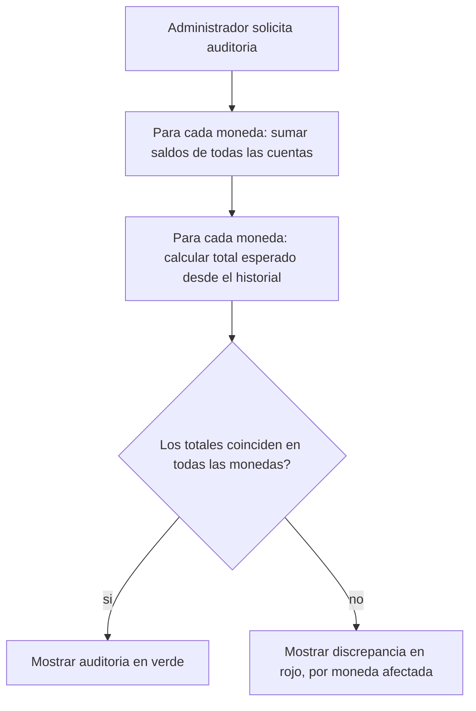

# CU-08 — Auditar el total de dinero en circulación

| Campo | Valor |
|---|---|
| Actor principal | Administrador |
| Actores secundarios | — |
| Requisitos relacionados | RF-14 |
| Casos de prueba relacionados | [`plan-de-pruebas.md`](../08-pruebas-y-despliegue/plan-de-pruebas.md#cu-08) |
| Pantalla | [`mockups/cu-08-auditar-total.html`](mockups/cu-08-auditar-total.html) |

## Descripción

El administrador pide una auditoría del sistema: la suma de todos los saldos,
por moneda, comparada con el total esperado según el historial de
operaciones. Con monedas múltiples, la auditoría se hace **por moneda** — no
existe un solo total global (ver RN-06 y la nota de `docs/adr/ADR-0001-...md`).

## Precondición

Ninguna — cualquier administrador puede auditar en cualquier momento.

## Postcondición

El administrador ve, por cada moneda, el total por saldos y el total esperado
por el log, y si coinciden.

## Flujo principal

| # | Acción del actor | Respuesta del sistema |
|---|---|---|
| 1 | El administrador abre la pantalla de auditoría | Calcula, para cada moneda, la suma de saldos de todas las cuentas |
| 2 | — | Calcula, para cada moneda, el total esperado deducido del historial de operaciones |
| 3 | — | Muestra ambos totales por moneda, y si coinciden |

## Flujos alternativos

Ninguno.

## Excepciones

| # | Condición | Respuesta del sistema |
|---|---|---|
| E1 | Los dos totales de una moneda no coinciden | Se muestra en rojo como discrepancia — esto no debería ocurrir nunca en producción; es la señal de un error grave |

## Reglas de negocio asociadas

| ID regla | Descripción breve |
|---|---|
| RN-02 | El dinero nunca se crea ni se destruye en una operación dentro de la misma moneda |
| RN-06 | La conversión de moneda registra la tasa aplicada — es lo que permite verificar que el valor no cambió al convertir |

## Diagrama de actividades

## Notas de trazabilidad

Corresponde a la historia de usuario 6 del PDF de la propuesta, ajustada para
auditar por moneda en vez de un solo total (ver `docs/adr/ADR-0001-...md`).
