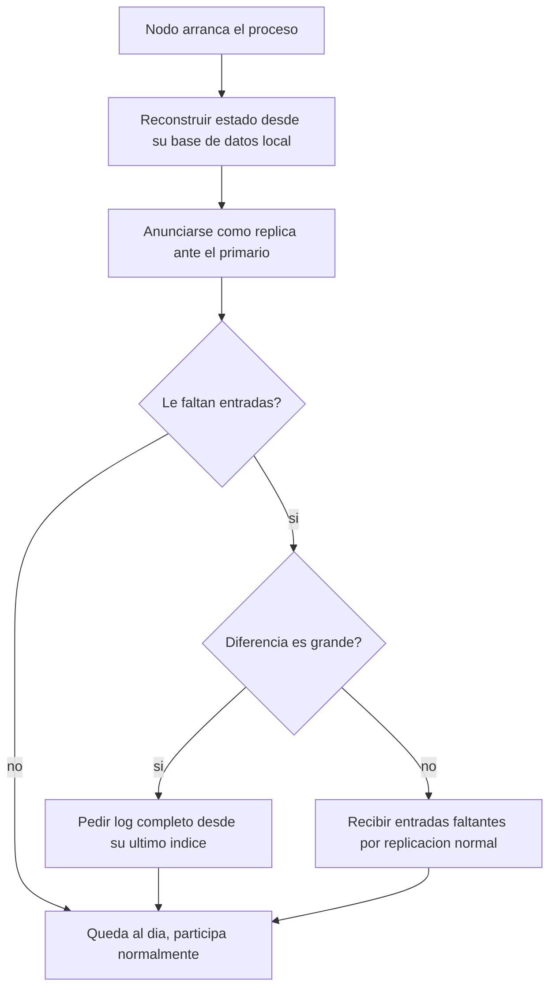

# CU-10 — Recuperar estado al reiniciar

| Campo | Valor |
|---|---|
| Actor principal | Administrador (dispara el reinicio) / Nodo (ejecuta la recuperación) |
| Actores secundarios | Nodo primario |
| Requisitos relacionados | RF-12 |
| Casos de prueba relacionados | [`plan-de-pruebas.md`](../08-pruebas-y-despliegue/plan-de-pruebas.md#cu-10) |
| Pantalla | No aplica — es un comportamiento automático al arrancar el proceso, no una acción de usuario (ver [`acciones-del-sistema.md`](acciones-del-sistema.md)) |

## Descripción

Un servidor que se reinicia (tras una caída o un mantenimiento) recupera su
estado leyendo su propia base de datos, y luego se sincroniza con el primario
para ponerse al día con lo que se perdió mientras estaba caído.

## Precondición

El nodo tiene su base de datos local intacta (no se perdió el disco).

## Postcondición

El nodo vuelve a participar del clúster como réplica, con el mismo estado que
tendría si nunca hubiera caído.

## Flujo principal

| # | Acción del actor | Respuesta del sistema |
|---|---|---|
| 1 | El nodo arranca su proceso | Reconstruye su estado en memoria a partir de su propia base de datos |
| 2 | — | Se anuncia como réplica ante el primario (nunca arranca asumiéndose primario) |
| 3 | — | Pide al primario el log a partir de su último índice conocido |
| 4 | — | Aplica las entradas que le faltan y queda al día |

## Flujos alternativos

| # | Condición | Respuesta del sistema |
|---|---|---|
| 3a | El nodo estuvo caído mucho tiempo y le faltan muchas entradas | Usa la sincronización masiva (`GET /interno/log?desde=N`) en vez de pedir de a una |

## Excepciones

| # | Condición | Respuesta del sistema |
|---|---|---|
| E1 | El nodo no encuentra ningún primario disponible | Queda a la espera, reintentando periódicamente |
| E2 | El log del nodo divergió del primario | El nodo trunca sus entradas no confirmadas y acepta las del primario, nunca por debajo de lo ya confirmado |

## Reglas de negocio asociadas

| ID regla | Descripción breve |
|---|---|
| RN-09 | Una confirmación de réplica se registra una sola vez por servidor y por operación |

## Diagrama de actividades

## Notas de trazabilidad

Corresponde a la historia de usuario 9 del PDF de la propuesta.
