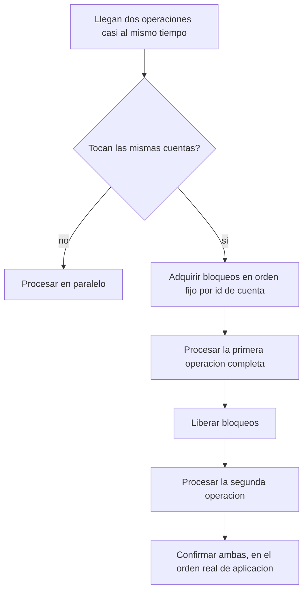

# CU-11 — Operaciones concurrentes

| Campo | Valor |
|---|---|
| Actor principal | Cliente (varios, al mismo tiempo) |
| Actores secundarios | Nodo primario |
| Requisitos relacionados | RF-07, RF-08 |
| Casos de prueba relacionados | [`plan-de-pruebas.md`](../08-pruebas-y-despliegue/plan-de-pruebas.md#cu-11) |
| Pantalla | No aplica — es una propiedad del sistema bajo carga, no una acción de un único usuario (ver [`acciones-del-sistema.md`](acciones-del-sistema.md)) |

## Descripción

Cuando dos o más clientes operan sobre la misma cuenta al mismo tiempo (por
ejemplo, dos retiros simultáneos), el sistema las serializa sin corromper el
saldo y sin perder ninguna operación. Cuando operan sobre cuentas distintas,
corren en paralelo sin bloquearse entre sí.

## Precondición

Existen al menos dos operaciones enviadas al primario en una ventana de
tiempo solapada.

## Postcondición

El saldo final es el mismo que si las operaciones se hubieran aplicado una
por una, en algún orden — nunca un resultado que mezcle partes de ambas
operaciones.

## Flujo principal

| # | Acción del actor | Respuesta del sistema |
|---|---|---|
| 1 | Dos clientes envían operaciones sobre la misma cuenta casi al mismo tiempo | El primario toma el bloqueo de esa cuenta en orden de llegada |
| 2 | — | Procesa la primera operación por completo (validar, registrar, replicar, aplicar) antes de tomar el bloqueo para la segunda |
| 3 | — | Confirma ambas operaciones, en el orden en que efectivamente se aplicaron |

## Flujos alternativos

| # | Condición | Respuesta del sistema |
|---|---|---|
| 1a | Las operaciones son sobre cuentas distintas | Se procesan en paralelo, sin esperarse entre sí |
| 1b | Una transferencia involucra dos cuentas (ej. `alice→bob` y `bob→alice` a la vez) | Los bloqueos se adquieren siempre en el mismo orden (por id de cuenta) para evitar interbloqueo |

## Excepciones

| # | Condición | Respuesta del sistema |
|---|---|---|
| E1 | La segunda operación, procesada después, dejaría el saldo negativo | Se rechaza esa segunda operación; la primera ya aplicada no se revierte |

## Reglas de negocio asociadas

| ID regla | Descripción breve |
|---|---|
| RN-01 | El saldo de una cuenta nunca puede quedar negativo |
| RN-02 | El dinero nunca se crea ni se destruye en una operación |

## Diagrama de actividades

Muestra por qué el orden de adquisición de bloqueos importa: sin un orden
fijo, dos transferencias cruzadas (`alice→bob` y `bob→alice` a la vez) podrían
interbloquearse.

## Cómo se valida

Con pruebas de concurrencia (N hilos retirando de la misma cuenta, dos
transferencias cruzadas en paralelo con límite de tiempo), no con una
interfaz — ver
[`../08-pruebas-y-despliegue/plan-de-pruebas.md`](../08-pruebas-y-despliegue/plan-de-pruebas.md).

## Notas de trazabilidad

Corresponde a la historia de usuario 7 del PDF de la propuesta.
