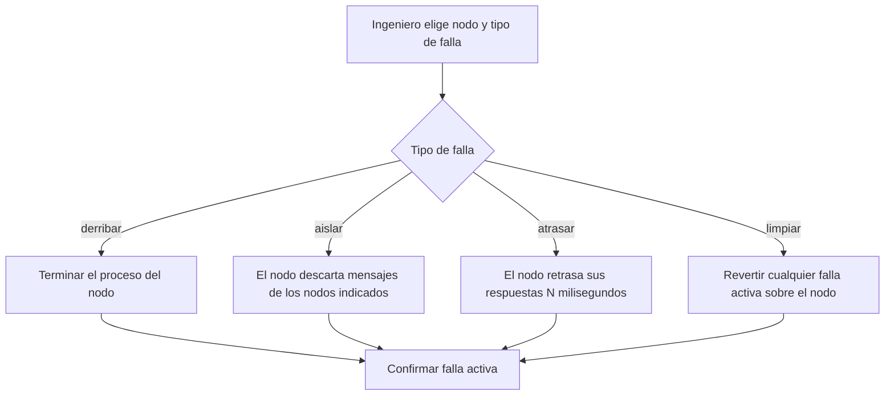

# CU-12 — Provocar falla para pruebas

| Campo | Valor |
|---|---|
| Actor principal | Ingeniero de pruebas |
| Actores secundarios | Nodo objetivo |
| Requisitos relacionados | RF-16 |
| Casos de prueba relacionados | [`plan-de-pruebas.md`](../08-pruebas-y-despliegue/plan-de-pruebas.md#cu-12) |
| Pantalla | [`mockups/cu-12-provocar-falla-para-pruebas.html`](mockups/cu-12-provocar-falla-para-pruebas.html) |

## Descripción

El ingeniero de pruebas provoca una falla controlada y reproducible sobre uno
o más nodos — derribar el proceso, aislarlo de la red, o retrasar sus
respuestas — para validar que la tolerancia a fallas funciona, sin depender
de matar procesos a mano.

## Precondición

El clúster está activo y accesible desde el panel de administración.

## Postcondición

El nodo objetivo queda en el estado de falla indicado, hasta que se limpie
explícitamente.

## Flujo principal

| # | Acción del actor | Respuesta del sistema |
|---|---|---|
| 1 | El ingeniero elige el nodo objetivo y el tipo de falla (derribar, aislar, retrasar) | Muestra los nodos activos del clúster |
| 2 | El ingeniero confirma la acción | El sistema aplica la falla sobre el nodo objetivo |
| 3 | — | Confirma que la falla quedó activa |

## Flujos alternativos

| # | Condición | Respuesta del sistema |
|---|---|---|
| 1a | El ingeniero elige "aislar" | Debe indicar de cuáles otros nodos se aísla (no necesariamente de todos) |
| 3a | El ingeniero pide "limpiar" | Se revierte cualquier falla activa sobre ese nodo |

## Excepciones

| # | Condición | Respuesta del sistema |
|---|---|---|
| E1 | El nodo objetivo ya está caído | Responde que no hay nada que aplicar |

## Reglas de negocio asociadas

Este caso de uso no introduce reglas de negocio propias — es un mecanismo de
prueba sobre RN-07 a RN-10 (ver
[`../01-requisitos/reglas-de-negocio.md`](../01-requisitos/reglas-de-negocio.md)).

## Diagrama de actividades

## Notas de trazabilidad

Corresponde a la historia de usuario 10 del PDF de la propuesta.
