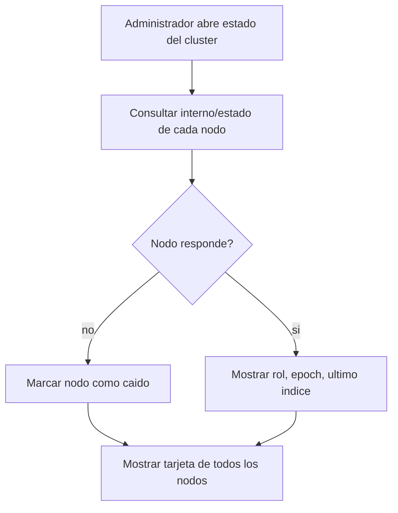

# CU-13 — Ver estado del clúster

| Campo | Valor |
|---|---|
| Actor principal | Administrador |
| Actores secundarios | Todos los nodos |
| Requisitos relacionados | RF-09, RF-11 |
| Casos de prueba relacionados | [`plan-de-pruebas.md`](../08-pruebas-y-despliegue/plan-de-pruebas.md#cu-13) |
| Pantalla | [`mockups/cu-13-ver-estado-del-cluster.html`](mockups/cu-13-ver-estado-del-cluster.html) |

## Descripción

El administrador ve, de un vistazo, cuáles nodos están activos, cuál es el
primario actual, el `epoch` vigente, y qué tan al día está cada réplica —
sin poder operar cuentas desde esta pantalla (es solo de monitoreo).

## Precondición

Al menos un nodo del clúster responde.

## Postcondición

El administrador ve el estado actual de cada nodo.

## Flujo principal

| # | Acción del actor | Respuesta del sistema |
|---|---|---|
| 1 | El administrador abre la pantalla de estado del clúster | Consulta `/interno/estado` de cada nodo conocido |
| 2 | — | Muestra, por nodo: rol (primario/réplica), `epoch`, último índice aplicado, y si está activo |

## Flujos alternativos

| # | Condición | Respuesta del sistema |
|---|---|---|
| 2a | Un nodo no responde | Se marca como caído, sin bloquear la vista de los demás |

## Excepciones

| # | Condición | Respuesta del sistema |
|---|---|---|
| E1 | Ningún nodo responde | Muestra un aviso de "sin contacto con el clúster" |

## Reglas de negocio asociadas

Este caso de uso es de monitoreo puro; no aplica ninguna regla de negocio de
`reglas-de-negocio.md` directamente — refleja el estado que esas reglas
protegen.

## Diagrama de actividades

## Notas de trazabilidad

Corresponde a la historia de usuario 11 del PDF de la propuesta.
