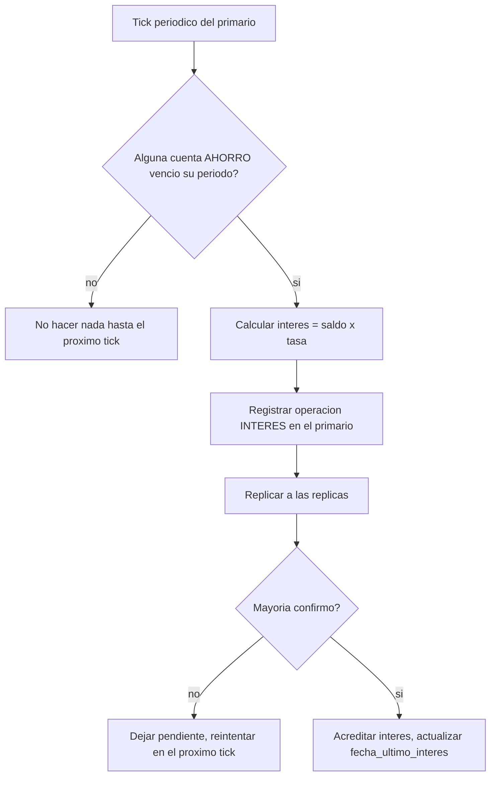

# CU-14 — Abrir cuenta de ahorro con interés periódico

| Campo | Valor |
|---|---|
| Actor principal | Cliente |
| Actores secundarios | Nodo primario, nodos réplica |
| Requisitos relacionados | RF-01, RF-19, RF-23 |
| Casos de prueba relacionados | [`plan-de-pruebas.md`](../08-pruebas-y-despliegue/plan-de-pruebas.md#cu-14) |
| Pantalla | [`mockups/cu-14-abrir-cuenta-ahorro.html`](mockups/cu-14-abrir-cuenta-ahorro.html) |

## Descripción

El cliente abre una cuenta de ahorro: además de moneda y saldo inicial (igual
que CU-01), define una tasa de interés periódica. El sistema acredita ese
interés automáticamente cada período, como una operación `INTERES` más en el
extracto — nunca reescribiendo el saldo directamente (RN-13).

## Precondición

El cliente tiene un usuario registrado en el sistema.

## Postcondición

Existe una cuenta nueva con `tipo_producto = AHORRO`, `tasa_interes` fijada y
`fecha_ultimo_interes` en el momento de apertura.

## Flujo principal

| # | Acción del actor | Respuesta del sistema |
|---|---|---|
| 1 | El cliente elige moneda, saldo inicial y confirma que quiere una cuenta de ahorro | Muestra la tasa de interés periódica vigente para ese producto |
| 2 | El cliente confirma la apertura | Valida saldo inicial y moneda (igual que CU-01) |
| 3 | — | El primario registra la operación `CREACION` con `tipo_producto = AHORRO` y `tasa_interes`, replica y espera mayoría |
| 4 | — | Confirma al cliente con el identificador de la nueva cuenta |

## Flujos alternativos

| # | Condición | Respuesta del sistema |
|---|---|---|
| 4a | Llega el período de interés de una cuenta `AHORRO` (evaluado en el *tick* periódico del primario, el mismo que dispara el `heartbeat` de RF-09/RF-10) | El primario calcula el interés sobre `saldo_centavos` con `tasa_interes`, registra una operación `INTERES` (destino = la propia cuenta), replica y espera mayoría antes de acreditar; actualiza `fecha_ultimo_interes` |

## Excepciones

| # | Condición | Respuesta del sistema |
|---|---|---|
| E1 | Saldo inicial negativo | Rechaza con error de valor inválido (igual que CU-01) |
| E2 | No hay mayoría de nodos disponibles | No confirma la creación ni el interés pendiente; responde que debe reintentarse |

## Reglas de negocio asociadas

| ID regla | Descripción breve |
|---|---|
| RN-01 | El saldo de una cuenta nunca puede quedar negativo |
| RN-13 | El interés se acredita como una operación `INTERES`, nunca se escribe directamente sobre `saldo_centavos` |

## Diagrama de actividades

Igual que CU-01 para la apertura; el pago de interés es un flujo separado,
disparado por tiempo en vez de por el cliente.

## Notas de trazabilidad

Caso de uso nuevo, agregado por la ampliación de productos financieros
pedida por el profesor (ver [`../01-requisitos/modelo-de-negocio.md`](../01-requisitos/modelo-de-negocio.md)) —
no proviene del PDF de la propuesta original.
