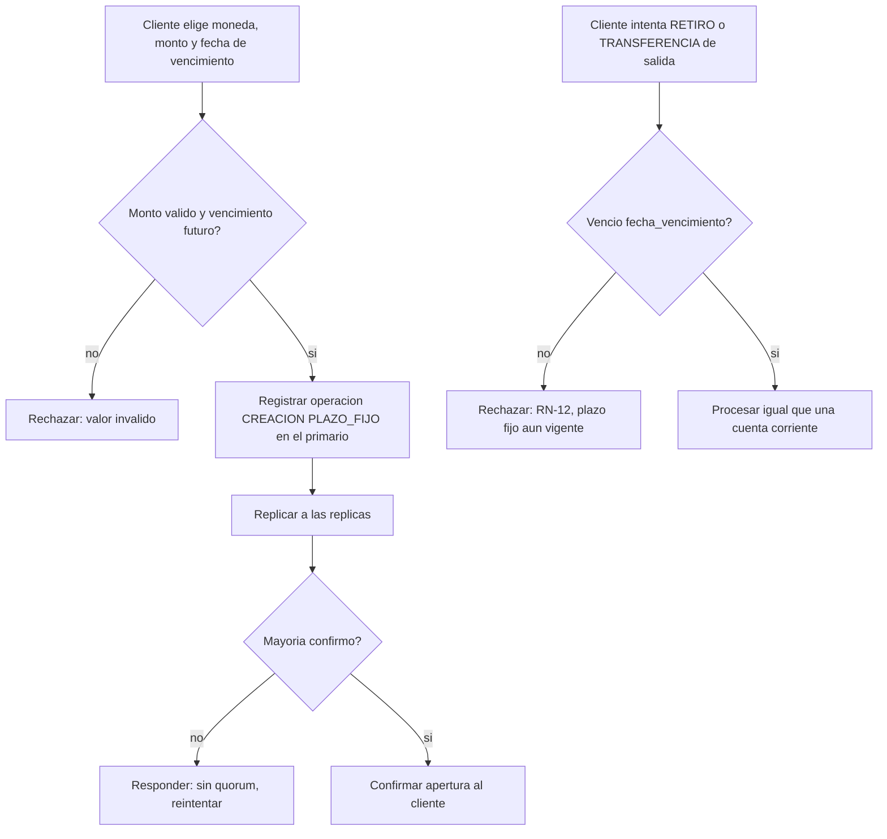

# CU-15 — Abrir depósito a plazo fijo

| Campo | Valor |
|---|---|
| Actor principal | Cliente |
| Actores secundarios | Nodo primario, nodos réplica |
| Requisitos relacionados | RF-01, RF-19, RF-24 |
| Casos de prueba relacionados | [`plan-de-pruebas.md`](../08-pruebas-y-despliegue/plan-de-pruebas.md#cu-15) |
| Pantalla | [`mockups/cu-15-abrir-deposito-plazo-fijo.html`](mockups/cu-15-abrir-deposito-plazo-fijo.html) |

## Descripción

El cliente abre un depósito a plazo fijo: define moneda, monto, tasa y una
fecha de vencimiento. Antes de esa fecha la cuenta no admite retiros ni ser
origen de una transferencia (RN-12); al vencer, el sistema acredita el
interés completo del plazo en una sola operación `INTERES`.

## Precondición

El cliente tiene un usuario registrado en el sistema.

## Postcondición

Existe una cuenta nueva con `tipo_producto = PLAZO_FIJO`, `tasa_interes` y
`fecha_vencimiento` fijadas, que rechaza `RETIRO` y salida de
`TRANSFERENCIA` hasta esa fecha.

## Flujo principal

| # | Acción del actor | Respuesta del sistema |
|---|---|---|
| 1 | El cliente elige moneda, monto y plazo (fecha de vencimiento) | Muestra la tasa vigente para ese plazo |
| 2 | El cliente confirma la apertura | Valida que el monto no sea negativo y que el plazo sea posterior a hoy |
| 3 | — | El primario registra la operación `CREACION` con `tipo_producto = PLAZO_FIJO`, `tasa_interes` y `fecha_vencimiento`, replica y espera mayoría |
| 4 | — | Confirma al cliente con el identificador de la nueva cuenta y la fecha de vencimiento |

## Flujos alternativos

| # | Condición | Respuesta del sistema |
|---|---|---|
| 4a | Se cumple `fecha_vencimiento` (evaluado en el mismo *tick* periódico del primario que revisa el interés de las cuentas `AHORRO`, ver CU-14) | El primario calcula el interés del plazo completo, registra una operación `INTERES` (destino = la propia cuenta), replica y espera mayoría; desde ese momento la cuenta vuelve a admitir `RETIRO` y `TRANSFERENCIA` de salida |

## Excepciones

| # | Condición | Respuesta del sistema |
|---|---|---|
| E1 | Monto inicial negativo o cero | Rechaza con error de valor inválido |
| E2 | `fecha_vencimiento` no es posterior a la fecha de apertura | Rechaza con error de valor inválido |
| E3 | El cliente intenta un `RETIRO` o una `TRANSFERENCIA` con esta cuenta como origen antes del vencimiento | Rechaza citando RN-12; el saldo no cambia |
| E4 | No hay mayoría de nodos disponibles | No confirma la creación ni el interés al vencer; responde que debe reintentarse |

## Reglas de negocio asociadas

| ID regla | Descripción breve |
|---|---|
| RN-01 | El saldo de una cuenta nunca puede quedar negativo |
| RN-12 | Un depósito a plazo fijo no admite `RETIRO` ni ser origen de `TRANSFERENCIA` antes de vencer |
| RN-13 | El interés se acredita como una operación `INTERES`, nunca se escribe directamente sobre `saldo_centavos` |

## Diagrama de actividades

## Notas de trazabilidad

Caso de uso nuevo, agregado por la ampliación de productos financieros
pedida por el profesor (ver [`../01-requisitos/modelo-de-negocio.md`](../01-requisitos/modelo-de-negocio.md)) —
no proviene del PDF de la propuesta original.
