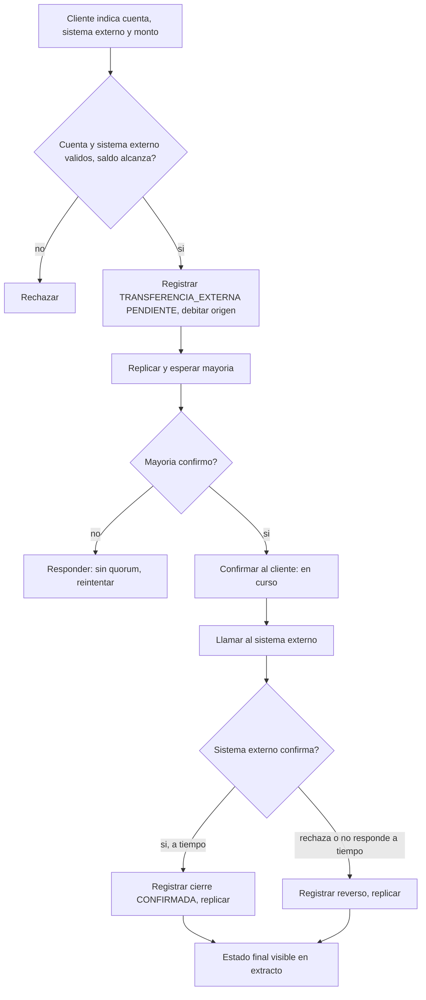
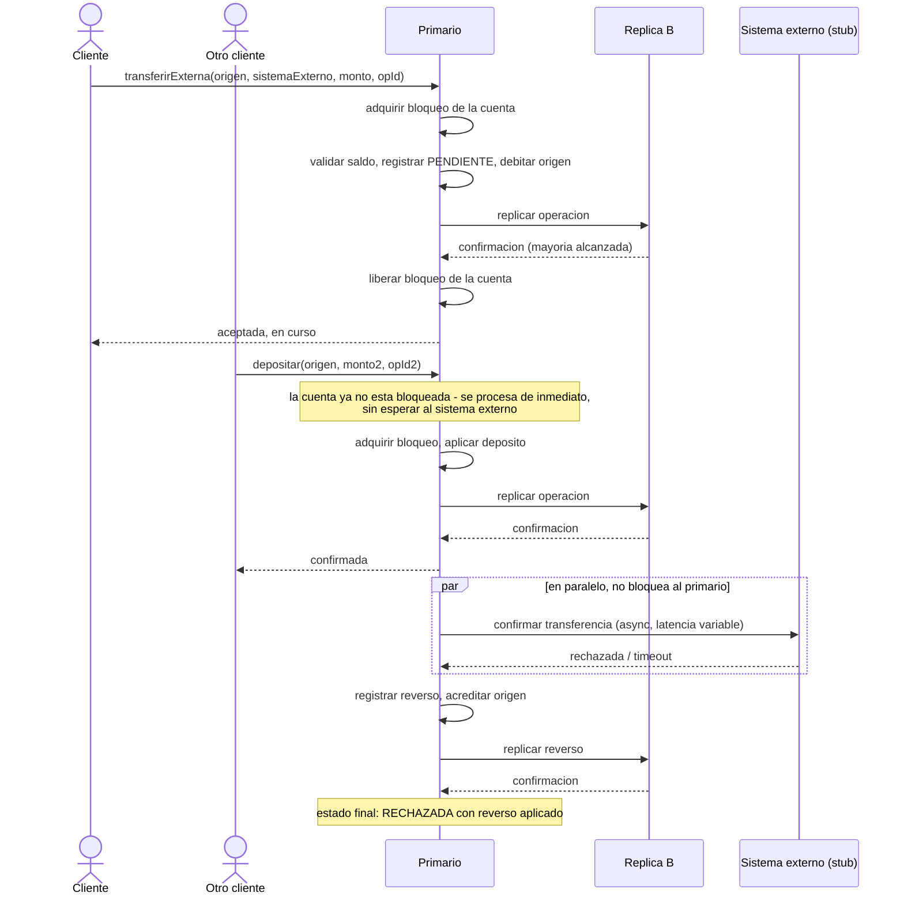

# CU-16 — Transferir a un sistema externo

| Campo | Valor |
|---|---|
| Actor principal | Cliente |
| Actores secundarios | Nodo primario, nodos réplica, Sistema externo |
| Requisitos relacionados | RF-25, RF-06, RF-07, RF-08, RF-10, RF-13 |
| Casos de prueba relacionados | [`plan-de-pruebas.md`](../08-pruebas-y-despliegue/plan-de-pruebas.md#cu-16) |
| Pantalla | [`mockups/cu-16-transferir-sistema-externo.html`](mockups/cu-16-transferir-sistema-externo.html) |

## Descripción

El cliente transfiere dinero desde una cuenta propia hacia una contraparte
fuera del clúster (`SistemaExterno`) — por ejemplo, otro banco o billetera
interoperable. A diferencia de CU-04/CU-05, el destino no es una cuenta de
este sistema: el primario debita la cuenta origen de inmediato y deja la
operación `PENDIENTE` mientras espera la confirmación asíncrona del sistema
externo (simulado, con latencia y fallas aleatorias en esta etapa).

Este caso de uso es el que más expone la concurrencia del sistema: mientras
una `TRANSFERENCIA_EXTERNA` sigue `PENDIENTE` esperando al sistema externo,
otras operaciones sobre la misma cuenta (otro depósito, otra transferencia)
deben seguir sirviéndose en orden, sin quedar bloqueadas por esa espera ni
ver un saldo inconsistente.

## Precondición

- La cuenta origen existe y el `SistemaExterno` indicado está `activo`.
- El saldo de la cuenta origen alcanza para el monto.

## Postcondición

- Si el sistema externo confirma: el monto queda debitado en firme, con
  `referencia_externa` guardada.
- Si el sistema externo rechaza o no responde a tiempo: el monto vuelve a la
  cuenta origen mediante una operación de reverso; la suma de saldos del
  sistema no cambió en ningún momento intermedio (RN-02, RN-14).

## Flujo principal

| # | Acción del actor | Respuesta del sistema |
|---|---|---|
| 1 | El cliente indica cuenta origen, sistema externo destino y monto | Muestra el saldo actual de referencia y el sistema externo elegido |
| 2 | El cliente confirma | Valida que la cuenta exista, que el sistema externo esté activo y que el saldo alcance |
| 3 | — | El primario registra la operación `TRANSFERENCIA_EXTERNA` (`PENDIENTE`), debita la cuenta origen, replica y espera mayoría |
| 4 | — | Confirma al cliente que la transferencia fue **aceptada y está en curso** (no confirmada en firme todavía) |
| 5 | — | El primario llama al `SistemaExterno`; cuando este responde, registra una segunda operación de cierre (confirmación o reverso), replica y espera mayoría |
| 6 | — | Actualiza el estado final (`CONFIRMADA` o `RECHAZADA` con reverso aplicado) — consultable en el extracto (CU-07) |

## Flujos alternativos

| # | Condición | Respuesta del sistema |
|---|---|---|
| 3a | Mientras la `TRANSFERENCIA_EXTERNA` sigue `PENDIENTE`, llega otra operación sobre la misma cuenta (depósito, retiro, otra transferencia) | Se procesa con el mismo mecanismo de bloqueo por cuenta de CU-11: espera a que la escritura anterior termine de aplicarse localmente (débito + replicación de esa entrada), no a que el sistema externo responda — el bloqueo se libera apenas la entrada de log queda aplicada, igual que cualquier otra operación |
| 5a | El sistema externo responde con rechazo | El primario registra una operación de reverso (misma mecánica que un `DEPOSITO` a la cuenta origen), replica y espera mayoría antes de confirmarlo |
| 5b | El sistema externo no responde dentro del tiempo límite | Se trata igual que 5a: se asume rechazo y se revierte — no se deja una operación `PENDIENTE` indefinida |

## Excepciones

| # | Condición | Respuesta del sistema |
|---|---|---|
| E1 | Saldo insuficiente en el paso 2 | Rechaza; ninguna cuenta cambia |
| E2 | El sistema externo indicado no existe o no está `activo` | Rechaza antes de debitar nada |
| E3 | No hay mayoría de nodos disponibles en el paso 3 | No debita; responde que debe reintentarse (igual que CU-04) |
| E4 | El primario cae después del paso 3 pero antes del paso 5 | El nuevo primario retoma la operación `PENDIENTE` desde el log replicado y continúa desde ahí — no reinicia el débito (RN-08, RF-13) |

## Reglas de negocio asociadas

| ID regla | Descripción breve |
|---|---|
| RN-01 | El saldo de una cuenta nunca puede quedar negativo |
| RN-02 | El dinero nunca se crea ni se destruye — un reverso siempre iguala al débito original |
| RN-07 | Una escritura solo se confirma tras la mayoría |
| RN-14 | Débito inmediato + `PENDIENTE` hasta confirmación externa; reverso explícito si falla, nunca reescritura directa del saldo |

## Diagrama de actividades

## Diagrama de secuencia (con operación concurrente sobre la misma cuenta)

Muestra por qué el `PENDIENTE` prolongado no bloquea al resto del sistema: el
bloqueo por cuenta se libera apenas termina de aplicarse la entrada de log de
la transferencia externa — no se mantiene tomado mientras se espera al
sistema externo.

## Cómo se valida

Con una prueba de concurrencia dedicada: disparar una `TRANSFERENCIA_EXTERNA`
contra un *stub* con latencia alta configurada y, mientras sigue `PENDIENTE`,
lanzar N operaciones más sobre la misma cuenta — deben servirse sin esperar
al *stub*, y el total del sistema debe cuadrar tanto si el externo confirma
como si rechaza (ver
[`../08-pruebas-y-despliegue/plan-de-pruebas.md`](../08-pruebas-y-despliegue/plan-de-pruebas.md#cu-16)).

## Notas de trazabilidad

Caso de uso nuevo, agregado por la ampliación de productos financieros
pedida por el profesor (ver [`../01-requisitos/modelo-de-negocio.md`](../01-requisitos/modelo-de-negocio.md)) —
no proviene del PDF de la propuesta original. El sistema externo es un *stub*
simulado dentro del propio backend (ver
[`../07-tecnologia/stack-tecnologico.md`](../07-tecnologia/stack-tecnologico.md)),
no una integración real con un tercero.
