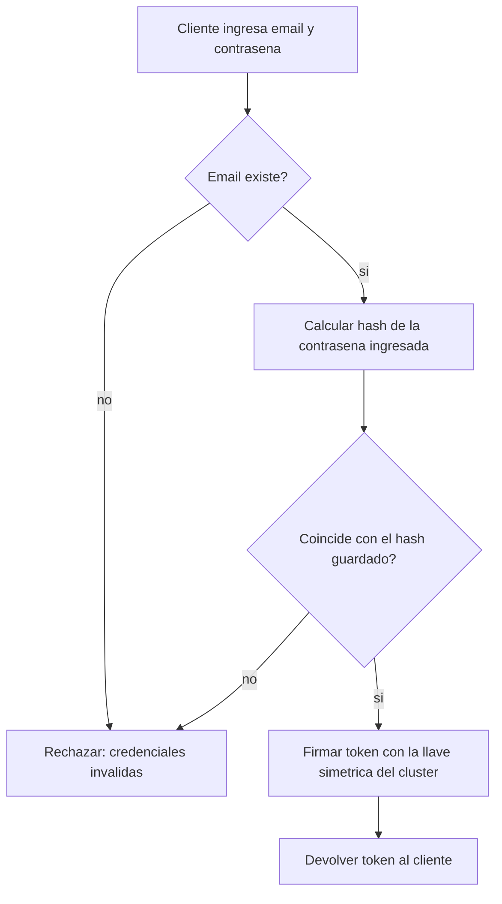

# CU-17 — Iniciar sesión

| Campo | Valor |
|---|---|
| Actor principal | Cliente |
| Actores secundarios | — |
| Requisitos relacionados | RF-26 |
| Casos de prueba relacionados | [`plan-de-pruebas.md`](../08-pruebas-y-despliegue/plan-de-pruebas.md#cu-17) |
| Pantalla | Pendiente de diseño |

## Descripción

El cliente se identifica con email y contraseña. El sistema verifica la
contraseña contra el hash guardado (RN-15) y, si es correcta, devuelve un
token de sesión firmado con una llave simétrica compartida por todos los
nodos (RN-16) — cualquier nodo puede validar ese token después, sin
preguntarle al que lo emitió.

A diferencia de las operaciones bancarias, iniciar sesión **no** escribe una
`Operación` ni necesita confirmación por mayoría: es una lectura contra
`Usuario`, que ya está replicado igual que el resto de los datos (RN-04) —
cualquier nodo, primario o réplica, puede atenderla.

## Precondición

El usuario existe y tiene una contraseña configurada.

## Postcondición

El cliente recibe un token de sesión válido, con el que las siguientes
peticiones prueban de quién son sin volver a enviar la contraseña.

## Flujo principal

| # | Acción del actor | Respuesta del sistema |
|---|---|---|
| 1 | El cliente ingresa email y contraseña | — |
| 2 | El cliente confirma | El nodo busca al usuario por email y calcula el hash de la contraseña ingresada con la misma función y sal que se usó al guardarla |
| 3 | — | Si el hash coincide, firma un token (payload + `HMAC-SHA256` con la llave simétrica del clúster) y lo devuelve |

## Flujos alternativos

| # | Condición | Respuesta del sistema |
|---|---|---|
| 3a | El cliente ya tiene un token vigente y hace otra petición | No vuelve a pasar por este caso de uso — cualquier nodo valida el token recalculando la firma con la misma llave simétrica, sin ir a la base de datos |

## Excepciones

| # | Condición | Respuesta del sistema |
|---|---|---|
| E1 | El email no existe | Responde con error de credenciales inválidas — el mismo mensaje que E2, para no revelar qué emails están registrados |
| E2 | La contraseña no coincide | Responde con error de credenciales inválidas |

## Reglas de negocio asociadas

| ID regla | Descripción breve |
|---|---|
| RN-15 | La contraseña nunca se guarda en texto plano ni cifrada de forma reversible, solo como hash |
| RN-16 | El token de sesión se firma con una llave simétrica compartida por todos los nodos |

## Diagrama de actividades

## Notas de trazabilidad

Caso de uso nuevo — cierra un vacío que ya existía: `modelo-de-negocio.md`
listaba "autenticación mínima" dentro de alcance desde el inicio, pero
`Usuario` nunca tuvo un campo de contraseña ni un caso de uso propio para
esto.
