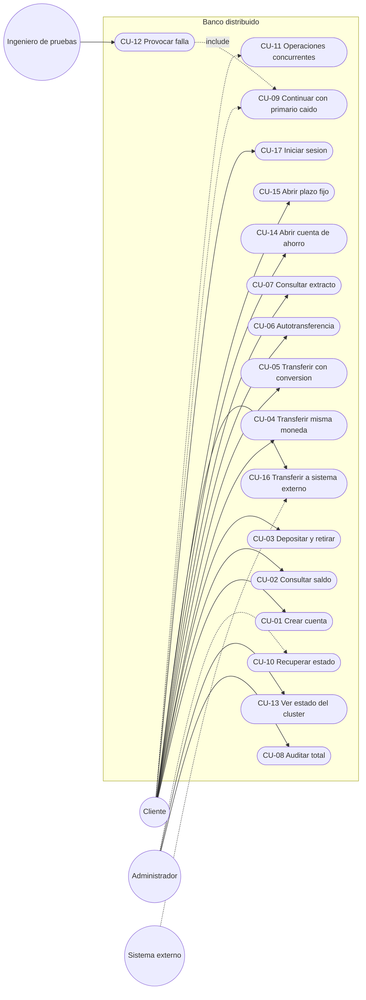

# Matriz actor × caso de uso

`X` = el actor inicia o participa directamente en el caso de uso.

| Caso de uso | Cliente | Administrador | Ingeniero de pruebas | Nodo (sistema) | Sistema externo |
|---|---|---|---|---|---|
| CU-01 Crear cuenta | X | | | | |
| CU-02 Consultar saldo | X | | | | |
| CU-03 Depositar y retirar | X | | | | |
| CU-04 Transferir (misma moneda) | X | | | X | |
| CU-05 Transferir con conversión | X | | | X | |
| CU-06 Autotransferencia | X | | | X | |
| CU-07 Consultar extracto | X | | | | |
| CU-08 Auditar total | | X | | | |
| CU-09 Continuar con primario caído | X | | | X | |
| CU-10 Recuperar estado al reiniciar | | X | | X | |
| CU-11 Operaciones concurrentes | X | | | X | |
| CU-12 Provocar falla para pruebas | | | X | X | |
| CU-13 Ver estado del clúster | | X | | X | |
| CU-14 Abrir cuenta de ahorro | X | | | X | |
| CU-15 Abrir depósito a plazo fijo | X | | | X | |
| CU-16 Transferir a sistema externo | X | | | X | X |
| CU-17 Iniciar sesión | X | | | | |

## Diagrama de casos de uso

