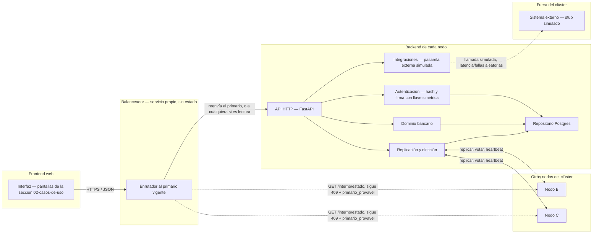

# Diagrama de componentes

Muestra las piezas de software y cómo se comunican, sin entrar todavía en
dónde corre cada una físicamente (eso es
[`diagrama-de-despliegue.md`](diagrama-de-despliegue.md)).

## Responsabilidad de cada componente

| Componente | Responsabilidad | De dónde viene |
|---|---|---|
| Interfaz (frontend) | Pantallas de cliente y de administrador, consume la API | Nuevo — ver `docs/adr/ADR-0003-linha-grafica.md` |
| Balanceador | Único punto de entrada público; encuentra al primario vigente y le reenvía las escrituras, reenvía lecturas a cualquier nodo; sigue `409 nao_sou_primario` | Nuevo — servicio propio, sin estado, no forma parte de ningún nodo |
| API HTTP | Enrutamiento, validación de forma de la petición, traducción de errores | Evoluciona `interface/servidor_http.py` de Prototipo 1 |
| Dominio bancario | Reglas de negocio: saldo, transferencia, conversión, invariantes | Evoluciona `dominio/` de Prototipo 1 |
| Replicación y elección | Log de replicación, quórum, heartbeat, voto, fencing por epoch; también dispara la revisión periódica de interés (RF-23/RF-24) | Evoluciona `cluster/` de Prototipo 1 (etapa aún por construir) |
| Repositorio Postgres | Persistir cuentas, operaciones y el log de replicación en tablas | Reemplaza `persistencia/wal.py` (WAL en archivo) por tablas |
| Integraciones | Adaptador hacia sistemas externos para `TRANSFERENCIA_EXTERNA` (RF-25); en esta etapa es un *stub* simulado en el mismo proceso, no un cliente HTTP real | Nuevo — ver [`../04-modulos/mapa-de-modulos.md`](../04-modulos/mapa-de-modulos.md) |
| Autenticación | Hash de contraseña y firma/verificación de token de sesión con llave simétrica (RF-26) | Nuevo — ver [`../04-modulos/mapa-de-modulos.md`](../04-modulos/mapa-de-modulos.md) |

## Por qué el balanceador es un componente propio, no solo lógica del cliente

Es una decisión explícita del equipo, más allá de lo mínimo necesario: RF-13
ya exigía que **alguien** siga al primario y reintente — podía vivir como
lógica dentro del frontend/CLI (más simple, cero infraestructura nueva), pero
se prefirió un servicio dedicado para que la redundancia del backend sea una
pieza de arquitectura visible, no un detalle escondido en el cliente. Al no
tener estado propio (solo cachea "quién es el primario" y reenvía), correr
dos copias del balanceador no necesita ningún protocolo de consenso —
cualquiera de las dos responde igual, a diferencia de los nodos.
