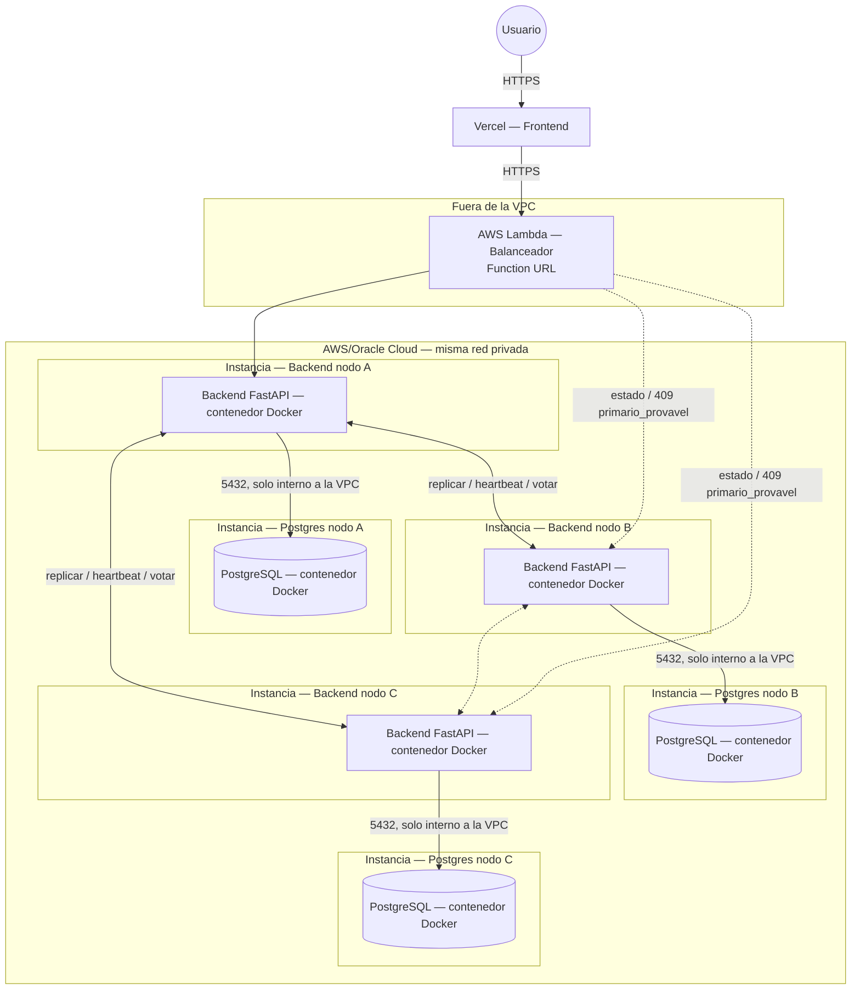

# Diagrama de despliegue

Refleja las decisiones de [`../../docs/adr/ADR-0001-persistencia-replicacao-implantacao.md`](../../docs/adr/ADR-0001-persistencia-replicacao-implantacao.md)
y [`../../docs/adr/ADR-0002-stack-tecnologico-e-implantacao.md`](../../docs/adr/ADR-0002-stack-tecnologico-e-implantacao.md):
**backend y base de datos en instancias separadas**, una por cada uno (6
instancias para 3 nodos) — decisión explícita del equipo. Balanceador y
frontend, en cambio, **no** son instancias: van en Lambda y Vercel (ver la
nota más abajo), porque ninguno de los dos tiene el problema que sí tienen
los nodos (estado propio + necesidad de estar siempre encendidos).

## Notas de despliegue

- **Backend y Postgres van en instancias separadas, una por cada uno** —
  3 nodos = 6 instancias, no 3. Cada backend sigue hablando **solo con su
  propia base de datos** — nunca con la de otro nodo; eso no cambia, solo
  cambia que la conexión cruza la red interna de la VPC en vez de ser un
  socket local. Ver el porqué (y el costo de latencia que se acepta a
  propósito) en
  [`../../docs/adr/ADR-0002-...md`](../../docs/adr/ADR-0002-stack-tecnologico-e-implantacao.md),
  sección "Recomendación: dónde corre el backend".
- Todas las instancias de un mismo nodo (backend + su Postgres) deben estar
  en el **mismo proveedor y la misma VPC/red privada** — cruzar de
  proveedor ahí sí metería internet en un salto sensible a RNF-05.
- **El balanceador va en AWS Lambda (Function URL), no en una instancia.**
  No tiene estado propio — solo pregunta "¿quién es primario?" y reenvía —
  así que no necesita estar siempre encendido ni tener disco propio, que es
  justo lo que hacía mala idea usar *serverless* para los nodos (ver
  `docs/adr/ADR-0002-...md`). Detalle de despliegue en `GUIA-DESPLIEGUE.md`.
- **El frontend va en Vercel, no en una instancia** — es estático, mismo
  argumento que el balanceador. (Nota histórica: hubo una versión intermedia
  de esta decisión que lo autoalojaba en Nginx junto al balanceador; se
  volvió a Vercel al mover el balanceador a Lambda, por la misma razón de
  costo.)
- Solo la Function URL de Lambda y Vercel quedan expuestos a internet — los
  nodos (backend y Postgres) se quedan en la red privada; ni `/interno/*`
  ni el puerto 5432 se exponen fuera de la VPC.
- Instancias **detenidas** (no solo apagadas dentro del SO) fuera de las
  sesiones de prueba, para conservar horas gratis / crédito — ver el
  ADR-0002 y el ADR-0001 (Oracle Cloud Always Free, sin límite de 12 meses)
  para el detalle del *free tier* vigente. Con 6 instancias (backend + BD
  separados) el presupuesto de horas gratis de AWS EC2 (750 h/mes,
  compartidas entre todas las instancias) se agota al doble de velocidad
  que con 3 — vale la pena revisar la tabla de `ADR-0001` con este conteo
  antes de decidir el proveedor. Lambda y Vercel no consumen ese
  presupuesto — tienen sus propias capas gratuitas, permanentes.
- El módulo `integraciones` (RF-25) no agrega instancia ni servicio nuevo:
  corre dentro del mismo backend de cada nodo, como un *stub* simulado —
  ver [`diagrama-de-componentes.md`](diagrama-de-componentes.md).
