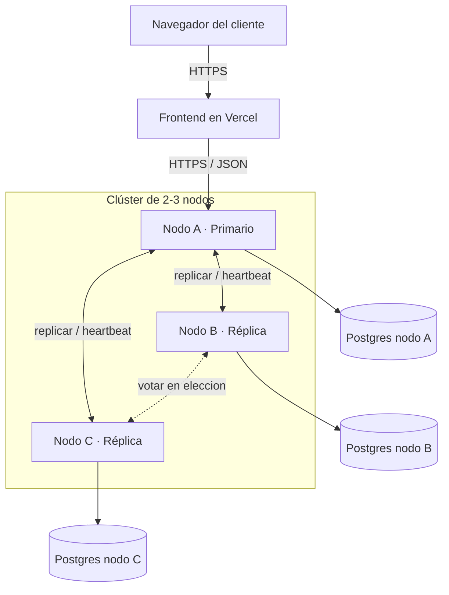
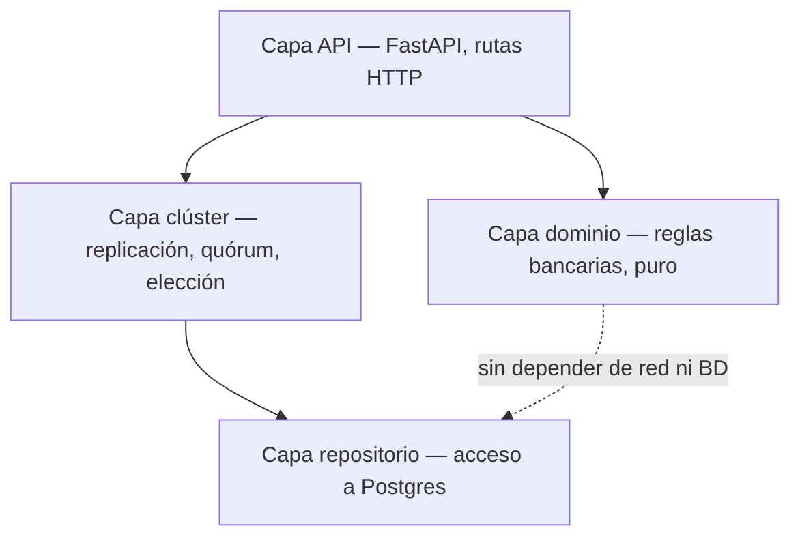

# Vista general de la arquitectura

## Estilo arquitectónico

Primario/réplica con replicación por log, sobre 2 o 3 nodos que mantienen la
misma base de cuentas completa (no hay partición de clientes entre
servidores). Cada nodo combina backend (Python/FastAPI) y su propia base de
datos (PostgreSQL) — ver
[`../../docs/adr/ADR-0002-stack-tecnologico-e-implantacao.md`](../../docs/adr/ADR-0002-stack-tecnologico-e-implantacao.md).

## Sobre "configurar los nodos" (nota de RF-18)

El equipo cuestionó tratar la lista de servidores del clúster como un
requisito funcional (era RF-18 en la propuesta original). Aquí se trata como
lo que es: una **decisión de despliegue**, documentada en
[`diagrama-de-despliegue.md`](diagrama-de-despliegue.md) y en
[`../../docs/adr/ADR-0001-persistencia-replicacao-implantacao.md`](../../docs/adr/ADR-0001-persistencia-replicacao-implantacao.md),
no como una funcionalidad que el cliente del banco pide. RF-18 queda marcado
"en revisión" en
[`../01-requisitos/requisitos-funcionales.md`](../01-requisitos/requisitos-funcionales.md)
hasta que el equipo decida si se elimina de la tabla de RF o se reformula.

## Por qué primario/réplica y no un protocolo de consenso más complejo

Con todas las cuentas replicadas en todos los nodos, una transferencia es
siempre una operación **local al primario** — débito y crédito ocurren en el
mismo nodo, en la misma entrada de log. Esto evita necesitar un *commit* en
dos fases entre grupos distintos, que sí haría falta si las cuentas se
dividieran entre servidores. Ver el detalle de esta decisión en
`docs/SPECS.md` §1 y §11.1.

## Capas dentro de cada nodo

La capa de dominio no conoce HTTP ni Postgres — solo recibe y devuelve datos.
Esto viene directo de Prototipo 1 (`dominio/` no importaba `socket` ni `http`)
y se mantiene porque es lo que permite probar las reglas de negocio sin
levantar un clúster completo. Ver
[`../04-modulos/mapa-de-modulos.md`](../04-modulos/mapa-de-modulos.md).

## Interés periódico y transferencias externas (RF-23 a RF-25)

Ninguno de los dos productos agrega un componente desplegado nuevo:

- **Interés de `AHORRO`/`PLAZO_FIJO`**: se evalúa dentro del mismo *tick*
  periódico que el primario ya ejecuta para el `heartbeat` (RF-09, RF-10) —
  en cada vuelta revisa si alguna cuenta tiene un período de interés vencido
  y, si lo tiene, genera una operación `INTERES` como cualquier otra
  escritura (se registra, se replica, se espera mayoría). No hay un
  planificador ("cron") aparte.
- **`TRANSFERENCIA_EXTERNA`** (RF-25): agrega un módulo nuevo, `integraciones`
  (ver [`../04-modulos/mapa-de-modulos.md`](../04-modulos/mapa-de-modulos.md)),
  que en esta etapa es un *stub simulado* dentro del mismo backend —
  latencia y fallas aleatorias, sin llamar a un tercero real. La operación
  queda `PENDIENTE` mientras se espera esa respuesta simulada; el bloqueo por
  cuenta (mismo mecanismo de CU-11) se libera apenas se aplica el débito
  local, no al terminar la espera — así el resto de operaciones sobre esa
  cuenta no se ven bloqueadas por la latencia externa. Ver
  [`../02-casos-de-uso/cu-16-transferir-sistema-externo.md`](../02-casos-de-uso/cu-16-transferir-sistema-externo.md).
