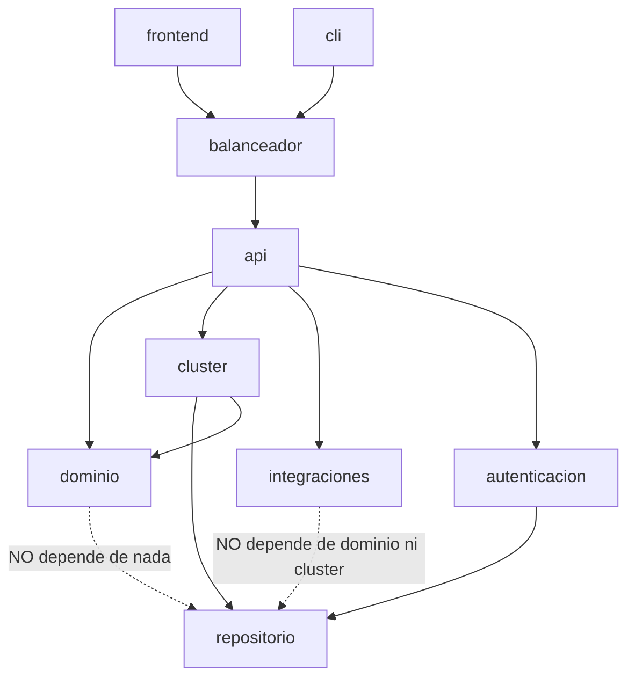

# Diagrama de paquetes

Muestra las dependencias permitidas entre módulos. La flecha va del que
depende hacia el que usa — `dominio` no depende de nada, a propósito.



## Regla de dependencia

`dominio` nunca importa `repositorio`, `cluster`, `api` ni ninguna librería de
red o de base de datos — recibe y devuelve estructuras de datos simples. Esta
regla ya existía en Prototipo 1 y se mantiene con el cambio de stack. Se
verifica en un comando, desde `prototipo-1/`:

```bash
python3 -c "import banco.dominio.operacoes"   # no toca psycopg2 ni fastapi
```

`cluster` es el único módulo que conoce tanto a `dominio` (para aplicar
operaciones) como a `repositorio` (para persistirlas) — es el punto donde se
implementa el quórum y la elección, y por eso es el módulo más sensible del
sistema (ver `docs/SPECS.md` §7-8).

`integraciones` es un módulo hoja, igual que `repositorio`: solo sabe hacer
(o simular) una llamada externa y devolver el resultado, sin conocer
`dominio` ni `cluster`. Quien decide cuándo llamarlo y qué hacer con la
respuesta es la capa de servicio que vive dentro de `api` (ver
[`../06-diseno-detallado/diagrama-de-clases-servicio.md`](../06-diseno-detallado/diagrama-de-clases-servicio.md)) —
el mismo patrón que ya separa `RepositorioCuentas` de `ServicioCuentas`.

`autenticacion` es otro módulo hoja: solo sabe calcular y verificar hashes y
firmas, no conoce `dominio` ni `cluster` — por eso puede validar un token en
cualquier nodo sin ninguna llamada de red entre ellos (RN-16).

`balanceador` es el único módulo que **no vive dentro de un nodo** — es su
propio servicio, sin estado propio, desplegado aparte. Por eso no depende de
`dominio`, `cluster` ni `repositorio`: solo habla `HTTP` con la `api` de cada
nodo, igual que lo haría un cliente cualquiera. Al no tener estado propio,
correr dos copias de `balanceador` no necesita ningún protocolo de
consenso — a diferencia de los nodos, cualquier copia responde igual.
