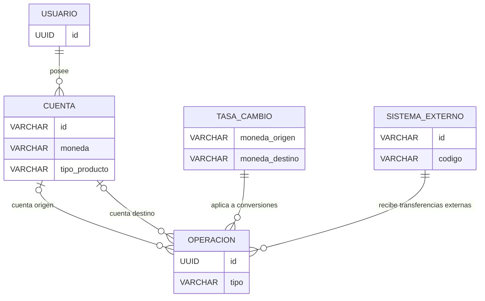

# Modelo conceptual (entidad-relación)

Solo entidades del **dominio del negocio** y sus relaciones, sin tipos de dato
ni restricciones — esas viven en [`modelo-logico.md`](modelo-logico.md). Un
modelo conceptual solo debe contener las entidades sobre las que el negocio
razona (cliente, cuenta, operación, moneda); el **cómo** el clúster logra
tolerancia a fallas (qué nodo existe, quién confirmó una escritura) es un
mecanismo de replicación, no un dato del banco — vive en
[`../../docs/adr/ADR-0001-persistencia-replicacao-implantacao.md`](../../docs/adr/ADR-0001-persistencia-replicacao-implantacao.md)
y en el diagrama de secuencia de
[`../06-diseno-detallado/diagrama-de-secuencia-eleccion-y-failover.md`](../06-diseno-detallado/diagrama-de-secuencia-eleccion-y-failover.md),
no en este modelo de datos.

## Entidades y su propósito

| Entidad | Propósito |
|---|---|
| Usuario | Dueño de una o más cuentas |
| Cuenta | Guarda saldo en una moneda específica; puede ser corriente, de ahorro (interés periódico) o depósito a plazo fijo (RF-23, RF-24) |
| Operación | Todo movimiento de dinero: creación, depósito, retiro, transferencia, conversión, interés, transferencia externa |
| Tasa de cambio | Tasa vigente entre dos monedas, usada y registrada al momento de una conversión (RN-06) |
| Sistema externo | Contraparte fuera del clúster a la que se le envió una transferencia interoperable (RF-25) — es dato del negocio (a quién se le mandó la plata), no infraestructura del clúster |

Ver el detalle campo por campo en [`modelo-logico.md`](modelo-logico.md) y el
significado de cada campo en [`diccionario-de-datos.md`](diccionario-de-datos.md).

## Por qué no hay `Servidor` ni `RegistroReplicacion` aquí

Una versión anterior de este modelo incluía `Servidor` (nodo del clúster) y
`RegistroReplicacion` (qué nodo confirmó qué operación) como entidades. Eso
mezclaba dos capas distintas:

- **Datos del negocio**: lo que el banco necesita persistir para responder
  "¿cuánto dinero tiene el cliente y qué movimientos hizo?" — Usuario, Cuenta,
  Operación, Tasa de cambio.
- **Mecanismo de replicación**: cómo el clúster logra que la mayoría de los
  nodos confirme una escritura antes de darla por buena (RN-07) y cómo evita
  contar dos veces la misma confirmación (RN-09). Esto es infraestructura del
  consenso, no algo sobre lo que el negocio pregunte con una consulta SQL —
  igual que un log de replicación de PostgreSQL no aparece como tabla de
  negocio en el esquema de una aplicación.

Ambas reglas (RN-07, RN-09) siguen vigentes y probadas — solo que su
cumplimiento es responsabilidad del módulo `cluster`/WAL, no de una tabla en
este modelo de datos.
