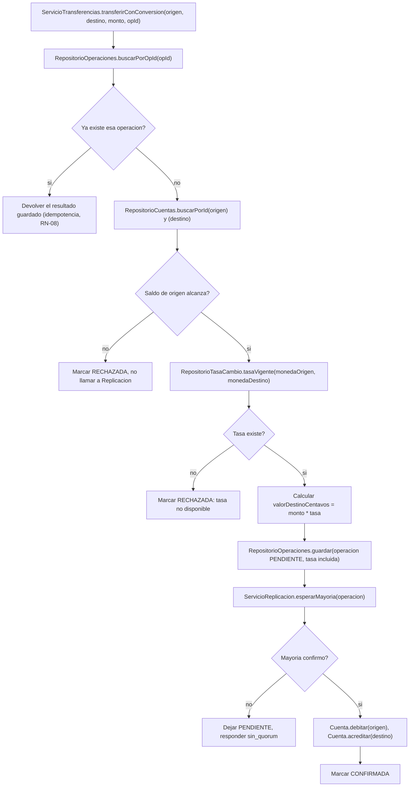

# Diagrama de actividades — conversión de moneda (vista técnica)

El diagrama de actividades **orientado al usuario** ya está en
[`../02-casos-de-uso/cu-05-transferir-con-conversion.md`](../02-casos-de-uso/cu-05-transferir-con-conversion.md#diagrama-de-actividades).
Este es el mismo flujo, pero desde el punto de vista de las clases de
servicio y repositorio (ver
[`diagrama-de-clases-servicio.md`](diagrama-de-clases-servicio.md)) — útil
para quien va a implementar `ServicioTransferencias.transferirConConversion`.

## Descripción

Detalla qué llamadas concretas hace el servicio al repositorio en cada paso,
en vez de hablar en términos de "el sistema valida" como en la versión de
negocio.

## Nota de implementación

El cálculo `valorDestinoCentavos = monto * tasa` debe hacerse con aritmética
de enteros/decimales exactos (`BigDecimal`/`NUMERIC`, nunca `float`) — mismo
principio de `docs/SPECS.md` §3.1, ahora aplicado también a la conversión, no
solo a la representación del dinero en una sola moneda.
