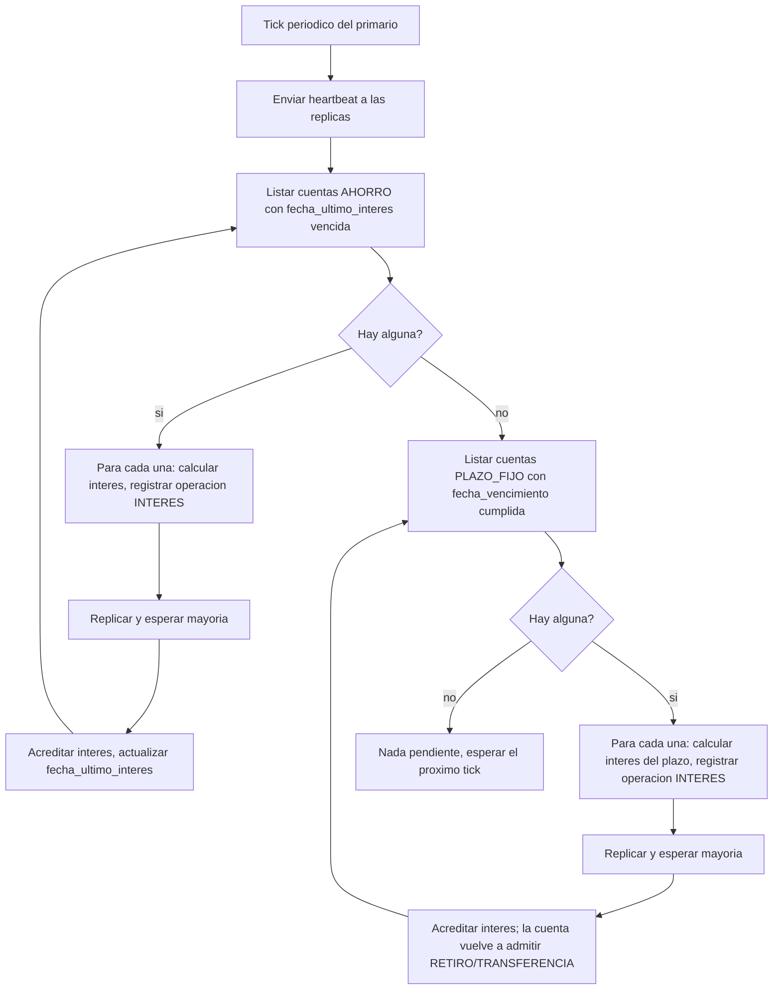

# Diagrama de actividades — tick periódico de interés y vencimiento

A diferencia de las transferencias, esto no pertenece a un único caso de
uso: es una responsabilidad de fondo del rol `PRIMARIO` (igual que
`diagrama-de-secuencia-eleccion-y-failover.md`), que CU-14 y CU-15 solo
referencian como flujo alternativo. Vive aquí porque es comportamiento del
clúster, no de una pantalla.

## Descripción

El mismo *tick* periódico que ya dispara el `heartbeat` (RF-09, RF-10)
revisa, en cada vuelta, si alguna cuenta `AHORRO` cumplió su período de
interés o si alguna `PLAZO_FIJO` llegó a su vencimiento. Cada acreditación de
interés es una operación más, con su propio ciclo de registro-replicación-
confirmación — no hay atajos que salten la mayoría solo porque el disparo
fue por tiempo y no por un cliente.

## Notas de implementación

- Si no hay mayoría disponible en el momento del tick (E2/E4 de CU-14/CU-15),
  la cuenta simplemente se vuelve a evaluar en el próximo tick — no se
  reintenta con lógica especial, es el mismo camino que cualquier escritura
  sin quórum.
- Este tick corre solo en el nodo `PRIMARIO` (ver
  [`diagrama-de-estados-nodo.md`](diagrama-de-estados-nodo.md)); una réplica
  nunca genera operaciones `INTERES` por su cuenta, evitando doble pago si
  hay una elección en curso.
