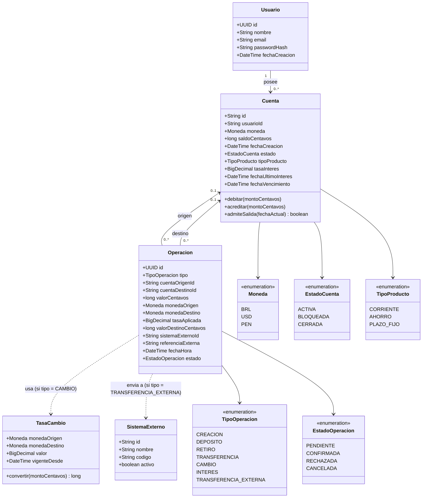

# Diagrama de clases — entidad

Representa el modelo de dominio (capa `dominio`, ver
[`../04-modulos/mapa-de-modulos.md`](../04-modulos/mapa-de-modulos.md)). Es la
traducción a clases del modelo lógico de
[`../05-modelo-de-datos/modelo-logico.md`](../05-modelo-de-datos/modelo-logico.md).

Estas clases no tienen métodos de red ni de acceso a Postgres — esas
responsabilidades están en las capas de interfaz y servicio (ver
[`diagrama-de-clases-interfaz.md`](diagrama-de-clases-interfaz.md) y
[`diagrama-de-clases-servicio.md`](diagrama-de-clases-servicio.md)), siguiendo
la misma separación que ya tenía `dominio/` en Prototipo 1.

No hay clases `Servidor` ni `RegistroReplicacion` aquí: representan el
mecanismo de replicación del clúster, no el dominio bancario — ver el porqué
en la última sección de
[`../05-modelo-de-datos/modelo-conceptual-er.md`](../05-modelo-de-datos/modelo-conceptual-er.md).
`SistemaExterno` sí es una clase de dominio, aunque también sea "externa" al
clúster: el negocio necesita saber a quién se le envió cada transferencia,
igual que necesita `TasaCambio`.
