# Diagrama de clases — servicio (control)

Capa *control*: donde vive la lógica de aplicación que coordina entidades,
repositorio y replicación. Los controladores de la capa de interfaz llaman a
estas clases; estas clases llaman a las entidades de
[`diagrama-de-clases-entidad.md`](diagrama-de-clases-entidad.md) y al
repositorio.

```mermaid
classDiagram
    class ServicioCuentas {
        +crearCuenta(usuarioId, moneda, saldoInicial) Cuenta
        +abrirCuentaAhorro(usuarioId, moneda, saldoInicial, tasaInteres) Cuenta
        +abrirPlazoFijo(usuarioId, moneda, monto, tasaInteres, fechaVencimiento) Cuenta
        +consultarSaldo(cuentaId) Cuenta
        +depositar(cuentaId, monto, opId) Operacion
        +retirar(cuentaId, monto, opId) Operacion
        +consultarExtracto(cuentaId) List~Operacion~
    }

    class ServicioTransferencias {
        +transferir(origenId, destinoId, monto, opId) Operacion
        +transferirConConversion(origenId, destinoId, monto, opId) Operacion
        +autotransferir(origenId, destinoId, monto, opId) Operacion
    }

    class ServicioTransferenciasExternas {
        +transferirExterna(origenId, sistemaExternoId, monto, opId) Operacion
        +manejarRespuestaExterna(opId, confirmada, referenciaExterna)
    }

    class ServicioIntereses {
        +revisarPendientes(fechaActual) List~Operacion~
        +acreditarInteres(cuentaId, fechaActual) Operacion
    }

    class ServicioAuditoria {
        +auditarPorMoneda() Map~Moneda, ResultadoAuditoria~
    }

    class ServicioAutenticacion {
        +iniciarSesion(email, contrasena) TokenSesion
        +validarToken(token) Usuario
    }
    class RepositorioUsuarios {
        <<interface>>
        +buscarPorEmail(email) Usuario
    }

    class ServicioReplicacion {
        +replicarEntrada(entrada) ResultadoReplicacion
        +esperarMayoria(entrada) boolean
        +manejarHeartbeat(epoch, commitLider)
        +ejecutarTickPeriodico()
    }

    class GatewayExterno {
        <<interface>>
        +confirmar(sistemaExternoId, monto, opId) RespuestaExterna
    }
    class RepositorioSistemasExternos {
        <<interface>>
        +buscarPorId(id) SistemaExterno
    }

    class ServicioEleccion {
        +iniciarEleccion()
        +votar(epoch, candidatoId, ultimoIndice, ultimoEpoch) boolean
        +asumirPrimario(epoch)
        +despromoverA Replica(epochRecibido)
    }

    class RepositorioCuentas {
        <<interface>>
        +buscarPorId(id) Cuenta
        +guardar(cuenta)
    }
    class RepositorioOperaciones {
        <<interface>>
        +guardar(operacion)
        +buscarPorOpId(opId) Operacion
        +listarPorCuenta(cuentaId) List~Operacion~
    }
    class RepositorioTasaCambio {
        <<interface>>
        +tasaVigente(monedaOrigen, monedaDestino) TasaCambio
    }

    ServicioCuentas --> RepositorioCuentas
    ServicioCuentas --> RepositorioOperaciones
    ServicioTransferencias --> RepositorioCuentas
    ServicioTransferencias --> RepositorioOperaciones
    ServicioTransferencias --> RepositorioTasaCambio
    ServicioTransferencias --> ServicioReplicacion
    ServicioTransferenciasExternas --> RepositorioCuentas
    ServicioTransferenciasExternas --> RepositorioOperaciones
    ServicioTransferenciasExternas --> RepositorioSistemasExternos
    ServicioTransferenciasExternas --> ServicioReplicacion
    ServicioTransferenciasExternas --> GatewayExterno
    ServicioIntereses --> RepositorioCuentas
    ServicioIntereses --> RepositorioOperaciones
    ServicioIntereses --> ServicioReplicacion
    ServicioReplicacion --> ServicioIntereses : ejecutarTickPeriodico llama a revisarPendientes
    ServicioAuditoria --> RepositorioCuentas
    ServicioAuditoria --> RepositorioOperaciones
    ServicioAutenticacion --> RepositorioUsuarios
    ServicioReplicacion --> ServicioEleccion : consulta epoch/rol
```

## Por qué el repositorio es una interfaz aquí

`RepositorioCuentas`, `RepositorioOperaciones`, `RepositorioTasaCambio` y
`RepositorioSistemasExternos` se declaran como interfaces en esta capa — la
implementación concreta contra PostgreSQL vive en el módulo `repositorio`
(ver [`../04-modulos/mapa-de-modulos.md`](../04-modulos/mapa-de-modulos.md)).
Esto es lo que permite probar `ServicioTransferencias` con un repositorio
falso en memoria, sin levantar una base de datos real — el mismo principio
que ya usaban las pruebas de Prototipo 1 sobre `dominio/`.

`GatewayExterno` sigue el mismo patrón, pero implementado por el módulo
`integraciones` en vez de `repositorio` — en esta etapa esa implementación es
un *stub* con latencia y fallas aleatorias (RF-25), lo que además permite
probar `ServicioTransferenciasExternas` con un `GatewayExterno` falso y
determinista en pruebas unitarias, sin depender del *stub* aleatorio.

`ServicioAutenticacion` no depende de `ServicioReplicacion` — iniciar sesión
no escribe una `Operación` ni necesita confirmación por mayoría (CU-17), es
una lectura contra `Usuario`, que ya está replicado igual que el resto de
los datos. `validarToken` ni siquiera toca el repositorio: solo recalcula la
firma `HMAC` con la llave simétrica del clúster y compara.

`ServicioIntereses` no es llamado por ningún controlador HTTP — lo dispara
`ServicioReplicacion.ejecutarTickPeriodico()`, el mismo *tick* que ya generaba
el `heartbeat` (RF-09, RF-10). Esto evita agregar un planificador nuevo: el
interés de `AHORRO` y el vencimiento de `PLAZO_FIJO` se revisan como una
responsabilidad más del rol `PRIMARIO` (ver
[`diagrama-de-estados-nodo.md`](diagrama-de-estados-nodo.md)).
