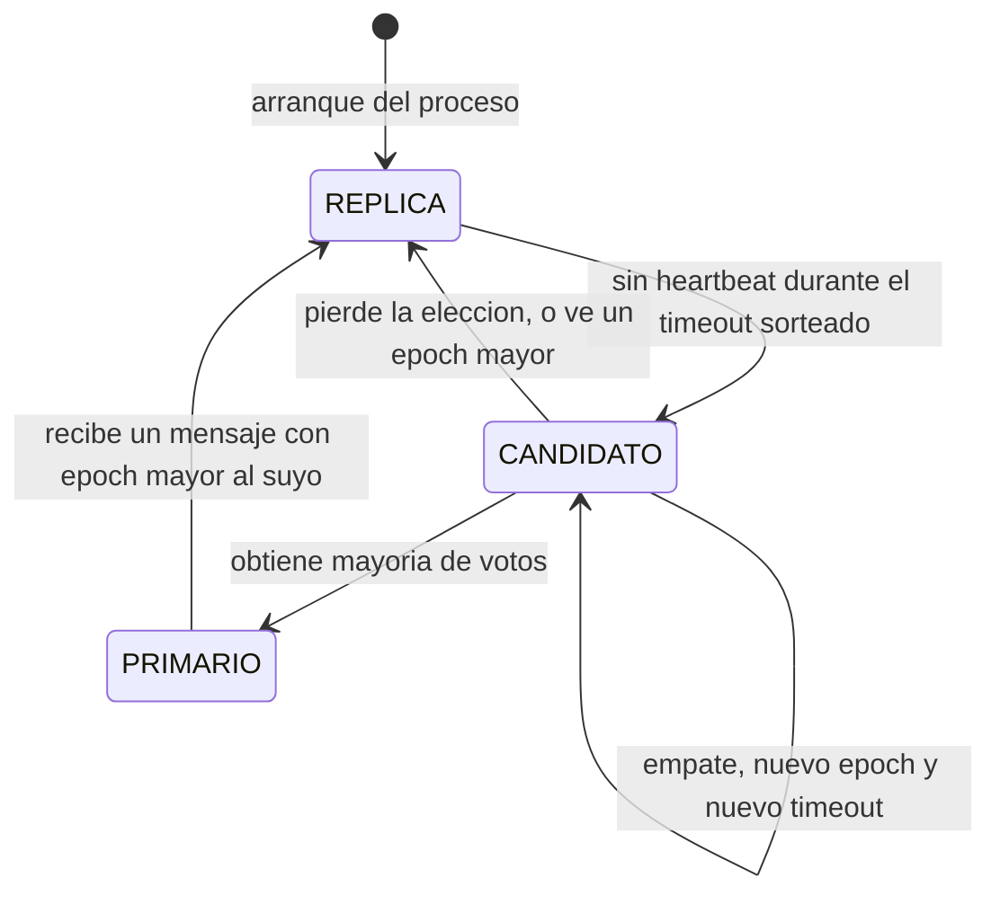

# Diagrama de estados — rol de un nodo

## Descripción

Muestra los tres roles que puede tener un nodo del clúster y qué evento
provoca cada transición. Todo nodo arranca siempre como réplica, nunca se
asume primario por su propia memoria de haberlo sido antes (`docs/SPECS.md` §4.2).

## Notas por estado

| Estado | Qué hace el nodo | Qué NO hace |
|---|---|---|
| RÉPLICA | Aplica las entradas recibidas hasta `indice_commit`, responde lecturas si se piden explícitamente como desactualizadas | No acepta escrituras de clientes |
| CANDIDATO | Pide voto a los demás nodos con su `epoch` incrementado | No aplica escrituras mientras espera resultado de la elección |
| PRIMARIO | Acepta escrituras, replica, cuenta mayoría, envía *heartbeat*; en el mismo *tick* revisa interés de `AHORRO` y vencimiento de `PLAZO_FIJO` (RF-23, RF-24, ver [`diagrama-de-actividades-tick-interes.md`](diagrama-de-actividades-tick-interes.md)) | Nunca acepta una escritura de cliente antes de grabar su propia entrada `noop` en el `epoch` actual (ver `diagrama-de-secuencia-eleccion-y-failover.md`); una réplica nunca genera operaciones `INTERES` por su cuenta |

Este diagrama es el que dispara
[`../02-casos-de-uso/cu-09-continuar-con-primario-caido.md`](../02-casos-de-uso/cu-09-continuar-con-primario-caido.md)
en la práctica.
