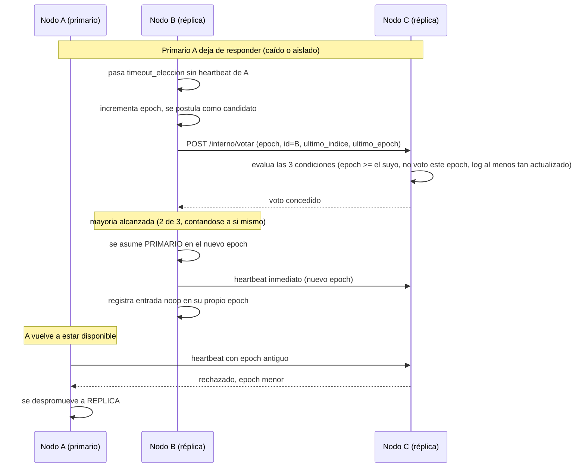

# Diagrama de secuencia — elección y failover

Comportamiento del clúster, no de una pantalla — es lo que sostiene a
[`../02-casos-de-uso/cu-09-continuar-con-primario-caido.md`](../02-casos-de-uso/cu-09-continuar-con-primario-caido.md)
por debajo. Sigue el protocolo descrito en `docs/SPECS.md` §8.

## Descripción

Muestra la secuencia completa desde que el primario deja de enviar
*heartbeat* hasta que un nuevo primario queda operando: detección por
*timeout*, postulación con `epoch` incrementado, voto de las réplicas según
las tres condiciones de `SPECS.md` §8.2, y el *heartbeat* inmediato al
asumir.

## Por qué la entrada `noop`

El nuevo primario B registra una operación `noop` en su propio `epoch` antes
de aceptar escrituras de clientes. Una entrada heredada del primario anterior
—aunque esté en la mayoría de los nodos— no puede confirmarse solo por conteo
de réplicas hasta que el `epoch` actual tenga al menos una entrada propia
confirmada; confirmar la `noop` primero arrastra a todo lo anterior de forma
segura. El razonamiento completo está en `docs/SPECS.md` §8.4.

Ver el ciclo de vida del rol de un nodo en
[`diagrama-de-estados-nodo.md`](diagrama-de-estados-nodo.md).
