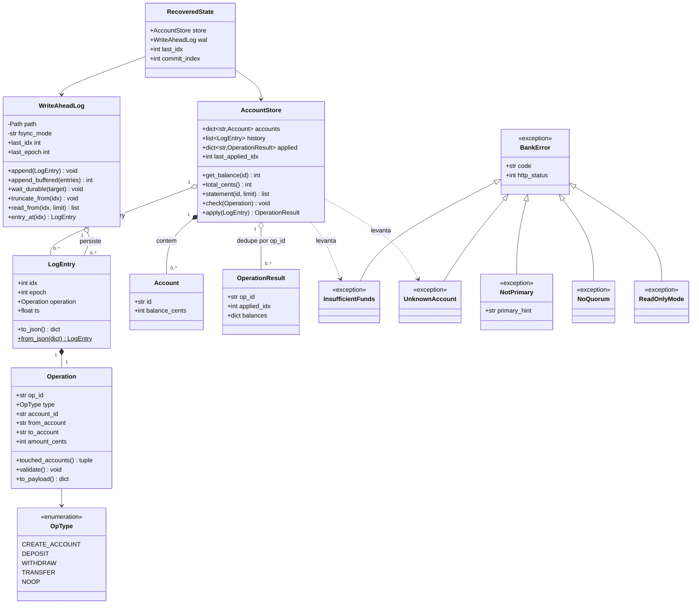
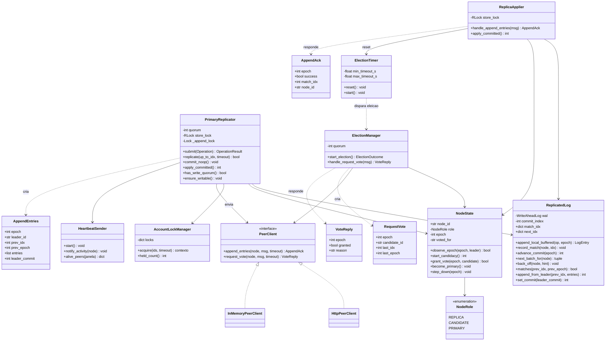
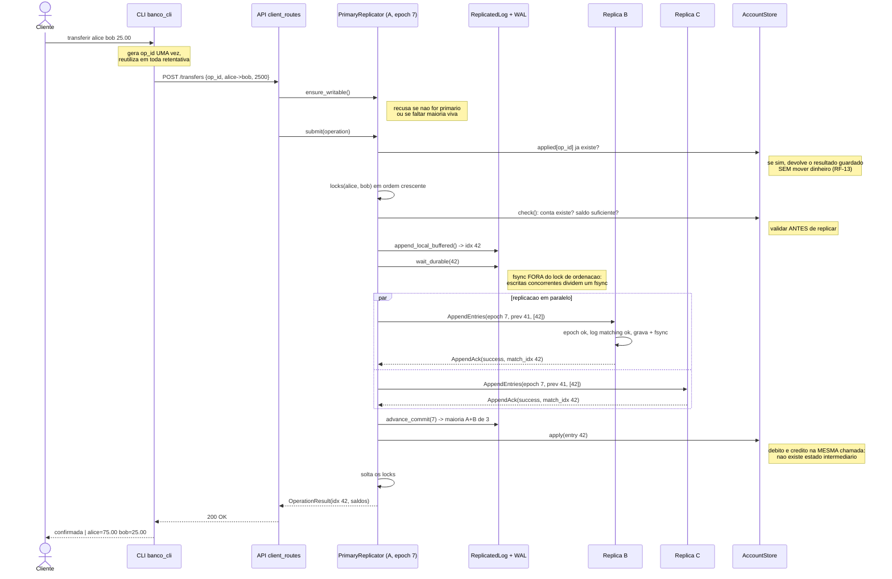
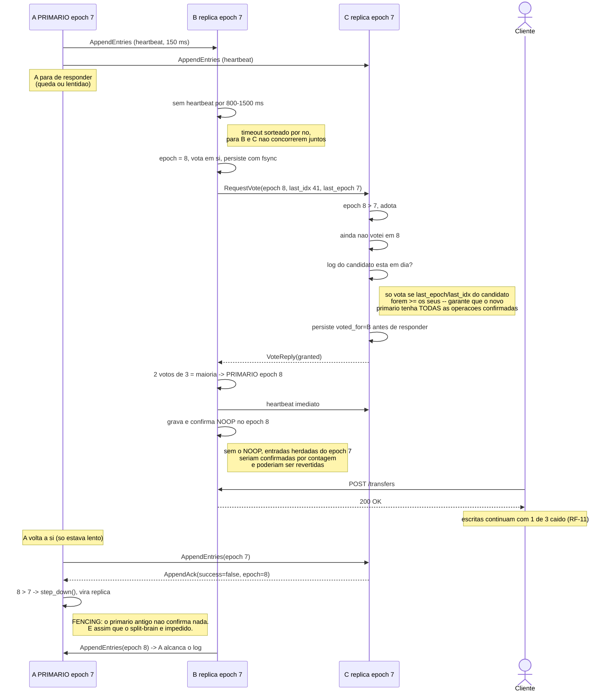
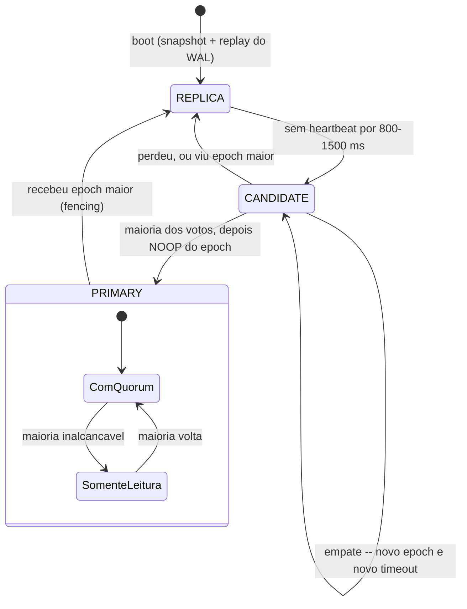

# Diagramas UML

Os mesmos cinco diagramas em dois formatos:

- **Mermaid**, nesta pagina -- o GitHub renderiza sozinho, e so abrir o arquivo.
- **PlantUML**, em [`docs/uml/`](uml/) -- notacao mais ortodoxa (visibilidade,
  multiplicidade, estereotipos, notas), para exportar em SVG/PNG e anexar ao relatorio.

Para exportar os `.puml`:

```bash
# com o plantuml instalado
plantuml -tsvg docs/uml/*.puml

# ou sem instalar nada, baixando o jar
curl -sLo /tmp/plantuml.jar https://github.com/plantuml/plantuml/releases/download/v1.2024.7/plantuml-1.2024.7.jar
java -jar /tmp/plantuml.jar -tsvg -o ./saida docs/uml/*.puml
```

O desenho por tras destes diagramas esta descrito em [`arquitetura.md`](arquitetura.md).

---

## 1. Classes -- dominio e persistencia

Camada pura: nao conhece rede nem disco. E o determinismo do `AccountStore` que
permite replicar por log e recuperar por replay.



Tres decisoes que este diagrama codifica:

- **`op_id`** e gerado pelo cliente e mantido em toda retentativa. E a chave de
  idempotencia que torna seguro repetir uma transferencia quando o primario cai (RF-13).
- **`touched_accounts()`** devolve as contas **ordenadas**. Como os locks sao sempre
  tomados nessa ordem, duas transferencias cruzadas nunca dao deadlock.
- **Uma transferencia e uma unica `LogEntry`**, aplicada por uma unica chamada de
  `apply`. E dai que vem a atomicidade de RF-05, sem protocolo de duas fases.

## 2. Classes -- replicacao e eleicao



Os pontos delicados, todos verificados por teste:

- **`advance_commit`** so confirma por contagem entradas do **epoch corrente**. Uma
  entrada herdada do primario anterior e confirmada por arraste, junto com o NOOP da
  promocao. Confirma-la por contagem permitiria reverte-la depois.
- **`NodeState`** grava `epoch` e `voted_for` com fsync **antes** de responder. Votar,
  cair e esquecer o voto elegeria dois primarios no mesmo epoch.
- **`ElectionTimer`** sorteia o timeout com uma semente **derivada por no**. Com a
  semente global pura, os tres sorteiam o mesmo valor, viram candidatos juntos e
  dividem os votos indefinidamente -- exatamente o que a aleatoriedade evita.

## 3. Sequencia -- transferencia confirmada por maioria



Se a maioria nao responder dentro de `replication_timeout_ms`, a resposta e **503
`no_quorum`**: a entrada fica gravada porem **nao confirmada**. O cliente repete com o
mesmo `op_id` e o dinheiro se move exatamente uma vez.

## 4. Sequencia -- failover e fencing por epoch



## 5. Estados -- papeis de um no



Um no **sempre** sobe como replica, mesmo que fosse primario antes de cair: quem manda
e decidido pela eleicao, nunca pelo que o no lembra de si mesmo.

Dentro de `PRIMARY` ha o modo degradado **somente leitura**: sem maioria viva, o
primario recusa escritas com 503 em vez de aceitar operacoes que nunca serao
confirmadas, mas continua respondendo saldo, extrato e auditoria.
