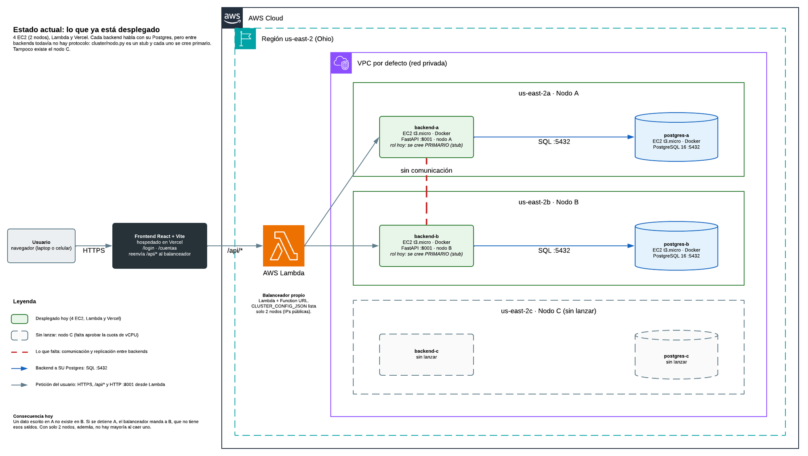

# Propuesta del proyecto final: el banco distribuido en servidores reales de AWS

> **Estado:** borrador para discutir con el equipo · **Fecha:** 21 de septiembre de 2026
> **Región AWS:** `us-east-2` (Ohio) · **Equipo:** Jefferson, Cristhian y Paulo
>
> Explica **qué queremos construir, con qué piezas y en qué orden**. No repite los
> pasos de consola de [`GUIA-DESPLIEGUE.md`](GUIA-DESPLIEGUE.md) ni el detalle del
> protocolo de [`../docs/SPECS.md`](../docs/SPECS.md): los enlaza.

| Tienes | Lee |
|---|---|
| 1 minuto | §1 |
| 5 minutos | §1, §2 y §3 |
| Quieres saber **por qué** la arquitectura es así y no otra | §2.3 |
| Quieres saber por qué **los Postgres no se hablan entre sí** | §2.4 |
| Vas a programar o desplegar | §5, §6 y §7 |
| Vas a preparar la demo | §8 |
| Hay que decidir algo | §10 |

---

## 1. Resumen en un minuto

**Lo que queremos.** Una **simulación bancaria** (el dinero y los clientes son de prueba) que
corre sobre **instancias reales de AWS**: varias instancias prendidas a la vez, que se apagan
y se vuelven a prender, y que **se van sincronizando solas** al volver. Lo que se simula es el
banco; lo real son los servidores, la red, las caídas y la sincronización. Así, en la defensa
se puede **apagar un EC2 desde la consola y ver que el banco sigue funcionando, sin perder ni
duplicar dinero**, y después prenderlo y ver cómo se pone al día.

**Cómo, en cuatro ideas:**

1. **Tres nodos, seis EC2.** Cada nodo son dos servidores: uno con el backend (FastAPI) y
   otro con su PostgreSQL. Cada nodo va en una zona de disponibilidad distinta
   (`us-east-2a`, `2b`, `2c`).
2. **Balanceador propio en AWS Lambda y frontend en Vercel.** No usamos ALB, RDS ni ningún
   servicio que haga la réplica por nosotros: elegir primario, confirmar por mayoría y
   recuperarse de una caída es justo lo que el curso evalúa.
3. **Regla de comunicación.** Cada backend habla **solo con su propio Postgres**. Los
   **backends se hablan entre sí** (replicar, latido, votar). Los **Postgres no se hablan
   nunca**. Las tres bases quedan iguales porque los tres backends aplican **la misma
   secuencia de operaciones**, confirmada por mayoría; no porque Postgres replique (§2.4).
4. **Dónde estamos.** Ya hay 4 EC2 (nodos A y B), la Lambda y el frontend en Vercel, más el
   dominio bancario correcto del Prototipo 1. **Falta** el protocolo entre backends (hoy
   [`backend/banco/cluster/nodo.py`](backend/banco/cluster/nodo.py) es un *stub*), el nodo C
   (cuota de vCPU) y cerrar la red.

**Qué necesitamos del equipo:** validar la arquitectura (§2), decidir los puntos de §10 y
repartirnos las fases de §7.

**Alcance.** *Dentro:* login, crear cuenta, depositar, retirar, transferir, extracto y
auditoría; tres nodos con réplica, elección, failover y reintegración; balanceador;
frontend; pruebas de falla y mediciones. *Fuera, por ahora:* multi-moneda, ahorro, plazo
fijo y transferencia externa (RF-19 a RF-25), respaldos y multi-región. Primero lo
distribuido; después lo bancario extra.

---

## 2. La arquitectura objetivo


*Arquitectura objetivo. Haz clic en la imagen para verla en tamaño completo. Original
editable en [Lucidchart](https://lucid.app/lucidchart/cacc6b00-521f-4c45-b4e4-439fa28070ff/view),
página «1. Arquitectura objetivo» (privado: hay que compartirlo desde Lucid). Naranja y
punteado: lo que aún no existe (nodo C).*

Se lee de izquierda a derecha: el usuario entra por Vercel, la Lambda encuentra al primario y,
dentro de la VPC, cada nodo tiene su backend y su Postgres. Las líneas **moradas** son la
comunicación entre backends; las **azules**, cada backend con su propio Postgres.

### 2.1 Las piezas

| Pieza | Dónde corre | ¿Guarda estado? | Para qué sirve |
|---|---|---|---|
| Frontend React + Vite | Vercel | No | Las pantallas. Le habla siempre a `/api/*`, nunca a un nodo |
| Balanceador propio | AWS Lambda (Function URL) | No | Encuentra al primario y le manda las escrituras; sigue la redirección `409` cuando se equivoca |
| `backend-a`, `backend-b`, `backend-c` | 3 EC2 `t3.micro` con Docker, una por zona | Sí: rol, `epoch` y log | Reglas del banco y protocolo de réplica |
| `postgres-a`, `postgres-b`, `postgres-c` | 3 EC2 `t3.micro` con Docker, **separadas** de su backend | Sí: los datos del nodo | Almacenamiento del nodo; solo lo usa su backend |

### 2.2 Quién habla con quién

| De | A | Cómo | Para qué |
|---|---|---|---|
| Usuario | Vercel | HTTPS | Cargar la aplicación |
| Vercel | Lambda | HTTPS, *rewrite* de `/api/*` ([`frontend/vercel.json`](frontend/vercel.json)) | Enviar las llamadas de la API al balanceador |
| Lambda | Los backends | HTTP `:8001` | Preguntar `/interno/estado` y reenviar la petición al primario |
| Backend | **Su propio** Postgres | SQL `:5432`; el *security group* `banco-postgres` solo acepta a `banco-backend` | Guardar log y estado |
| Backend | Los otros backends | HTTP `:8001`: `/interno/replicar`, `/interno/votar`, `/interno/log`, `/interno/estado` | Réplica, latido y elecciones |
| Postgres | Postgres | **Nunca** | No usamos `streaming replication` (§2.4) |

Si algún diagrama muestra una línea entre dos Postgres, está mal.

### 2.3 Por qué la arquitectura es así y no otra

Cada decisión tiene una alternativa razonable. Esta tabla dice cuál descartamos y por qué. El
criterio común: como esto es una simulación bancaria cuyo objetivo es **ver instancias que se
apagan y se sincronizan**, gana lo que deja **apagar y prender cada pieza por separado** y lo
que **hace visible el protocolo** (elección, mayoría, sincronización).

| Decisión | Alternativa descartada | Por qué esta y no la otra |
|---|---|---|
| **3 nodos** | 2 nodos | Con 2 la mayoría es 2: al apagar uno, el otro no puede escribir. Con 3 se apaga uno y los otros dos siguen (§6.5). Hoy hay 2 solo por la cuota de vCPU |
| **Un nodo por zona de disponibilidad** (`2a`, `2b`, `2c`) | Todos en una zona, o un nodo por región | Si todos están en una zona y esa zona falla, caen los 3 a la vez y la mayoría no sirve de nada. Entre regiones la latencia (50 a 100 ms) se confunde con una caída: el latido es de 150 ms y el *timeout* de elección de 800 a 1500 ms, y saltarían elecciones falsas. Entre zonas de una región es de 1 a 2 ms |
| **Backend y Postgres en EC2 separadas** | Los dos en la misma instancia | Decisión del equipo ([`ADR-0002`](../docs/adr/ADR-0002-stack-tecnologico-e-implantacao.md)). Cada pieza se apaga y se prende por separado, así que se prueban fallas distintas (cae solo el backend, cae solo el Postgres) y una no arrastra a la otra. Costo: un salto de red dentro de la VPC (milisegundos) y 6 instancias en vez de 3 |
| **Postgres en un EC2 propio, con Docker** | RDS, Aurora, Cloud SQL | Los servicios gestionados replican y hacen failover por su cuenta, y esconden justo lo que se evalúa (RF-09, RF-10, RF-13). Además su alta disponibilidad no es gratuita. En un EC2 propio decidimos nosotros cuándo se apaga y se prende |
| **Backend en EC2 con Docker** | Fargate o ECS, Kubernetes, Lambda | Un nodo tiene identidad fija, estado propio y está encendido todo el tiempo (latido cada 150 ms): no es el perfil de un servicio efímero de «pago por uso» y, encendido 24/7, suele costar más que una VM. Además, «apagar un EC2» es justo la prueba que queremos mostrar |
| **Balanceador propio, en Lambda** | ALB o NLB de AWS, o una EC2 para el balanceador | El profesor habló de un balanceador para la réplica del backend y el equipo decidió **construirlo, no contratarlo**. Aquí no se reparte carga: solo el primario acepta escrituras, así que el balanceador **busca al primario y sigue la redirección `409`** (RF-13). La Lambda no tiene estado, no necesita estar encendida siempre y no añade una séptima instancia. Costo: *cold start* y esperas de hasta 2 s por nodo (G7) |
| **Frontend estático en Vercel** | Nginx en una EC2, S3 o Amplify | Es estático y sin estado, no forma parte del protocolo evaluado, es gratis y se despliega con cada `push`. Una EC2 más sería la séptima instancia sin aportar nada ([`ADR-0002`](../docs/adr/ADR-0002-stack-tecnologico-e-implantacao.md)). Ojo: depende de la cuenta de GitHub del dueño del repo (R9) |
| **Backends conectados todos con todos** | Una estrella con un coordinador central | El primario habla con cada réplica (replicar y latir) y cualquiera puede volverse candidato y pedir votos a los demás, así que los tres pares deben poder hablarse. Un coordinador central sería un punto único de falla: justo lo que se quiere evitar |
| **Confirmar por mayoría** (2 de 3) | Confirmar solo en el primario, o esperar a los tres | Confirmar solo en el primario pierde lo «confirmado» si este se apaga. Esperar a los tres bloquea las escrituras en cuanto hay un nodo apagado. La mayoría aguanta una caída y, como dos mayorías siempre comparten un nodo, el nuevo primario tiene todo lo confirmado |
| **Replicar comandos entre backends** | Replicación nativa de Postgres o RDS Multi-AZ | Ver §2.4 |
| **`t3.micro` en `us-east-2`** | Instancias mayores u otra región | Es una simulación: 2 vCPU y 1 GiB alcanzan y el costo cabe en los créditos (§9). `us-east-2` es donde ya está todo desplegado y sus 3 zonas alcanzan para los 3 nodos. Para medir rendimiento puede hacer falta un tipo mayor solo por un rato (R8) |

### 2.4 ¿Por qué las bases de datos no se comunican entre sí?

**Respuesta corta.** Porque **la réplica es justo lo que este proyecto tiene que construir**, y
porque así cada Postgres es solo un almacén que se puede apagar y prender sin arrastrar a los
demás. Los **backends** deciden qué se replica, cuándo algo queda confirmado y quién manda;
cada Postgres guarda lo que su backend le ordena y nada más.

**Qué pasaría si los Postgres se hablaran entre sí** (*streaming replication* nativa o
RDS Multi-AZ):

1. **El motor decidiría por nosotros.** Postgres copia los cambios a sus réplicas, pero **no
   elige** primario por sí solo: necesita un orquestador (Patroni con etcd, o el servicio
   gestionado de AWS). La elección, la mayoría y la recuperación (RF-09, RF-10, RF-13)
   quedarían fuera de nuestro código.
2. **Las réplicas nativas no aceptan escrituras** hasta que alguien las «promueve». En nuestro
   diseño cualquier nodo puede pasar a primario con votos.
3. **La copia nativa es asíncrona por defecto:** el primario confirma antes de que la réplica
   tenga el dato, y si cae en ese instante se pierde lo confirmado (contra RNF-02). Existe la
   síncrona, pero entonces sería el motor, y no nuestro protocolo, quien decidiera qué es una
   «mayoría».
4. **Habría que abrir el 5432 entre las bases** y configurarlas entre sí (`wal_level`, usuario
   de réplica, `primary_conninfo`, `pg_hba.conf`): más superficie de red y más cosas que se
   rompen al apagar y prender instancias. Una réplica que estuvo apagada demasiado tiempo hay
   que volver a sembrarla con una copia completa (`pg_basebackup`).

**Las tres formas de replicar, lado a lado**

| | A) *Streaming replication* nativa | B) RDS Multi-AZ | C) Réplica por la aplicación (**la nuestra**) |
|---|---|---|---|
| Quién elige al primario | Un orquestador externo (Patroni u otro) | AWS, sin que lo veamos | **Nuestros backends**, con voto y `epoch` |
| Quién decide que algo está confirmado | El motor (síncrono o asíncrono) | AWS | **Nuestros backends**, por mayoría |
| ¿Se ve en la demo lo que evalúa el curso? | No: lo hace Postgres | No: es una caja negra | **Sí**: cada paso es nuestro y se puede mostrar |
| Al apagar y prender una instancia | La réplica se pone al día por el WAL, o hay que volver a sembrarla | AWS lo resuelve solo | El backend que vuelve se pone al día con el log (ejemplo abajo) |
| Costo | El de las EC2 | Alta disponibilidad de pago | El de las EC2 |
| Dificultad para el equipo | Media: configurar y operar | Baja | **Alta**: hay que implementar y probar el protocolo |

A y B están descartadas desde [`ADR-0001`](../docs/adr/ADR-0001-persistencia-replicacao-implantacao.md)
(detalle en [`GUIA-REPLICA-POSTGRESQL.md`](GUIA-REPLICA-POSTGRESQL.md)).

**Qué ganamos con que solo se hablen los backends**

1. **El protocolo es nuestro y se ve.** Elección, mayoría, sincronización y reintegración son
   código del equipo, no configuración de Postgres.
2. **Las fallas quedan aisladas.** Cada Postgres es independiente: si uno se cae o se
   corrompe, no arrastra a los otros. **Un Postgres caído equivale a un nodo caído.**
3. **Se prende y se apaga sin ceremonia.** Como los Postgres no tienen configuración de
   réplica, se puede apagar y prender cualquier instancia; al volver, su backend lo pone al
   día con el log.
4. **La red es más simple y más segura.** El puerto 5432 solo se abre hacia el backend del
   mismo nodo (*security group* `banco-postgres`). Los Postgres no necesitan verse ni tener
   usuario de réplica.
5. **Se comprueba fácil.** Si el protocolo es correcto, las tres bases terminan con la misma
   huella (Fase 3). Si difieren, hay un error en nuestro código, no un misterio del motor.
6. **Es la misma idea que ya usa el dominio:** el mismo código aplicado a la misma secuencia
   de comandos da el mismo estado (Prototipo 1).

**Qué pagamos a cambio**

- Hay que **implementar y probar el protocolo** (Fase 2). Es más trabajo que activar una
  función de Postgres, y un error puede producir divergencia (R2).
- Cada escritura espera una ida y vuelta a las réplicas antes de confirmarse (afecta RNF-05).
- Todo lo no determinista (fechas, ids, sal del hash) debe decidirse en el primario (G5).
- No es apto para dinero real: sin respaldos ni WAL archiving (G10). Para una simulación
  bancaria es lo correcto.

**Cómo se van sincronizando las instancias al apagarse y prenderse.** Ejemplo con los índices
del log de cada nodo:

| # | Qué pasa | Último índice en A | en B | en C |
|---|---|---|---|---|
| 1 | Los 6 EC2 están prendidos y A es primario | 42 | 42 | 42 |
| 2 | Se detiene `backend-a` (*Stop instance*). B gana la elección | 42 (apagado) | 42 | 42 |
| 3 | Entran las operaciones 43, 44 y 45. Las guardan B y C (mayoría: 2 de 3) | 42 | 45 | 45 |
| 4 | Se prende `backend-a`. Su Postgres conserva sus datos; arranca como réplica y ve un `epoch` mayor | 42 | 45 | 45 |
| 5 | B le envía las entradas 43 a 45 (`/interno/replicar`). A las guarda y las aplica en **su** Postgres | 45 | 45 | 45 |
| 6 | Se corre la huella de convergencia en las tres bases | igual | igual | igual |

Si en vez del backend se apaga el EC2 de Postgres de un nodo, pasa lo mismo: ese backend no
puede guardar, deja de confirmar y se cuenta como caído; al volver el Postgres, se sincroniza
igual por el log.

---

## 3. Qué se simula y qué es real

| Se simula (datos de prueba) | Es real (AWS) |
|---|---|
| El banco: cuentas, saldos, clientes y dinero de laboratorio | Los servidores: EC2 con discos, IPs y *security groups* de verdad |
| Las operaciones: depositar, retirar, transferir | La red entre zonas de disponibilidad y sus latencias |
| Los extras bancarios, si se llegan a hacer: tasas de cambio, ahorro, plazo fijo | Las **fallas**: se apaga una instancia de verdad desde la consola |
| | La **sincronización**: los datos viajan por la red y se aplican en cada Postgres |

**Frente a los prototipos.** La idea es sencilla: **el protocolo no cambia; cambia dónde corre
y cómo se rompe.**

| Concepto | En los prototipos (procesos en laptops) | En AWS (esta propuesta) |
|---|---|---|
| Un «nodo» | Un proceso Python (`python -m banco.servidor --id A --porta 8001`) en un laptop | Un par de EC2: `backend-a` (contenedor FastAPI) y `postgres-a` (contenedor PostgreSQL), en `us-east-2a` |
| Tres nodos | Tres laptops, o tres procesos en dos laptops | Tres pares de EC2, uno por zona de disponibilidad |
| Red entre nodos | Wi-Fi o LAN, `config/cluster.json` con IPs de laptops, firewall del laptop | VPC de AWS, IPs privadas, *security groups* |
| Base de datos | Archivo JSONL (WAL) o Postgres local | PostgreSQL 16 en su propio EC2, uno por nodo, sin conexión entre ellos |
| «Matar un nodo» | `kill -9` del proceso o `POST /admin/falha` | *Stop instance* en la consola de EC2 (o `docker stop`) |
| Quién encuentra al primario | El CLI `banco.cli` | El balanceador en Lambda ([`enrutador.py`](balanceador/balanceador/enrutador.py)) |
| Interfaz | CLI y paneles locales | Frontend React en Vercel |
| Comprobar la red | `scripts/verificar_rede.sh` | El mismo `curl` a `/interno/estado`, contra las IPs privadas de los EC2 |
| Costo | 0 | Créditos de AWS (§9) |

**Lo que no cambia:** el dominio (dinero en centavos enteros, transferencia atómica, `op_id`
idempotente) y las reglas del protocolo (mayoría, `epoch`, elección con voto).

---

## 4. Punto de partida: lo que ya tenemos

### 4.1 La arquitectura de hoy



*Arquitectura de hoy. Haz clic en la imagen para verla en tamaño completo. Original editable
en [Lucidchart](https://lucid.app/lucidchart/cacc6b00-521f-4c45-b4e4-439fa28070ff/view),
página «2. Estado actual (hoy)». Verde: desplegado. Gris punteado: sin lanzar. Rojo punteado:
lo que falta.*

**Por qué está así hoy y no como el objetivo**

| Rasgo de hoy | Por qué está así | Cuándo cambia |
|---|---|---|
| 2 nodos (4 EC2) y sin nodo C | La cuenta nueva de AWS limita las vCPU: cada `t3.micro` usa 2 y el tope de 8 alcanza para 4 instancias. Las 6 necesitan 12 y la solicitud de aumento está pendiente. Es una decisión consciente y temporal ([`INVENTARIO-INSTANCIAS.md`](INVENTARIO-INSTANCIAS.md)) | Fase 1, cuando llegue la cuota |
| La Lambda está fuera de la VPC y llega a los backends por IP pública, con el puerto 8001 abierto | Es lo más simple de desplegar por consola: una Lambda sin VPC no necesita subredes ni *security groups*. Es una simplificación consciente de la guía, con la mejora ya identificada | Fase 1 (G3, G4) |
| Los backends no se hablan: `cluster/nodo.py` es un *stub* | Primero se construyeron y desplegaron el dominio, las rutas, la autenticación, el balanceador y el frontend; el protocolo se traerá de `prototipo-2`, que ya lo tiene probado. Como paso intermedio sirve: valida de punta a punta EC2, Docker, *security groups*, Lambda y Vercel, así que cuando el protocolo falle no habrá que sospechar de la infraestructura | Fase 2 |
| Cada backend se cree primario | Consecuencia del *stub*: sin protocolo no hay con quién competir el rol | Fase 2 |

Lo que **todavía no funciona** por esto (por ejemplo, que B no tiene los datos de A) está en
§5.1.

### 4.2 Lo que ya tenemos

| Pieza | Dónde | Estado | Qué aporta |
|---|---|---|---|
| **Prototipo 1**, el banco correcto de un nodo | `prototipo-1/` | Entregado | Dinero como entero de centavos (nunca `float`), transferencia como **una sola función** (atomicidad sin *commit* en dos fases), orden total de *locks* por id, validar antes de grabar, `op_id` generado por el cliente (reintento seguro), auditoría con dos cálculos independientes. Ver [`RELATORIO.md`](../prototipo-1/RELATORIO.md) |
| Backend de un nodo | [`backend/`](backend/) | Desplegado en A y B | FastAPI + Postgres, autenticación (PBKDF2 + token HMAC que cualquier nodo valida sin red), rutas de cuentas, transferencias y auditoría. El dominio es **copia literal** del Prototipo 1 |
| Balanceador | [`balanceador/`](balanceador/) | Desplegado en Lambda | Descubre al primario con `/interno/estado`, lo cachea, sigue `409` + `primario_provavel`; empaquetado con Mangum |
| Frontend | [`frontend/`](frontend/) | En Vercel | React 18 + Vite: login (CU-17) y consulta de saldo. El cliente envía `X-Op-Id` en cada escritura |
| Infraestructura AWS | [`INVENTARIO-INSTANCIAS.md`](INVENTARIO-INSTANCIAS.md) | 4 EC2 + Lambda | `postgres-a` y `backend-a` en `us-east-2a`; `postgres-b` y `backend-b` en `us-east-2b`; `t3.micro`, Docker, *security groups* `banco-backend` y `banco-postgres` |
| Docker y CI/CD | `docker-compose.yml`, `.github/workflows/ci-cd.yml` | Listos; el despliegue automático espera los secretos | Levanta 3 nodos con 3 Postgres en local con un comando |
| Decisiones y guías | ADR-0001/0002, [`GUIA-DESPLIEGUE.md`](GUIA-DESPLIEGUE.md), [`GUIA-REPLICA-POSTGRESQL.md`](GUIA-REPLICA-POSTGRESQL.md) | Escritas | El porqué de cada elección y los pasos de consola |

### 4.3 Lo que hay en `origin/main` y no en la copia local

Según la referencia `origin/main` de esta copia (su último commit es del 15 de septiembre),
hay 40 commits de Paulo que la copia local (`13fd95b`) no tiene:

- **`prototipo-2/`, con el protocolo real.** Tres nodos con log replicado, confirmación por
  mayoría, elección con `epoch`, *failover* verificado con `kill -9`, reintegración,
  inyección de fallas y un Postgres por nodo. Reporta 305 pruebas. Es la fuente natural del
  protocolo que falta aquí (§7, Fase 2).
- **`prototipo-1/` reconstruido** sobre FastAPI + PostgreSQL con panel React (111 pruebas),
  con uno o dos nodos contra **una** base compartida.
- **El README de `prototipo-1/` ya describe esa versión, pero el código de esa carpeta sigue
  siendo el entregado** (WAL propio, sin frontend). Es lo que explica por qué el README y la
  carpeta parecen no coincidir; se resuelve con `git pull`.
- **Se retiró la carpeta `docs/`** (commit `d8e1754`). Los enlaces `../docs/...` de este
  documento funcionan en la copia local actual.

---

## 5. Lo que falta: la brecha

### 5.1 El protocolo entre backends no existe todavía

[`backend/banco/cluster/nodo.py`](backend/banco/cluster/nodo.py) es un *stub*: todo nodo se
cree primario y da por confirmada cualquier escritura.

```python
def es_primario(self) -> bool:
    # TODO(prototipo-2): ... Hoy todo nodo se comporta como primario
    return True

def replicar_y_esperar_mayoria(self, entrada: dict) -> bool:
    # TODO(prototipo-2): POST /interno/replicar a los pares y contar confirmaciones (RF-10)
    return True
```

Y [`rutas_internas.py`](backend/banco/api/rutas_internas.py) solo expone `/interno/estado`.

**Consecuencia hoy.** A y B no se conocen. Ambos responden `rol: primario`, el balanceador se
queda con el primero de la lista y una escritura queda solo en el Postgres de ese nodo. Si se
detiene `backend-a`, el balanceador pasa a B, que **no tiene esos datos**. Para comprobarlo:

```bash
# 1) Registra un usuario y crea una cuenta pasando por el balanceador (Function URL).
# 2) En la terminal de cada EC2 de Postgres (cambia el nombre del contenedor):
docker exec postgres-a psql -U banco -d banco -c "SELECT count(*) FROM usuario;"
docker exec postgres-b psql -U banco -d banco -c "SELECT count(*) FROM usuario;"
# Hoy: uno da 1 y el otro 0. Con el protocolo real, los dos dan lo mismo.
```

### 5.2 Todo lo pendiente

| # | Brecha | Por qué importa | Fase |
|---|---|---|---|
| G1 | Protocolo: log replicado, mayoría, latido, elección con `epoch`, reintegración | Es el corazón: RF-09 a RF-13 y RNF-01 a RNF-03 | 2 |
| G2 | Nodo C (`postgres-c` y `backend-c` en `us-east-2c`) | Con 2 nodos, al caer uno no hay mayoría (§6.5) | 1 |
| G3 | El puerto 8001 está abierto a internet y `/interno/*` no tiene autenticación | SPECS supone red confiable; una llamada falsa a `/interno/replicar` sería grave | 1 |
| G4 | La Lambda usa IPs **públicas**, que cambian al parar e iniciar una instancia | Una configuración vieja da errores que parecen del protocolo | 1 |
| G5 | Escrituras deterministas: `now()`, UUID y sal del hash de contraseña los decide el primario y viajan dentro de la entrada de log | Si cada nodo genera los suyos, las tres BD nunca serán idénticas | 2 |
| G6 | [`cliente.js`](frontend/src/api/cliente.js) genera un `op_id` **nuevo** en cada llamada | Un reintento tras el failover se vería como otra operación y podría duplicar dinero | 2 |
| G7 | El balanceador espera hasta 2 s por nodo, uno tras otro, y lee «de cualquier nodo» | Failover percibido más lento y lecturas posiblemente atrasadas | 2 |
| G8 | Falta el resto de pantallas: transferir, depositar, extracto, auditoría, estado del clúster | Sin ellas la demo no se puede hacer desde el frontend | 5 |
| G9 | Inyección de fallas, métricas y *benchmark* (RF-15, RF-16, RNF-04, RNF-05) | Para probar y medir con números reales | 4 y 5 |
| G10 | Sin respaldos (WAL archiving, `pg_dump`) | Límite conocido; se documenta, no se resuelve | 5 |
| G11 | Multi-moneda, ahorro, plazo fijo, transferencia externa (RF-19 a RF-25) | Ampliaciones pedidas por el profesor; van después del núcleo | opcional |

---

## 6. Cómo funcionará el sistema objetivo

### 6.1 Replicar comandos, no bytes

1. Postgres **no** replica. Cada nodo tiene su Postgres completo e independiente (§2.4).
2. Los **backends** replican el **comando** («transferir 25.00 de alice a bob»), no los bytes
   del disco.
3. Cada nodo aplica el comando con el **mismo código de dominio** sobre **su propio**
   Postgres. Misma secuencia de comandos, mismo resultado: las tres bases quedan iguales.

Garantías (de [`SPECS.md`](../docs/SPECS.md) §2):

| Garantía | Cómo |
|---|---|
| La suma de los saldos no cambia por una falla | Una transferencia es **una** entrada de log, aplicada por **una** función |
| Lo confirmado al cliente sobrevive a la caída del primario | Solo se confirma cuando está en disco en la **mayoría** de los nodos |
| Nunca hay dos primarios en el mismo `epoch` | Voto por mayoría + `epoch` que solo crece |
| Repetir una operación no mueve el dinero dos veces | Deduplicación por `op_id` |

### 6.2 Roles

Cada backend es **RÉPLICA**, **CANDIDATO** o **PRIMARIO**. Solo el primario acepta
escrituras. El `epoch` es el número de mandato: un primario viejo que vuelve tiene un
`epoch` menor, lo rechazan todos y se degrada a réplica. Con 3 nodos la mayoría es 2.

Parámetros ya definidos en [`config/cluster.exemplo.json`](config/cluster.exemplo.json):
latido cada 150 ms, *timeout* de elección sorteado entre 800 y 1500 ms, *timeout* de
replicación de 500 ms.

### 6.3 Una escritura, paso a paso


*Flujo 1: una transferencia normal, con A como primario y los tres nodos vivos. Haz clic en la
imagen para verla en tamaño completo. Original editable en
[Lucidchart](https://lucid.app/lucidchart/840047e2-7294-4992-978c-66eb4e58dbd1/view).*

1. El usuario actúa en el frontend (por ejemplo, transferir). El cliente añade `X-Op-Id` y
   `Authorization: Bearer <token>`.
2. Vercel reenvía `/api/*` a la Function URL de la Lambda.
3. La Lambda pregunta `/interno/estado` para hallar al primario (o usa el que cacheó).
4. Reenvía la petición al primario. Si ese nodo contesta `409 nao_sou_primario`, sigue
   `primario_provavel`.
5. El primario deduplica por `op_id`, toma los *locks* por id y valida (token, dueño de la
   cuenta, saldo). Lo inválido se rechaza **sin escribir nada** en el log.
6. Guarda la entrada de log (índice, `epoch`, `op_id`, comando, fecha decidida por él) en su
   Postgres.
7. Envía `POST /interno/replicar` a las réplicas. Cada una guarda la entrada en **su**
   Postgres y responde `ok`.
8. Con la mayoría (2 de 3, contándose a sí mismo) la entrada queda **confirmada**. Si no
   responden a tiempo: `503 sem_quorum`.
9. El primario aplica el cambio a su estado (débito y crédito en una sola transacción) y
   responde `200`.
10. En el siguiente latido (150 ms) las réplicas reciben `commit_lider` y aplican la entrada
    a su propio Postgres.

**Por qué el flujo es así y no otro**

- **Se valida antes de escribir en el log.** Así no se replica una operación que iba a
  rechazarse: las tres bases no reciben basura.
- **La transferencia es una sola entrada de log**, no dos (débito y crédito). Por eso es
  atómica sin *commit* en dos fases: en cada nodo se aplica completa o no se aplica.
- **Se responde al usuario después de la mayoría, no antes.** Si se respondiera al guardar solo
  en el primario y este se apagara, el usuario vería «éxito» de algo que ningún otro nodo
  tiene.
- **El primario decide las fechas, los ids y las sales;** las réplicas no los generan. Así las
  tres bases quedan idénticas (G5).
- **Las réplicas aplican cuando llega el siguiente latido,** que es cuando saben que la entrada
  está confirmada. Por eso una lectura en una réplica puede ir un latido atrasada (D3).
- **El balanceador pregunta antes de reenviar** porque el primario puede cambiar en cualquier
  momento: cachea al último conocido y corrige si recibe un `409`.

### 6.4 Qué pasa cuando algo falla (3 nodos)


*Flujo 2: se detiene el EC2 del primario, se elige otro y el nodo caído vuelve y se pone al
día. Haz clic en la imagen para verla en tamaño completo. Original editable en
[Lucidchart](https://lucid.app/lucidchart/840047e2-7294-4992-978c-66eb4e58dbd1/view).*

| Falla | Qué ocurre | Requisito |
|---|---|---|
| Se detiene una réplica (backend o su Postgres) | El primario conserva la mayoría (2 de 3) y sigue sin cortes | RF-11 |
| Se detiene el **primario** | Sin latidos durante 800 a 1500 ms, una réplica se postula (`epoch` + 1) y gana con 2 votos. Al asumir, graba un `noop` de su `epoch` antes de aceptar escrituras | RF-09, RNF-03 |
| Se cae solo el **Postgres** de un nodo | Ese backend no puede guardar, deja de confirmar y cuenta como nodo caído. *Hay que implementarlo así; hoy el backend devuelve error 500* | RF-11 |
| Se pierden 2 de 3 | Sin mayoría: las escrituras dan `503 sem_quorum` y luego modo solo lectura; las lecturas siguen | Correcto: no hay forma segura de escribir |
| Partición de red | Sigue el lado con mayoría; el otro se calla. No hay *split-brain* | RNF-01 |
| Vuelve un nodo caído | Arranca **siempre como réplica**, ve un `epoch` mayor y se pone al día con `/interno/replicar` y `/interno/log` | RF-12 |
| Se cae una zona de disponibilidad completa | Equivale a un nodo caído; por eso cada nodo va en su propia zona | RF-11 |
| Se reinicia la Lambda | No tiene estado; solo paga un *cold start* | Ninguna pérdida de datos |
| Se cae Vercel | Es estático; solo se pierde la interfaz | Ninguna pérdida de datos |

**Por qué el failover es así y no otro**

- **Plazo de elección aleatorio (800 a 1500 ms).** Si todas las réplicas esperaran lo mismo se
  postularían a la vez y dividirían los votos; con el azar, una gana.
- **Un voto por `epoch` y solo a quien tenga el log al día.** Así el nuevo primario tiene todo
  lo que se confirmó, porque dos mayorías siempre comparten un nodo.
- **El nuevo primario graba un `noop` de su `epoch`** antes de aceptar escrituras, para
  confirmar con seguridad las entradas heredadas del primario anterior
  ([`SPECS.md`](../docs/SPECS.md) §8.4).
- **El reintento usa el mismo `op_id`.** Si la operación ya estaba confirmada se devuelve el
  resultado guardado; si no, se aplica una sola vez. Nunca se duplica.
- **El nodo que vuelve arranca siempre como réplica,** aunque antes fuera primario. Su `epoch`
  es viejo, así que no puede imponer su log: recibe el del primario actual y se pone al día
  (RF-12).
- **La Lambda prueba primero con el primario cacheado y, si no responde, con los demás.** Por
  eso se mide por separado la elección y la redirección (Fase 4).

### 6.5 ¿Dos o tres nodos?

El código del protocolo es el mismo con N = 2 o N = 3 (los nodos salen de la configuración);
lo que cambia es **cuántas caídas soporta sin dejar de escribir**.

| Nodos | Mayoría | Caídas que tolera para **escribir** | Qué se puede demostrar |
|---|---|---|---|
| 2 (hoy) | 2 | 0 | Que el sistema sigue vivo en solo lectura y que el nodo reiniciado se sincroniza. **No** el failover con escrituras |
| 3 (objetivo) | 2 | 1 | Todo: se apaga un EC2 y se sigue escribiendo |

Con 2 nodos, si se corta la red entre ellos cada uno vería «1 de 2» y ninguno puede seguir
solo sin arriesgar el dinero (dos retiros de 100 sobre una cuenta con 100). Por eso el
mínimo para tolerar una falla es 3. Hoy trabajamos con 2 por la cuota de vCPU, como decisión
temporal ([`INVENTARIO-INSTANCIAS.md`](INVENTARIO-INSTANCIAS.md)).

---

## 7. Plan de trabajo por fases

Los responsables siguen el reparto de [`ROADMAP.md`](../docs/ROADMAP.md) y del README de
`prototipo-2`; son una **propuesta a confirmar** en el equipo. No hay fechas: dependen de la
cuota de AWS y de la fecha de entrega.

### Fase 0: alinear el equipo y el repositorio

- [ ] `git pull` para traer `prototipo-2/` y el Prototipo 1 reconstruido. **Antes**, copiar
      `docs/` fuera del repo si se quiere conservar: en `origin/main` fue retirada
- [ ] Leer `prototipo-2/README.md`, `REDE.md` y `UML.md`
- [ ] Decidir D1 (camino de código) y D2 (2 o 3 nodos), §10
- [ ] Confirmar la solicitud de aumento de cuota de vCPU (§9)
- **Listo cuando:** D1 y D2 quedan anotadas en este documento

**Responsables:** todos.

### Fase 1: infraestructura completa y segura

- [ ] Lanzar `postgres-c` y `backend-c` en `us-east-2c` (pasos 1 a 3 de la guía), cuando
      llegue la cuota
- [ ] Rotar las contraseñas de Postgres y la `SECRET_KEY` usadas en las primeras pruebas
      (hubo secretos en archivos versionados; se limpiaron en `18debfd`, pero siguen en el
      historial de git). Guardarlos en `/etc/banco/nodo-X.env`, que es lo que ya espera
      [`ci-cd.yml`](.github/workflows/ci-cd.yml), nunca en git
- [ ] Red: `banco-backend` acepta `8001` solo desde el *security group* del balanceador y
      desde sí mismo (los backends se hablan entre sí); `banco-postgres` solo `5432` desde
      `banco-backend`. Opcional: un *security group* por nodo para que la red misma impida
      que un backend toque el Postgres de otro
- [ ] Meter la Lambda **dentro de la VPC** (subredes de las 3 zonas, *security group* propio,
      política `AWSLambdaVPCAccessExecutionRole`). La Function URL sigue siendo pública. Así
      el balanceador usa IPs **privadas**, que no cambian al parar e iniciar (D4)
- [ ] `config/cluster.json` en cada backend y `CLUSTER_CONFIG_JSON` de la Lambda con las IPs
      privadas de los 3 backends
- [ ] Probar con `curl http://<ip-privada>:8001/interno/estado` de cada backend hacia los
      otros dos y desde la Lambda, **antes** de arrancar el protocolo
- [ ] Actualizar [`INVENTARIO-INSTANCIAS.md`](INVENTARIO-INSTANCIAS.md)
- **Listo cuando:** los 6 EC2 están arriba, `/interno/estado` responde entre todos y desde la
  Lambda, y el puerto 8001 ya no está abierto a `0.0.0.0/0`

**Responsables:** Jefferson (AWS) y Paulo (configuración del clúster y red).

### Fase 2: protocolo de réplica en el backend

- [ ] Portar y adaptar los módulos de `prototipo-2/banco/cluster/` (log de replicación,
      elección, replicador, configuración) a `backend/banco/cluster/`, en lugar del *stub*
- [ ] Tablas nuevas en cada Postgres: un **log de replicación** (índice, `epoch`, `op_id`,
      tipo, datos JSONB, instante) y un **estado del nodo** (`epoch`, `voto_en`,
      `indice_commit`), con `no_id` como clave primaria para que dos nodos no compartan BD
      por error. Equivalen a `registo_do_log` y `estado_do_no` de `prototipo-2`
- [ ] Rutas `/interno/replicar`, `/interno/votar`, `/interno/log`, y `/interno/estado`
      completo (`rol`, `epoch`, último índice, `indice_commit`)
- [ ] Toda escritura (registro, crear cuenta, depósito, retiro, transferencia) pasa por el
      log; el primario fija fechas, ids y hash de contraseña **dentro** de la entrada (G5)
- [ ] Arranque siempre como réplica; sincronización del nodo atrasado con `/interno/log`
- [ ] Semilla del sorteo derivada **por nodo** (`semilla + crc32(id)`) y `heartbeat_ms`
      mucho menor que el *timeout* de elección (SPECS §8.1)
- [ ] Frontend: generar el `op_id` **una vez por intención** y reutilizarlo en los
      reintentos (G6)
- [ ] Balanceador: sondear con *timeout* corto y en paralelo, y mandar las lecturas al
      primario (G7, D3)
- [ ] Pruebas con el `docker-compose.yml` local (3 nodos y 3 Postgres): convergencia,
      failover y reintegración **antes** de subir a AWS
- **Listo cuando:** en local, matar al primario no pierde ninguna operación confirmada y las
  tres bases terminan idénticas

**Responsables:** Cristhian (núcleo del protocolo), Jefferson (réplica, persistencia y
reintegración), Paulo (rutas, cliente y balanceador, frontend).

### Fase 3: despliegue del protocolo y verificación de convergencia

- [ ] Actualizar los 3 backends (`git pull` y `docker build`, como en el Paso 3 de la guía, o
      `docker pull` desde `ghcr.io` si activamos el CI/CD) y la Lambda (imagen nueva a ECR)
- [ ] Correr la **huella de convergencia** en las tres bases (abajo)
- **Listo cuando:** tras varias transferencias desde el frontend, las tres huellas coinciden

**Responsables:** Jefferson y Paulo (CI/CD).

Huella de convergencia. Se ejecuta igual en cada EC2 de Postgres y las tres salidas deben
ser idénticas. Deja fuera `fecha_hora` hasta que el primario la fije dentro de la entrada:

```bash
# cambia el nombre del contenedor: postgres-a, postgres-b o postgres-c
docker exec -i postgres-a psql -U banco -d banco -At <<'SQL'
SELECT
  (SELECT count(*) FROM usuario)                                        AS usuarios,
  (SELECT count(*) FROM cuenta)                                         AS cuentas,
  (SELECT coalesce(sum(saldo_centavos), 0) FROM cuenta)                 AS total_centavos,
  (SELECT md5(coalesce(string_agg(id || ':' || saldo_centavos, ',' ORDER BY id), ''))
     FROM cuenta)                                                       AS huella_saldos,
  (SELECT md5(coalesce(string_agg(id::text || ':' || tipo || ':' || valor_centavos
                                  || ':' || estado, ',' ORDER BY id), ''))
     FROM operacion)                                                    AS huella_operaciones;
SQL
```

### Fase 4: pruebas de falla en vivo

- [ ] Ejecutar el guion de §8 sobre AWS y registrar cada corrida (capturas y log)
- [ ] Inyección de fallas `POST /admin/falha` (`atraso`, `isolar`, `derrubar`, `limpiar`)
      para reproducir una partición **sin tocar los *security groups*** (RF-16)
- [ ] Medir por separado (a) la elección de un nuevo primario y (b) el tiempo hasta que el
      balanceador redirige (RNF-03)
- **Listo cuando:** los escenarios de §8 pasan y quedan registrados

**Responsables:** Cristhian y Jefferson, como en el ROADMAP (2.9 y 3.1).

### Fase 5: medición, pantallas que faltan y cierre

- [ ] Métricas en `/admin/metricas` (RF-15) y *benchmark* con concurrencia 1, 2, 4, 8, 16 y
      32: se reporta el **número real**, cumpla o no la meta (RNF-04, RNF-05), contra los
      nodos y contra el balanceador
- [ ] Pantallas que faltan: transferir, depositar, extracto, auditoría y estado del clúster
- [ ] Documentar modos de falla y límites conocidos (RNF-10): sin respaldos, *cold start*,
      2 nodos vs. 3
- [ ] Actualizar README, inventario y guías; ensayo final completo
- **Listo cuando:** el ensayo corre de punta a punta sin ayuda

**Responsables:** Jefferson (mediciones), Paulo (métricas y pantallas), todos (documentación).

---

## 8. La demostración final

**Antes de empezar:** los 6 EC2 en *Running*; `/interno/estado` responde en los tres; el
frontend abierto; la consola de EC2 a la vista; una terminal por Postgres con el comando de
la huella.

| # | Acción | Qué se debe ver |
|---|---|---|
| 1 | Estado del clúster (pantalla de la Fase 5, o `curl` a `/interno/estado`) | 3 nodos, un primario y el mismo `epoch` en todos |
| 2 | Login, crear 2 cuentas, depositar y hacer varias transferencias (también dos a la vez desde dos pestañas) | Todas se confirman |
| 3 | Auditoría | Anotar el total en circulación |
| 4 | Huella de las 3 bases | Las tres salidas idénticas |
| 5 | Consola de AWS: **Instance state → Stop instance** sobre el EC2 del primario | El EC2 pasa a *Stopping* |
| 6 | Volver al frontend y operar | Sigue funcionando; estado del clúster: nuevo primario, `epoch` mayor, el caído «sin contacto» |
| 7 | Repetir la última transferencia con el **mismo** `op_id` | No se duplica el dinero |
| 8 | **Start instance** sobre el EC2 detenido | Los contenedores arrancan solos (`--restart unless-stopped`); vuelve como réplica y se pone al día |
| 9 | Huella de las 3 bases y auditoría | Iguales entre sí y el total igual al del paso 3 |
| 10 | Opcional: detener 2 nodos | Escrituras `503 sem_quorum`, lecturas siguen; al iniciar uno, vuelve la mayoría |
| 11 | Opcional: detener solo el Postgres de un nodo | Ese nodo cuenta como caído; el clúster sigue |

Siempre **Stop**, nunca *Terminate*: Stop conserva los discos y los datos.

**Criterios de aceptación**

| Criterio | Requisito | Cómo se mide |
|---|---|---|
| El total de dinero nunca cambia | RNF-01 | Auditoría antes y después, y huella idéntica |
| Lo confirmado sobrevive al *Stop* del primario | RNF-02 | Una transferencia hecha justo antes del Stop aparece en los dos nodos restantes |
| Nuevo primario en menos de 2 s | RNF-03 | Registros de elección con marcas de tiempo. El balanceador se mide aparte |
| El sistema atiende con un EC2 apagado | RF-11, RNF-11 | Pasos 5 a 7 |
| Un nodo reiniciado se reintegra | RF-12 | Paso 8 |
| Un reintento no duplica | RF-13 | Paso 7 |
| Las tres bases son idénticas | Objetivo del equipo | Huella |
| Números reales de desempeño | RF-15, RNF-04, RNF-05 | Fase 5 |

---

## 9. Costos y cuotas

**Cuota de vCPU.** Cada `t3.micro` usa 2 vCPU. El tope actual de la cuenta (8 vCPU) permite 4
instancias. Las 6 necesitan 12 vCPU: hay que solicitar el aumento en *Service Quotas → EC2 →
Running On-Demand Standard instances*. Conviene pedir 16 para tener margen. La solicitud
figura como pendiente en [`INVENTARIO-INSTANCIAS.md`](INVENTARIO-INSTANCIAS.md).

**Costo estimado.** Precios de lista aproximados; verificar en el AWS Pricing Calculator. El
de `t3.micro` es el visto en la consola de la cuenta.

| Concepto | Precio de referencia | 6 EC2 encendidas 24/7 (720 h) | 6 EC2 encendidas 40 h al mes |
|---|---|---|---|
| EC2 `t3.micro` | US$ 0.0104 por hora | ≈ US$ 45 | ≈ US$ 2.5 |
| IPv4 pública, mientras la instancia corre | ≈ US$ 0.005 por hora | ≈ US$ 22 | ≈ US$ 1.2 |
| Disco EBS de 8 GiB por instancia (también detenida) | ≈ US$ 0.08 por GiB-mes | ≈ US$ 4 | ≈ US$ 4 |
| Lambda (Function URL) y Vercel | Capas gratuitas para este volumen | 0 | 0 |
| **Total aproximado por mes** | | **≈ US$ 70** | **≈ US$ 8** |

La cuenta es nueva y funciona con créditos (hasta US$ 200 durante 6 meses según el anuncio
de AWS de julio de 2025: US$ 100 al crear la cuenta y hasta US$ 100 más por completar
actividades). Dos meses **24/7** costarían ≈ US$ 140, más de lo que garantiza el primer
bloque de US$ 100. Apagando las instancias fuera de las sesiones de prueba sobra
presupuesto. Reglas prácticas:

- **Stop** al terminar cada sesión.
- Crear un presupuesto en *Billing → Budgets* con alerta a US$ 10 y a US$ 25.
- Recordar que las IPs públicas cambian al iniciar: la Lambda debería usar las privadas (D4).

---

## 10. Decisiones abiertas y riesgos

### Decisiones

| ID | Decisión | Opciones | Recomendación |
|---|---|---|---|
| D1 | Camino para el protocolo | **A)** portar los módulos de `prototipo-2` al backend FastAPI de `projeto-final`. **B)** desplegar `prototipo-2` tal cual en los EC2 | **A.** Conserva lo ya desplegado (autenticación, Lambda, frontend) y reutiliza un protocolo ya probado. B sirve como prueba de un día para validar red, zonas y *security groups* mientras se hace el port |
| D2 | Número de nodos | 2 o 3 | **3.** Con 2 no se puede demostrar escritura tras apagar un EC2 (§6.5). Pedir la cuota hoy |
| D3 | Lecturas | **a)** siempre al primario. **b)** a cualquier nodo | **a),** consistencia simple. **b)** solo cuando no hay primario, avisando que el dato puede estar atrasado un latido |
| D4 | Red entre la Lambda y los backends | **a)** Lambda dentro de la VPC, IPs privadas y *security group* contra *security group*. **b)** seguir por IP pública con un secreto compartido en `/interno/*` | **a).** **b)** puede servir de refuerzo mientras se hace |
| D5 | Dónde vive el estado bancario en cada nodo | **a)** tablas SQL (`cuenta`, `operacion`) más una tabla de log, aplicando el log en la misma transacción. **b)** solo el log en Postgres y el estado en memoria por *replay*, como `prototipo-2` | **a),** para que el profesor vea las cuentas con un `SELECT` en cada BD. Cuidado con tener dos fuentes de verdad: la auditoría debe comparar el estado contra el log |

### Riesgos

| # | Riesgo | Impacto | Mitigación |
|---|---|---|---|
| R1 | La cuota de vCPU no llega a tiempo | Sin nodo C no hay demo de escritura tras apagar un EC2 | Pedirla hoy. Contingencia, no recomendada: correr `backend-c` y `postgres-c` como contenedores extra en las EC2 existentes (otros puertos), sabiendo que apagar esa EC2 tumba 2 de 3 nodos |
| R2 | Un error del protocolo produce dos primarios o dinero duplicado | Rompe RNF-01 | Portar módulos ya probados, probar en local antes de AWS, huella y auditoría en cada corrida |
| R3 | Puerto o *security group* mal puesto | Elecciones sin fin y `epoch` que sube solo; parece un error del protocolo | `curl /interno/estado` entre todos los nodos antes de arrancar (SPECS §9) |
| R4 | IPs públicas que cambian | Configuración vieja en la Lambda y errores de conexión | Lambda en la VPC con IPs privadas (D4); mientras tanto, actualizar el inventario y la variable antes de cada sesión |
| R5 | `/interno/*` alcanzable desde internet | Alguien podría forjar un latido o una réplica | Cerrar el 8001 a `0.0.0.0/0` (Fase 1) |
| R6 | Secretos en el historial de git | Filtración de contraseñas o de la `SECRET_KEY` | Rotarlos y usar `/etc/banco/nodo-X.env` (Fase 1) |
| R7 | Datos no deterministas (fechas, UUID, sal del hash) | Las tres bases nunca coinciden | El primario los fija dentro de la entrada de log (G5) |
| R8 | `t3.micro` (2 vCPU, 1 GiB de RAM) es *burstable*: gasta créditos de CPU | *Benchmark* lento o con costo extra | Medir con carga acotada; considerar un tipo mayor solo durante la medición |
| R9 | El proyecto de Vercel depende de la cuenta de GitHub del dueño del repo (Paulo) | Nadie más puede redesplegar | Confirmar quién es dueño del proyecto en Vercel e invitar al resto |
| R10 | Querer sumar RF-19 a RF-25 antes del protocolo | El núcleo llega tarde | Prioridad al núcleo distribuido; los extras después |

---

## 11. Documentos relacionados

| Documento | Para qué |
|---|---|
| [`README.md`](README.md) | Qué contiene `projeto-final/` y qué funciona hoy |
| [`GUIA-DESPLIEGUE.md`](GUIA-DESPLIEGUE.md) | Los pasos de consola de AWS, de la llave SSH a la Lambda y Vercel |
| [`GUIA-REPLICA-POSTGRESQL.md`](GUIA-REPLICA-POSTGRESQL.md) | Por qué la réplica la hace la aplicación y no Postgres |
| [`INVENTARIO-INSTANCIAS.md`](INVENTARIO-INSTANCIAS.md) | La foto de lo que corre hoy en AWS |
| [`diagramas/`](diagramas/) | Las imágenes de los diagramas de Lucid que se usan en este documento |
| [`../docs/SPECS.md`](../docs/SPECS.md) | El protocolo: réplica, elección, *fencing*, rutas internas |
| [`../docs/ROADMAP.md`](../docs/ROADMAP.md) | Subfases y responsables |
| [`../docs/adr/ADR-0001-persistencia-replicacao-implantacao.md`](../docs/adr/ADR-0001-persistencia-replicacao-implantacao.md) y [`ADR-0002`](../docs/adr/ADR-0002-stack-tecnologico-e-implantacao.md) | Decisiones de persistencia, réplica y despliegue |
| [`../docs/entregables/03-arquitectura/diagrama-de-despliegue.md`](../docs/entregables/03-arquitectura/diagrama-de-despliegue.md) | Diagrama de despliegue previo (esta propuesta lo concreta) |
| [`../prototipo-1/RELATORIO.md`](../prototipo-1/RELATORIO.md) | Decisiones del Prototipo 1 |
| `prototipo-2/README.md`, `REDE.md`, `UML.md` (en `origin/main`) | El protocolo ya implementado y cómo correrlo en tres máquinas |

---

## 12. Glosario

<details>
<summary>Términos que aparecen en este documento</summary>

| Término | Significado |
|---|---|
| **Nodo** | Un servidor del banco. Aquí, un par de EC2: backend y su Postgres |
| **Primario / réplica** | El primario es el único que acepta escrituras; las réplicas copian su log |
| **`epoch`** | Número de mandato del primario. Solo crece; impide que un primario viejo mande |
| **Mayoría (quórum)** | Más de la mitad de los nodos. Con 3 nodos son 2 |
| **Heartbeat (latido)** | Mensaje periódico del primario (cada 150 ms) que dice «sigo vivo» y transporta el `commit_lider` |
| **Failover** | Cambio automático de primario cuando el actual falla |
| **Split-brain** | Dos primarios a la vez aceptando escrituras; la falla que el protocolo evita |
| **`op_id`** | Identificador de una operación, generado por el cliente. Repetirlo no repite el efecto |
| **Log de replicación** | Lista ordenada de comandos aplicados; es lo que se copia entre nodos |
| **Huella de convergencia** | Resumen (conteos y `md5`) de las tablas de una base; si las tres coinciden, las bases son iguales |
| **AZ (zona de disponibilidad)** | Centro de datos independiente dentro de una región de AWS |
| **Function URL** | Dirección HTTPS que AWS da a una función Lambda |
| **Security group** | Firewall de una instancia EC2 o de una Lambda dentro de la VPC |
| **Stub** | Pieza puesta como marcador que finge funcionar; `cluster/nodo.py` hoy |

</details>
