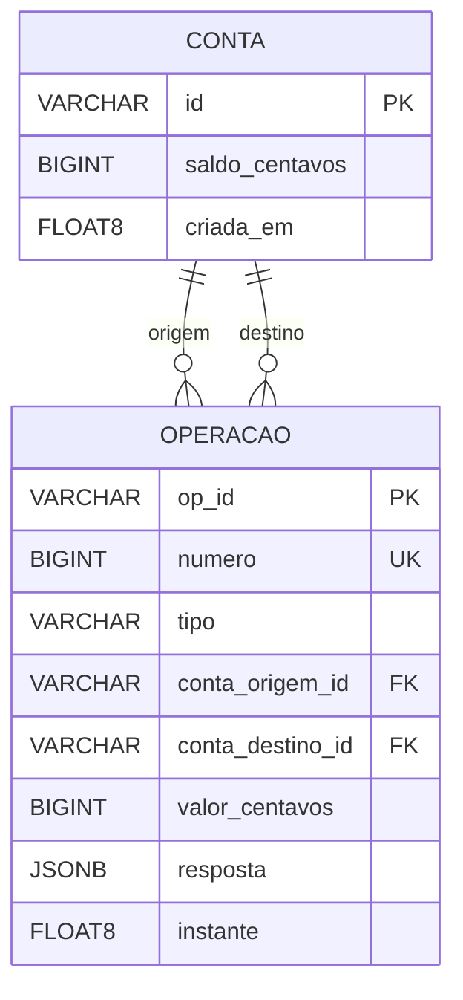

# Protótipo 1 — um banco correto

Trabalho de Computação Distribuída — USP/ICMC, São Carlos.

**O que esta etapa faz, numa frase:** um banco com contas, depósitos, saques,
transferências, extrato e auditoria, onde o dinheiro nunca é criado nem
destruído — nem sequer quando vinte pedidos chegam à mesma conta ao mesmo
tempo, vindos de **duas máquinas diferentes**.

**Estado: 111 testes passam.** 55 correm sem instalar nada; os outros 56 pedem a
pilha do servidor e uma base de dados, e saltam-se sozinhos com o motivo
escrito quando não as há.

Corre de duas maneiras: **um portátil**, com tudo dentro, ou **dois portáteis**
a servir contra a mesma base ([`REDE.md`](REDE.md)). A segunda é a montagem dos
ensaios, e funciona sem uma linha de código a mais porque o servidor não guarda
estado nenhum em memória — quem serializa as escritas é o PostgreSQL.

> **Não há replicação, eleição de primário nem tolerância a falhas**, e dois nós
> contra a mesma base não são replicação: a base é um ponto único de falha. É
> deliberado. O dinheiro tem de estar certo **antes** de ser distribuído — uma
> corrida que passe despercebida aqui vai parecer, na etapa seguinte, um erro de
> replicação, e procurar-se-á no sítio errado durante dias. RF-09 e RF-10 são da
> etapa 2, e estão em [`prototipo-2/`](../prototipo-2/) — lá há três nós, log
> replicado, eleição de primário e failover a sério.

---

## Como executar

### Um portátil, tudo de uma vez

```bash
docker compose up --build
```

Painel em <http://localhost:8080>, API em <http://localhost:8001>.

O painel é composto como um **extrato impresso**, e não como um painel de
administração: o documento ocupa a coluna larga, os controlos vivem num raio
estreito ao lado, e o dinheiro é tipografado para se ler do fundo da sala. Usa
dois tipos próprios, auto-alojados — um desvio a `CODESTYLE.md` 8.2 que está
registado em [`SPECS.md`](../docs/SPECS.md) 11.11.

### Dois portáteis, contra a mesma base

```bash
cp .env.exemplo .env      # NO_ID=A num, NO_ID=B no outro; a mesma BANCO_BD
docker compose -f compose.nuvem.yaml up --build
```

O passo a passo, a demonstração e a tabela de "quando não arranca" estão em
[`REDE.md`](REDE.md).

### Os testes

```bash
# Numa máquina limpa: 55 testes do domínio, sem instalar nada.
python3 -m unittest discover -s tests

# Com a pilha e uma base descartável: os 111.
pip install -r requisitos.txt
createdb banco_teste
BANCO_BD_TESTE=postgresql:///banco_teste python3 -m unittest discover -s tests
```

A base de teste é apagada no início de cada teste, e por isso o código recusa-se
a trabalhar numa base cujo nome não contenha `teste`.

### Só o nó, contra um PostgreSQL já a correr

```bash
pip install -r requisitos.txt
createdb banco && psql banco -f db/esquema.sql
BANCO_BD=postgresql:///banco python3 -m banco.servidor --id A --porta 8001
```

### Um exemplo completo

```bash
curl -X POST localhost:8001/contas -H 'Content-Type: application/json' \
     -d '{"conta":"alice","saldo_inicial":"100.00","op_id":"exemplo-01"}'
curl -X POST localhost:8001/contas -H 'Content-Type: application/json' \
     -d '{"conta":"bob","op_id":"exemplo-02"}'
curl -X POST localhost:8001/transferencias -H 'Content-Type: application/json' \
     -d '{"de":"alice","para":"bob","valor":"25.50","op_id":"exemplo-03"}'
curl localhost:8001/auditoria
```

O dinheiro viaja como **texto**: `"25.50"`, nunca `25.50`. Um número JSON seria
descodificado como `float`, e um `float` em dinheiro é a origem do desvio de
arredondamento que RNF-01 proíbe. Um número é recusado com `400 valor_invalido`.

O `op_id` é gerado **pelo cliente**. É o que torna seguro repetir um pedido de
que não se sabe o desfecho: se a primeira tentativa chegou a ser aplicada, a
segunda devolve o resultado guardado em vez de mover o dinheiro outra vez.

---

## Rotas

| Rota | Método | O que faz |
|---|---|---|
| `/contas` | POST | Cria uma conta (RF-01) |
| `/contas/{id}` | GET | Saldo (RF-02) |
| `/contas/{id}/deposito` | POST | Depósito (RF-03) |
| `/contas/{id}/saque` | POST | Saque (RF-03, RF-06) |
| `/transferencias` | POST | Transferência (RF-04, RF-05) |
| `/contas/{id}/extrato` | GET | Extrato (F-05) |
| `/auditoria` | GET | Total em circulação (RF-14) |
| `/saude` | GET | O processo está de pé |

Os erros têm todos a mesma forma, e por isso o cliente tem um só caminho de
tratamento:

```json
{"erro": "saldo_insuficiente",
 "mensagem": "alice tem R$ 120,00 e a operação pede R$ 500,00"}
```

`valor_invalido` 400 · `conta_inexistente` 404 · `conta_duplicada` 409 ·
`saldo_insuficiente` 422.

---

## Como está organizado

```
banco/
├── dominio/       as regras, puras: sem rede e sem disco
├── repositorio/   o SQL, e só o SQL
├── servico/       a ordem obrigatória de escrita, e as leituras
├── api/           as rotas HTTP e a tradução dos erros
└── servidor.py    o arranque do nó
```

E, à volta: `compose.yaml` (um portátil, com a sua base dentro),
`compose.nuvem.yaml` com `.env.exemplo` (dois portáteis, base partilhada),
`scripts/preparar_base.sh` (cria as tabelas, uma vez) e [`REDE.md`](REDE.md).

As setas apontam sempre para dentro: `api → servico → {dominio, repositorio}`.
O domínio não importa nada de rede nem de disco, e é isso que permite testá-lo
sem instalar nada.

**Toda a escrita passa por uma função**, `ServicoDeEscrita.aplicar()`. As quatro
operações são a mesma sequência de passos com um objeto diferente lá dentro, e
escrevê-la quatro vezes seria dar-lhe quatro sítios para divergir.

---

## A base de dados

Duas tabelas, e não mais. `conta` diz quanto dinheiro existe **agora**;
`operacao` diz **tudo o que aconteceu**. O esquema completo, com o porquê de
cada coluna, está em [`db/esquema.sql`](db/esquema.sql).



| Coluna | Tipo | Regra |
|---|---|---|
| `conta.id` | `VARCHAR(32)` | Chave primária. `CHECK` do formato `[a-z0-9_-]`, 1 a 32 caracteres |
| `conta.saldo_centavos` | `BIGINT` | `NOT NULL`, `CHECK >= 0` — a segunda linha de defesa de RF-06 |
| `conta.criada_em` | `DOUBLE PRECISION` | `NOT NULL`. Instante Unix |
| `operacao.op_id` | `VARCHAR(64)` | Chave primária, **gerada pelo cliente** |
| `operacao.numero` | `BIGINT` | `NOT NULL UNIQUE`, da sequência `operacao_numero` |
| `operacao.tipo` | `VARCHAR(20)` | `CHECK` em `criar_conta`, `deposito`, `saque`, `transferencia` |
| `operacao.conta_origem_id` | `VARCHAR(32)` | Chave estrangeira. Nulo em `criar_conta` e `deposito` |
| `operacao.conta_destino_id` | `VARCHAR(32)` | Chave estrangeira. Nulo em `saque` |
| `operacao.valor_centavos` | `BIGINT` | `NOT NULL`, `CHECK >= 0` |
| `operacao.resposta` | `JSONB` | `NOT NULL`. O corpo que o cliente recebeu |
| `operacao.instante` | `DOUBLE PRECISION` | `NOT NULL`. Instante Unix |

**Porque é que são duas tabelas e não uma.** A auditoria (RF-14) soma as duas de
maneiras independentes e compara: os saldos de `conta` contra o histórico de
`operacao`. Se fosse o mesmo cálculo duas vezes, concordarem não provaria nada.

**As duas chaves estrangeiras são para a mesma tabela**, e é isso que faz uma
transferência ser uma linha só em vez de duas: `conta_origem_id` e
`conta_destino_id` apontam ambas para `conta`. O dinheiro entra pelo destino e
sai pela origem — criar conta e depositar só têm destino, sacar só tem origem, e
é essa assimetria que faz a auditoria somar certo sem conhecer as operações uma
a uma.

Quatro escolhas que valem a explicação:

| Escolha | Porquê |
|---|---|
| `op_id` é a **chave primária**, e vem do cliente | É a deduplicação (SPECS 3.3): repetir a mesma escrita move o dinheiro uma vez só. A base garante-o, não só o código |
| `op_id` é `VARCHAR`, não `UUID` | SPECS 3.3 dá `"3f1c8a2e"` como exemplo, que não é um UUID. A coluna `UUID` apertaria mais do que a especificação e devolveria um 500 do *driver* em vez de um `400 valor_invalido` explicado |
| Os instantes são `DOUBLE PRECISION`, não `TIMESTAMP` | SPECS 3.2 diz instante Unix. Com um `TIMESTAMP` sem fuso, dois portáteis com fusos diferentes leem valores diferentes da mesma linha |
| `resposta` guarda o corpo que o cliente recebeu | Ao repetir o `op_id` devolve-se **isto**, verbatim. Recalcular a partir dos saldos de agora daria uma resposta diferente se entretanto houvesse outras operações |

**Não há coluna `estado`.** Sem *commit* em duas fases, a linha só existe se a
transação confirmou — um campo a dizer o mesmo seria um segundo sítio a poder
divergir do primeiro.

**`numero` ordena, não conta.** É o `indice` de SPECS 3.3 no que importa aqui:
dar uma ordem total às operações, para o extrato não depender de dois instantes
empatarem. Não é contíguo, porque uma sequência do PostgreSQL não volta atrás
quando a transação é revertida.

---

## As três decisões que sustentam a invariante

**1. Dinheiro é inteiro de centavos.** Nunca `float`, em lado nenhum. A
conversão a partir de texto acontece uma única vez, na fronteira. Somar dez mil
valores em vírgula flutuante desvia-se por arredondamento, e o teste da
invariante falharia a apontar para o sítio errado.

**2. A transferência é uma só função, sem estado intermédio.** Não existe
instante nenhum em que o dinheiro tenha saído de uma conta e ainda não tenha
entrado na outra. Não há commit em duas fases porque não é preciso: as duas
contas estão sempre no mesmo nó.

**3. As contas são bloqueadas por ordem crescente de id.** A ordem nasce em
`Operacao.contas_tocadas()`, que já devolve os ids ordenados, e quem bloqueia
percorre a tupla e pronto — não tem de se lembrar da regra, e por isso não a
pode esquecer. É o que torna impossível o impasse de `alice→bob` contra
`bob→alice`.

**4. O servidor não guarda estado nenhum entre pedidos.** Cada pedido abre a sua
ligação, e os *locks*, a chave de deduplicação e a ordem das operações vivem
todos na base. É por isso que dois nós contra a mesma base ficam certos sem uma
linha de código a mais: dois processos em máquinas diferentes pedem os mesmos
*locks* que dois fios na mesma pediriam.

---

## Requisitos cobertos

| | |
|---|---|
| **Cobertos** | F-01 a F-07 · RF-01 a RF-08, RF-14 · RNF-01, RNF-08, RNF-10 |
| **Parcial** | RNF-09 (um comando, sim: `docker compose up`. Mas sem instalar nada, só os 55 testes do domínio) |
| **Fora desta etapa** | F-08 a F-11 · RF-09 a RF-13, RF-16 · RNF-02, RNF-03, RNF-06 — replicação, eleição e failover são das etapas seguintes |
| **Não cobertos em lado nenhum** | F-12 e RF-17, o cliente de linha de comando. Ver "o que mudou", abaixo |

**RF-04 fala em contas "em servidores diferentes", e com a montagem dos dois
portáteis está coberto a sério:** uma transferência pedida ao nó B mexe em contas
que o nó A também serve, e `teste_dois_nos.py` verifica-o. O que continua por
cobrir é a *tolerância a falhas* — os dois nós partilham a base, e não sobrevivem
à queda dela.

---

## O que mudou face à etapa entregue

Esta pasta foi reconstruída a partir de `projeto-final/`, para voltar a ser o que
a divisão em etapas precisa que ela seja: um banco de um nó só, a funcionar
isolado. O que lá estava antes — PostgreSQL como log replicado, eleição,
failover, injeção de falhas e um painel de cluster — era trabalho das etapas 2 e
3 a viver na pasta da etapa 1.

| Antes (`git show 3683a0f`) | Agora |
|---|---|
| `http.server` da biblioteca padrão | FastAPI e uvicorn |
| WAL em JSONL, com PostgreSQL como armazém do log | PostgreSQL como estado, em duas tabelas |
| `dominio`, `persistencia`, `cluster`, `interface` | `dominio`, `repositorio`, `servico`, `api` |
| Locks em memória, por conta | `SELECT ... FOR UPDATE`, por conta |
| Replicação, eleição, failover, injeção de falhas | Nada disso: é de outra etapa |
| Cluster de três nós, cada um com a sua base | Um ou dois nós, contra **uma** base ([`REDE.md`](REDE.md)) |
| Cliente de linha de comando | Painel web |
| 305 testes | 111 testes |

**Quatro defeitos do projeto final que não vieram atrás**, todos encontrados a
portar o código:

1. `guardar` de contas era um *upsert*. Com o id a vir do cliente, criar a conta
   `alice` outra vez passava a ser um comando que **repõe o saldo da alice**.
2. Não havia `FOR UPDATE`. Vinte saques simultâneos de R$ 1,00 numa conta com
   R$ 10,00 passavam os vinte.
3. `para_centavos` fazia `str(texto)` antes de validar, e por isso aceitava em
   silêncio o número `25.00` que SPECS 6 manda recusar.
4. A auditoria devolvia `Decimal`, porque `SUM()` sobre `BIGINT` devolve
   `numeric` — um valor que ia acabar em vírgula flutuante ao ser serializado.

**O que se perdeu, dito sem rodeios:** o cliente de linha de comando (F-12,
RF-17) deixa de existir no repositório inteiro — `projeto-final/` também não
tem. Quem quiser vê-lo tem de ir a `git show 7b430e6`. A replicação, a eleição
e o failover, que existiam nesta pasta, também deixaram de existir em qualquer
sítio. **Foram recuperadas**, para [`prototipo-2/`](../prototipo-2/), que é onde
a etapa 2 sempre devia ter estado — ver `docs/SPECS.md` 11.10.

---

## Modos de falha conhecidos (RNF-10)

| Situação | O que acontece | Porquê |
|---|---|---|
| O nó morre a meio de uma transferência | Nada se perde e nada fica a meio | A transação do PostgreSQL ou confirma tudo ou reverte tudo |
| O nó morre | Com um nó, o banco fica fora do ar até voltar. Com dois, o outro continua a servir | Não é tolerância a falhas: é só não haver estado no processo que morreu |
| **A base partilhada fica inacessível** | **Os dois nós devolvem 500** | É o ponto único de falha desta montagem. Não há réplica da base, e é a etapa 2 que resolve isto |
| O PostgreSQL fica inacessível | Todas as rotas devolvem 500 | Não há repetição automática nem modo degradado |
| Contra uma base na nuvem, cada pedido demora centenas de milissegundos | É conhecido e aceite | Uma ligação nova por pedido, e o custo é o TLS. Não há *pool*: `CONVENCOES.md` manda não o acrescentar sem um problema medido. O comando para o medir está em [`REDE.md`](REDE.md) |
| Os dois portáteis com `NO_ID=A` | O banco funciona, mas os dois painéis dizem o mesmo | Só afeta quem está a olhar. A tabela de [`REDE.md`](REDE.md) diz como corrigir |
| Duas criações **simultâneas** da mesma conta com o mesmo `op_id` | Uma responde 409 em vez de devolver o resultado guardado | Uma conta que ainda não existe não tem linha para bloquear, por isso as duas passam a validação e a chave primária decide. O dinheiro fica correto; só a resposta é que é feia |
| Um pedido demora mais de 5 s a obter um lock | 500, em vez de ficar à espera para sempre | `lock_timeout`. Com a ordem total dos locks isto nunca devia acontecer; existe para um erro futuro aparecer como erro e não como suite pendurada |
| Uma transação é revertida | O número da operação seguinte salta | Uma sequência não volta atrás. O número serve para ordenar, não para contar |
| Dinheiro enviado como número JSON | 400 `valor_invalido` | É um modo de falha desejado: ver a decisão 1 |

**Não há cópias de segurança.** Apagar o volume do PostgreSQL apaga o banco.
`docker compose down -v` faz exatamente isso.

---

## Resultados

| | |
|---|---|
| `banco/` | 1 243 linhas em 23 ficheiros |
| `tests/` | 1 458 linhas, 111 testes |
| `frontend/src/` | 1277 linhas |
| Suite completa | ~21 s |
| Módulo maior | `dominio/operacoes.py`, 230 linhas |

**A prova de que os testes de concorrência provam alguma coisa:** tirando a
cláusula `FOR UPDATE` de `banco/repositorio/contas.py`, cerca de nove testes
falham — o número exato varia de execução para execução, porque são corridas e
há sempre uma que passa por sorte. O que não varia é
`teste_saques_concorrentes_nao_ultrapassam_o_saldo`, com um nó e com dois.

Os números que se veem quando falha: com um nó, o total em circulação **sobe**
de R$ 200,00 para R$ 201,00; com dois nós, passam os vinte saques em vez de dez
e o total **desce** de R$ 200,00 para R$ 197,00. Dinheiro criado num caso e
destruído no outro. Foi verificado, e é o resultado que dá sentido a todos os
outros.

---

## Divisão de trabalho

| Número USP | Nome | Nesta etapa |
|---|---|---|
| 18404636 | Jefferson Daniel Flores Montenegro | Domínio: dinheiro, contas, operações e a invariante |
| 18514632 | Cristhian Jesus Maylle Briceño | Concorrência: ordem dos locks e os testes que a provam |
| 17819748 | Paulo Sebastian Rojo Pinedo | Persistência, rotas HTTP, painel web e Docker |
