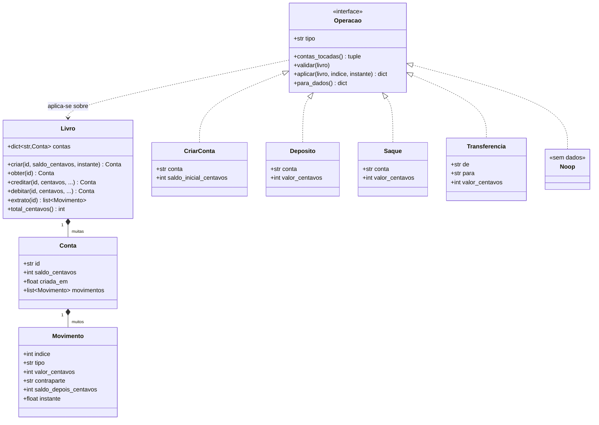
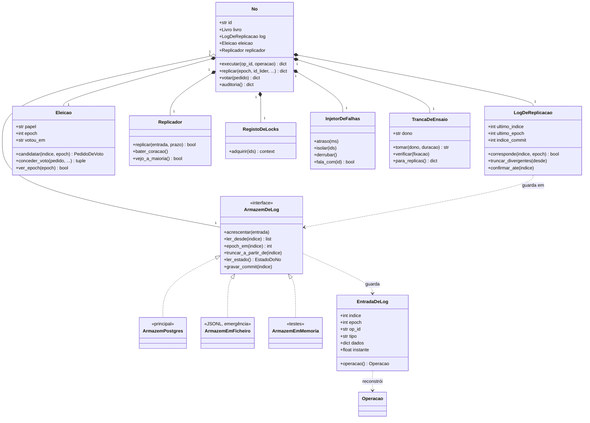
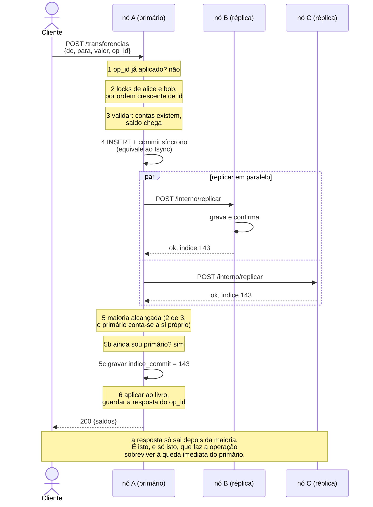
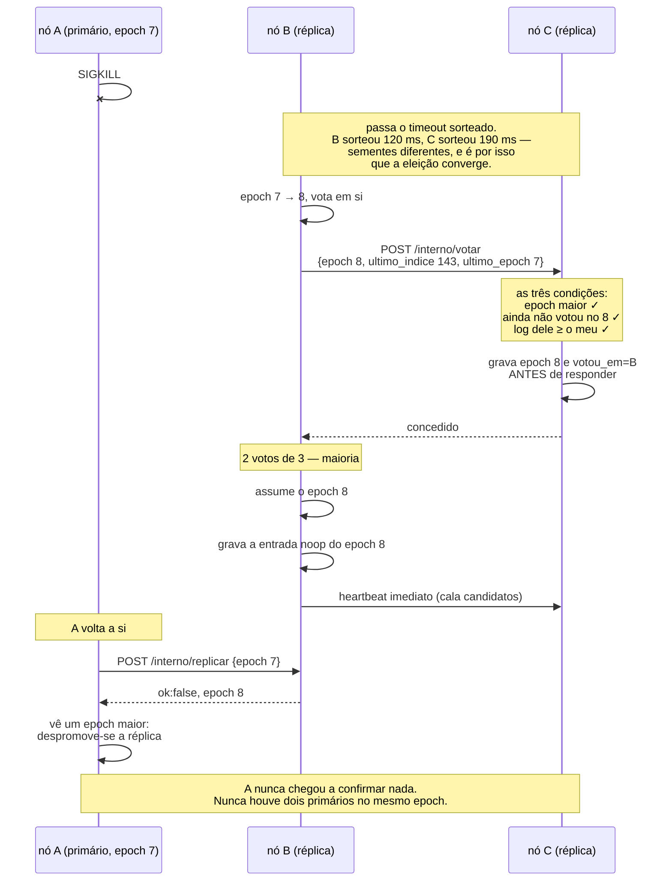
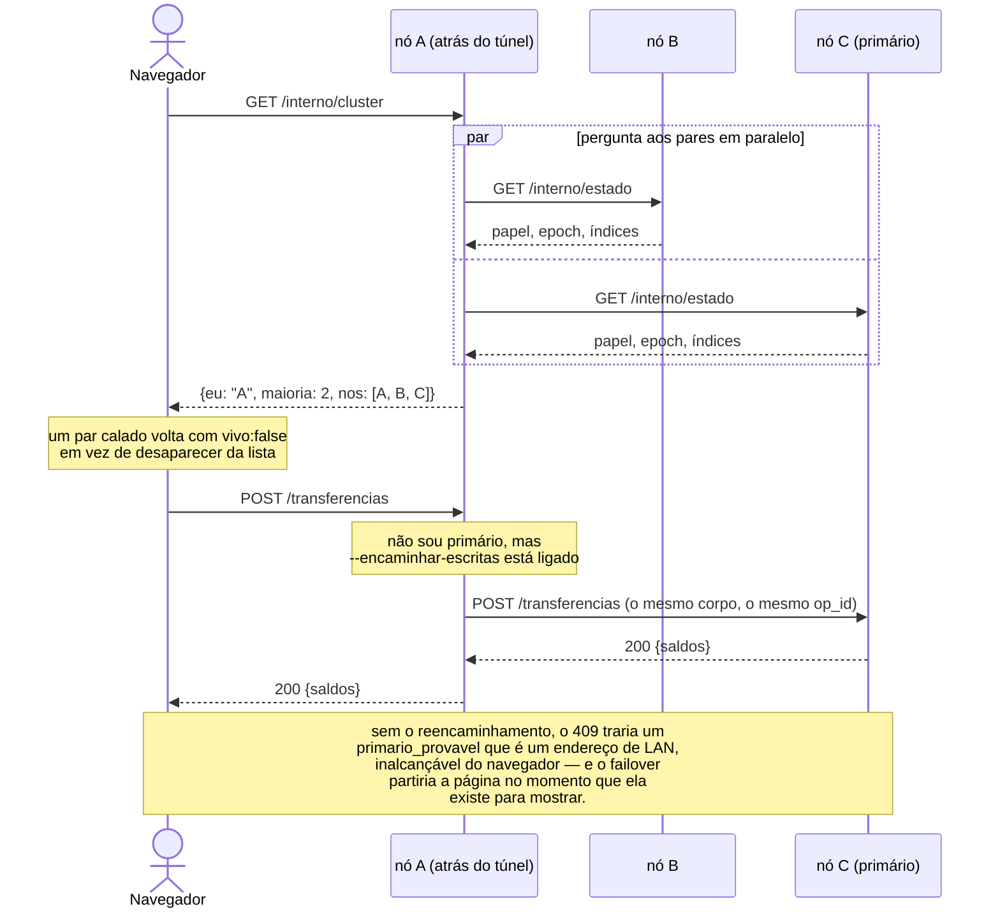
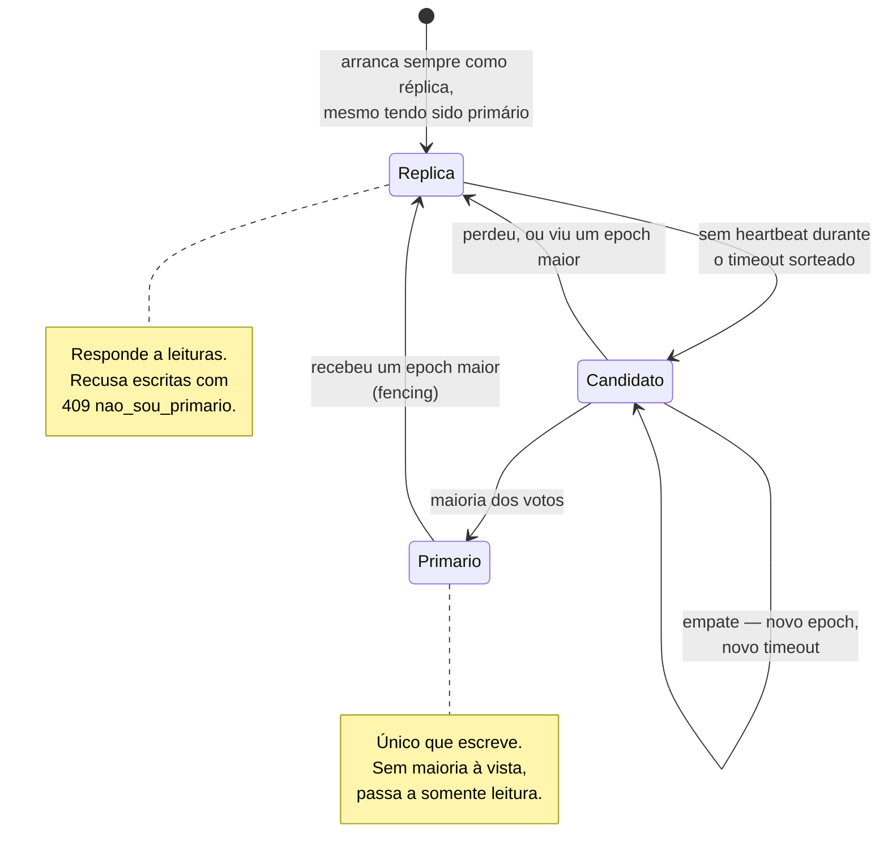
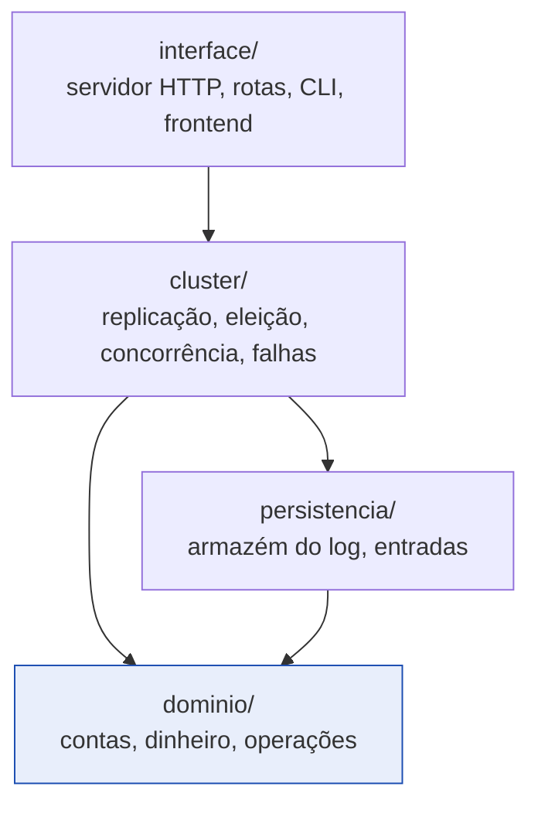

# Diagramas do banco

Em Mermaid, para renderizarem sozinhos no GitHub sem instalar nada — a mesma
razão por que o projeto não tem dependências.

Os diagramas mostram **o que existe no código**, não uma versão idealizada dele.
Quando divergirem, o código é que está certo e o diagrama é que está velho.

---

## 1. Domínio: cliente, conta e operações

O núcleo do banco, e a única parte que não sabe nada de rede nem de disco.



**O que o diagrama esconde e vale a pena dizer:** não há classe `Cliente`. Uma
conta é identificada por um `id` e mais nada — sem nome, sem documento, sem dono.
Não é esquecimento: autenticação está fora do âmbito por decisão da proposta, e
uma tabela de clientes sem autenticação seria decoração que ninguém usa.

**`Transferencia` é uma operação só.** Débito e crédito acontecem na mesma
chamada a `aplicar`, e é daí que vem a atomicidade de RF-05. Não existe instante
nenhum em que o dinheiro tenha saído de uma conta e ainda não tenha entrado na
outra.

---

## 2. Persistência e cluster

Como uma operação passa de objeto a linha durável, e quem a replica.



O `ArmazemDeLog` é uma interface por uma razão prática, não por gosto de
abstrair: os 305 testes correm numa máquina sem PostgreSQL instalado, e a
demonstração tem uma saída de emergência se a base não arrancar no dia.

**O `No` está partido em dois ficheiros**, e a divisão é por audiência:
`cluster/no.py` é o **banco** — aceita operações de clientes e responde a
leituras; `cluster/protocolo.py` é o **participante do protocolo** — atende os
pares em `/interno/replicar` e `/interno/votar`. Vem como *mixin* e não como
objeto à parte por honestidade: esses métodos mexem no mesmo livro e no mesmo log,
e fingir que são um colaborador independente esconderia o acoplamento em vez de o
resolver.

`cluster/vista.py` é um terceiro caminho, e está separado por uma razão de
correção: o frontend pergunta pelo cluster uma vez por segundo, e se essas chamadas
partilhassem o `ThreadPoolExecutor` de dois lugares que envia os *heartbeats*, uma
página aberta podia atrasar o batimento — e um *heartbeat* atrasado derruba um
primário saudável.

---

## 3. Uma transferência confirmada por maioria

A ordem dos passos é a da secção 5 do [`SPECS.md`](../docs/SPECS.md) e não pode
mudar.



---

## 4. Failover com fencing por `epoch`

O que acontece quando o primário morre a meio.



**Por que é que a `noop` existe.** Uma entrada herdada do primário anterior, mesmo
presente na maioria dos nós, não pode ser confirmada por contagem de réplicas: há
um cenário conhecido em que acaba sobrescrita por um líder seguinte, e uma
operação já dada como confirmada desapareceria. Confirmando primeiro a `noop` do
`epoch` atual, tudo o que vem antes fica confirmado por arrasto.

---

## 4.1 Como o frontend vê o cluster

O túnel HTTPS aponta a **um** nó, mas o ecrã mostra os três.



O nó que reencaminha é um **cliente puro**: não grava nada, não toca no seu log, e
por isso a ordem da secção 5 do SPECS continua intacta. O `op_id` vem no corpo
original, o que torna o reenvio seguro de repetir.

---

## 5. Os papéis de um nó



---

## 6. As camadas, e o que cada uma pode importar



`dominio/` não importa nada de rede nem de disco, e isso é verificável:

```bash
grep -rn "^import\|^from" banco/dominio/*.py
```

A mesma sequência de entradas de log produz exatamente o mesmo estado em qualquer
nó, e é essa pureza que faz a replicação por log e a recuperação por *replay*
funcionarem.
