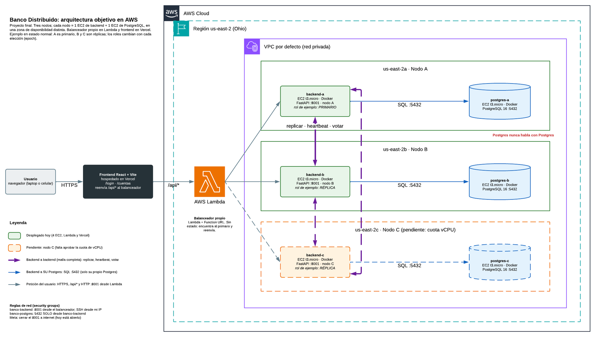
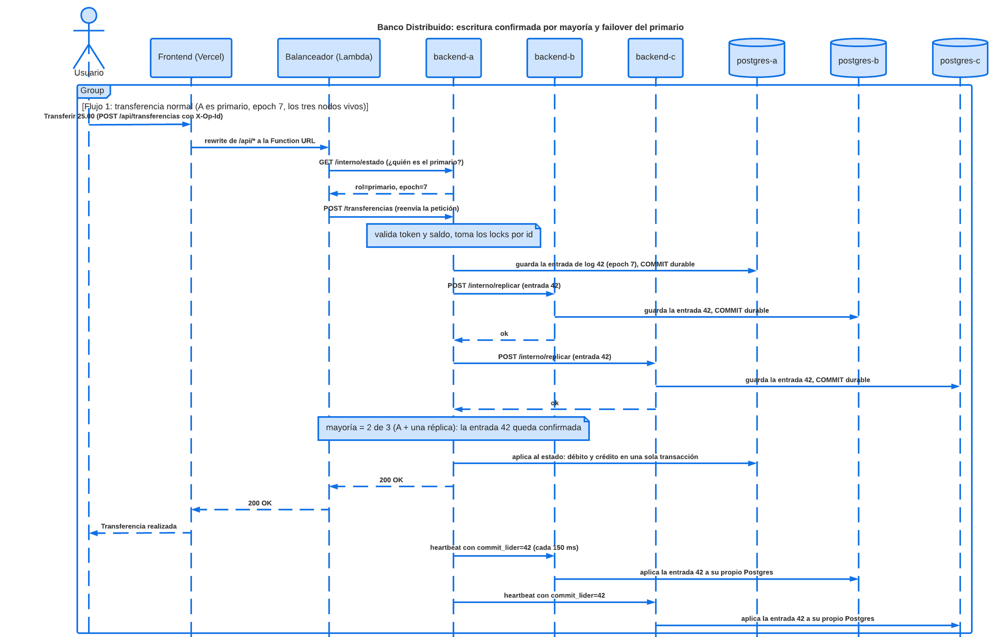
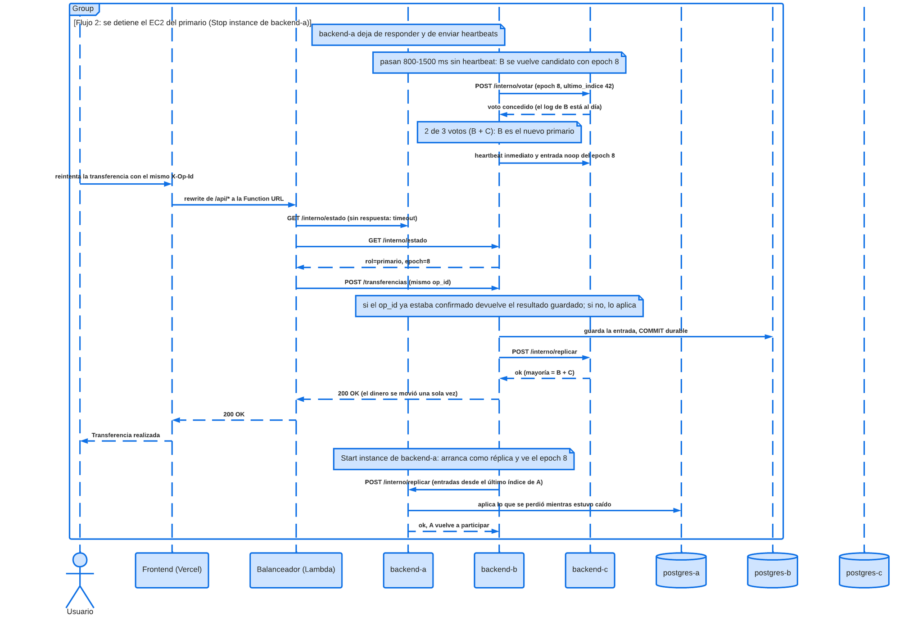

# Proposta de arquitetura: o banco distribuído em servidores reais da AWS

> **Estado:** rascunho para discutir em grupo · **Data:** 21 de setembro de 2026
> **Região AWS:** `us-east-2` (Ohio) · **Grupo:** Jefferson, Cristhian e Paulo
>
> Explica **o que queremos construir, com que peças e por que ordem**. Não repete os
> passos de consola de [`GUIA-IMPLANTACAO.md`](GUIA-IMPLANTACAO.md) nem o detalhe do
> protocolo: liga-os.
>
> **Estado a 5 de outubro de 2026:** a Fase 2 (§7) está feita no `prototipo-2/` e
> provada localmente com o `compose.yaml` — eleição, log replicado, maioria,
> failover e reintegração (ver `../README.md` e `../provas/`). As secções 4.1 e 5.1
> descrevem o *stub* que havia antes; ficam como registo do ponto de partida.
>
> Os documentos de `docs/` que cita foram retirados do repositório no commit
> `0307715`; leem-se com `git show 0307715^:docs/<caminho>`. O protocolo que o §4.3 e a
> Fase 2 mandam portar é o da primeira versão desta pasta: `git show 0307715:prototipo-2/<caminho>`.

| Tens | Lê |
|---|---|
| 1 minuto | §1 |
| 5 minutos | §1, §2 e §3 |
| Queres saber **porque** a arquitetura é assim e não outra | §2.3 |
| Queres saber porque **os Postgres não falam entre si** | §2.4 |
| Vais programar ou implantar | §5, §6 e §7 |
| Vais preparar a demonstração | §8 |
| Há que decidir algo | §10 |

---

## 1. Resumo num minuto

**O que queremos.** Uma **simulação bancária** (o dinheiro e os clientes são de teste) que
corre sobre **instâncias reais da AWS**: várias instâncias ligadas ao mesmo tempo, que se
desligam e voltam a ligar, e que **se vão sincronizando sozinhas** ao voltar. O que se simula
é o banco; o real são os servidores, a rede, as quedas e a sincronização. Assim, na defesa
pode-se **desligar um EC2 a partir da consola e ver que o banco continua a funcionar, sem
perder nem duplicar dinheiro**, e depois ligá-lo e ver como se põe em dia.

**Como, em quatro ideias:**

1. **Três nós, seis EC2.** Cada nó são dois servidores: um com o backend (FastAPI) e outro
   com o seu PostgreSQL. Cada nó fica numa zona de disponibilidade diferente
   (`us-east-2a`, `2b`, `2c`).
2. **Balanceador próprio no AWS Lambda e frontend no Vercel.** Não usamos ALB, RDS nem
   nenhum serviço que faça a réplica por nós: eleger o primário, confirmar por maioria e
   recuperar de uma queda é justamente o que a disciplina avalia.
3. **Regra de comunicação.** Cada backend fala **só com o seu próprio Postgres**. Os
   **backends falam entre si** (replicar, *heartbeat*, votar). Os **Postgres nunca falam**.
   As três bases ficam iguais porque os três backends aplicam **a mesma sequência de
   operações**, confirmada por maioria; não porque o Postgres replique (§2.4).
4. **Onde estamos.** Já há 4 EC2 (nós A e B), o Lambda e o frontend no Vercel, mais o
   domínio bancário correto do Protótipo 1. **Falta** o protocolo entre backends (hoje
   [`backend/banco/cluster/no.py`](../backend/banco/cluster/no.py) é um *stub*), o nó C
   (quota de vCPU) e fechar a rede.

**O que precisamos do grupo:** validar a arquitetura (§2), decidir os pontos do §10 e
repartir as fases do §7.

**Âmbito.** *Dentro:* login, criar conta, depositar, sacar, transferir, extrato e
auditoria; três nós com réplica, eleição, failover e reintegração; balanceador; frontend;
testes de falha e medições. *Fora, por agora:* multimoeda, poupança, prazo fixo e
transferência externa (RF-19 a RF-25), cópias de segurança e multi-região. Primeiro o
distribuído; depois o bancário extra.

---

## 2. A arquitetura objetivo



*Arquitetura objetivo. Clica na imagem para a ver em tamanho completo. Original editável no
[Lucidchart](https://lucid.app/lucidchart/cacc6b00-521f-4c45-b4e4-439fa28070ff/view),
página «1. Arquitectura objetivo» (privado: tem de ser partilhado a partir do Lucid). Laranja
e tracejado: o que ainda não existe (nó C). O texto da imagem está em espanhol, tal como no
original.*

Lê-se da esquerda para a direita: o utilizador entra pelo Vercel, o Lambda encontra o primário
e, dentro da VPC, cada nó tem o seu backend e o seu Postgres. As linhas **roxas** são a
comunicação entre backends; as **azuis**, cada backend com o seu próprio Postgres.

### 2.1 As peças

| Peça | Onde corre | Guarda estado? | Para que serve |
|---|---|---|---|
| Frontend React + Vite | Vercel | Não | As páginas. Fala sempre com `/api/*`, nunca com um nó |
| Balanceador próprio | AWS Lambda (Function URL) | Não | Encontra o primário e envia-lhe as escritas; segue o redirecionamento `409` quando se engana |
| `backend-a`, `backend-b`, `backend-c` | 3 EC2 `t3.micro` com Docker, uma por zona | Sim: papel, `epoch` e log | Regras do banco e protocolo de réplica |
| `postgres-a`, `postgres-b`, `postgres-c` | 3 EC2 `t3.micro` com Docker, **separadas** do seu backend | Sim: os dados do nó | Armazenamento do nó; só o seu backend o usa |

### 2.2 Quem fala com quem

| De | Para | Como | Para quê |
|---|---|---|---|
| Utilizador | Vercel | HTTPS | Carregar a aplicação |
| Vercel | Lambda | HTTPS, *rewrite* de `/api/*` ([`frontend/vercel.json`](../frontend/vercel.json)) | Enviar as chamadas da API ao balanceador |
| Lambda | Os backends | HTTP `:8001` | Perguntar `/interno/estado` e reenviar o pedido ao primário |
| Backend | **O seu próprio** Postgres | SQL `:5432`; o *security group* `banco-postgres` só aceita `banco-backend` | Guardar log e estado |
| Backend | Os outros backends | HTTP `:8001`: `/interno/replicar`, `/interno/votar`, `/interno/log`, `/interno/estado` | Réplica, *heartbeat* e eleições |
| Postgres | Postgres | **Nunca** | Não usamos `streaming replication` (§2.4) |

Se algum diagrama mostrar uma linha entre dois Postgres, está errado.

### 2.3 Porque a arquitetura é assim e não outra

Cada decisão tem uma alternativa razoável. Esta tabela diz qual descartámos e porquê. O
critério comum: como isto é uma simulação bancária cujo objetivo é **ver instâncias que se
desligam e se sincronizam**, ganha o que deixa **desligar e ligar cada peça em separado** e
o que **torna visível o protocolo** (eleição, maioria, sincronização).

| Decisão | Alternativa descartada | Porquê esta e não a outra |
|---|---|---|
| **3 nós** | 2 nós | Com 2 a maioria é 2: ao desligar um, o outro não pode escrever. Com 3 desliga-se um e os outros dois continuam (§6.5). Hoje há 2 só pela quota de vCPU |
| **Um nó por zona de disponibilidade** (`2a`, `2b`, `2c`) | Todos numa zona, ou um nó por região | Se todos estiverem numa zona e essa zona falhar, caem os 3 de uma vez e a maioria não serve de nada. Entre regiões a latência (50 a 100 ms) confunde-se com uma queda: o *heartbeat* é de 150 ms e o *timeout* de eleição de 800 a 1500 ms, e saltariam eleições falsas. Entre zonas de uma região é de 1 a 2 ms |
| **Backend e Postgres em EC2 separadas** | Os dois na mesma instância | Decisão do grupo (ADR-0002). Cada peça desliga-se e liga-se em separado, por isso testam-se falhas diferentes (cai só o backend, cai só o Postgres) e uma não arrasta a outra. Custo: um salto de rede dentro da VPC (milissegundos) e 6 instâncias em vez de 3 |
| **Postgres num EC2 próprio, com Docker** | RDS, Aurora, Cloud SQL | Os serviços geridos replicam e fazem failover por conta própria, e escondem justamente o que se avalia (RF-09, RF-10, RF-13). Além disso, a sua alta disponibilidade não é gratuita. Num EC2 próprio somos nós que decidimos quando se desliga e se liga |
| **Backend em EC2 com Docker** | Fargate ou ECS, Kubernetes, Lambda | Um nó tem identidade fixa, estado próprio e está ligado o tempo todo (*heartbeat* a cada 150 ms): não é o perfil de um serviço efémero de «pagar por uso» e, ligado 24/7, costuma custar mais do que uma VM. Além disso, «desligar um EC2» é exatamente o teste que queremos mostrar |
| **Balanceador próprio, no Lambda** | ALB ou NLB da AWS, ou um EC2 para o balanceador | O professor falou de um balanceador para a réplica do backend e o grupo decidiu **construí-lo, não contratá-lo**. Aqui não se reparte carga: só o primário aceita escritas, por isso o balanceador **procura o primário e segue o redirecionamento `409`** (RF-13). O Lambda não tem estado, não precisa de estar sempre ligado e não acrescenta uma sétima instância. Custo: *cold start* e esperas de até 2 s por nó (G7) |
| **Frontend estático no Vercel** | Nginx num EC2, S3 ou Amplify | É estático e sem estado, não faz parte do protocolo avaliado, é grátis e implanta-se a cada `push`. Mais um EC2 seria a sétima instância sem acrescentar nada (ADR-0002). Atenção: depende da conta do GitHub do dono do repositório (R9) |
| **Backends ligados todos com todos** | Uma estrela com um coordenador central | O primário fala com cada réplica (replicar e *heartbeat*) e qualquer um pode tornar-se candidato e pedir votos aos outros, por isso os três pares têm de poder falar. Um coordenador central seria um ponto único de falha: precisamente o que se quer evitar |
| **Confirmar por maioria** (2 de 3) | Confirmar só no primário, ou esperar pelos três | Confirmar só no primário perde o «confirmado» se este se desligar. Esperar pelos três bloqueia as escritas assim que há um nó desligado. A maioria aguenta uma queda e, como duas maiorias partilham sempre um nó, o novo primário tem tudo o que foi confirmado |
| **Replicar comandos entre backends** | Replicação nativa do Postgres ou RDS Multi-AZ | Ver §2.4 |
| **`t3.micro` em `us-east-2`** | Instâncias maiores ou outra região | É uma simulação: 2 vCPU e 1 GiB chegam e o custo cabe nos créditos (§9). `us-east-2` é onde já está tudo implantado e as suas 3 zonas chegam para os 3 nós. Para medir desempenho pode ser preciso um tipo maior só durante algum tempo (R8) |

### 2.4 Porque é que as bases de dados não comunicam entre si?

**Resposta curta.** Porque **a réplica é exatamente o que este projeto tem de construir**, e
porque assim cada Postgres é só um armazém que se pode desligar e ligar sem arrastar os
outros. Os **backends** decidem o que se replica, quando algo fica confirmado e quem manda;
cada Postgres guarda o que o seu backend lhe ordena e nada mais.

**O que aconteceria se os Postgres falassem entre si** (*streaming replication* nativa ou
RDS Multi-AZ):

1. **O motor decidiria por nós.** O Postgres copia as alterações para as suas réplicas, mas
   **não elege** o primário sozinho: precisa de um orquestrador (Patroni com etcd, ou o
   serviço gerido da AWS). A eleição, a maioria e a recuperação (RF-09, RF-10, RF-13)
   ficariam fora do nosso código.
2. **As réplicas nativas não aceitam escritas** até alguém as «promover». No nosso desenho,
   qualquer nó pode passar a primário com votos.
3. **A cópia nativa é assíncrona por omissão:** o primário confirma antes de a réplica ter o
   dado e, se cair nesse instante, perde-se o confirmado (contra RNF-02). Existe a síncrona,
   mas então seria o motor, e não o nosso protocolo, a decidir o que é uma «maioria».
4. **Seria preciso abrir a 5432 entre as bases** e configurá-las entre si (`wal_level`,
   utilizador de réplica, `primary_conninfo`, `pg_hba.conf`): mais superfície de rede e mais
   coisas que se partem ao desligar e ligar instâncias. Uma réplica que esteve desligada
   tempo demais tem de ser semeada de novo com uma cópia completa (`pg_basebackup`).

**As três formas de replicar, lado a lado**

| | A) *Streaming replication* nativa | B) RDS Multi-AZ | C) Réplica pela aplicação (**a nossa**) |
|---|---|---|---|
| Quem elege o primário | Um orquestrador externo (Patroni ou outro) | A AWS, sem que o vejamos | **Os nossos backends**, com voto e `epoch` |
| Quem decide que algo está confirmado | O motor (síncrono ou assíncrono) | A AWS | **Os nossos backends**, por maioria |
| Vê-se na demonstração o que a disciplina avalia? | Não: fá-lo o Postgres | Não: é uma caixa negra | **Sim**: cada passo é nosso e pode mostrar-se |
| Ao desligar e ligar uma instância | A réplica põe-se em dia pelo WAL, ou tem de ser semeada de novo | A AWS resolve sozinha | O backend que volta põe-se em dia com o log (exemplo abaixo) |
| Custo | O dos EC2 | Alta disponibilidade paga | O dos EC2 |
| Dificuldade para o grupo | Média: configurar e operar | Baixa | **Alta**: é preciso implementar e testar o protocolo |

A e B estão descartadas desde o ADR-0001 (detalhe em
[`GUIA-REPLICA-POSTGRESQL.md`](GUIA-REPLICA-POSTGRESQL.md)).

**O que ganhamos por só os backends falarem**

1. **O protocolo é nosso e vê-se.** Eleição, maioria, sincronização e reintegração são
   código do grupo, não configuração do Postgres.
2. **As falhas ficam isoladas.** Cada Postgres é independente: se um cai ou se corrompe, não
   arrasta os outros. **Um Postgres em baixo equivale a um nó em baixo.**
3. **Liga-se e desliga-se sem cerimónia.** Como os Postgres não têm configuração de réplica,
   pode desligar-se e ligar-se qualquer instância; ao voltar, o seu backend põe-no em dia
   com o log.
4. **A rede é mais simples e mais segura.** A porta 5432 só se abre para o backend do mesmo
   nó (*security group* `banco-postgres`). Os Postgres não precisam de se ver nem de ter
   utilizador de réplica.
5. **Verifica-se com facilidade.** Se o protocolo estiver certo, as três bases acabam com a
   mesma impressão digital (Fase 3). Se diferirem, há um erro no nosso código, não um
   mistério do motor.
6. **É a mesma ideia que o domínio já usa:** o mesmo código aplicado à mesma sequência de
   comandos dá o mesmo estado (Protótipo 1).

**O que pagamos em troca**

- É preciso **implementar e testar o protocolo** (Fase 2). É mais trabalho do que ativar uma
  funcionalidade do Postgres, e um erro pode produzir divergência (R2).
- Cada escrita espera uma ida e volta às réplicas antes de se confirmar (afeta RNF-05).
- Tudo o que não é determinista (datas, ids, sal do hash) tem de ser decidido no primário
  (G5).
- Não serve para dinheiro real: sem cópias de segurança nem arquivo do WAL (G10). Para uma
  simulação bancária é o correto.

**Como as instâncias se vão sincronizando ao desligar e ligar.** Exemplo com os índices do
log de cada nó:

| # | O que acontece | Último índice em A | em B | em C |
|---|---|---|---|---|
| 1 | Os 6 EC2 estão ligados e A é primário | 42 | 42 | 42 |
| 2 | Para-se o `backend-a` (*Stop instance*). B ganha a eleição | 42 (desligado) | 42 | 42 |
| 3 | Entram as operações 43, 44 e 45. B e C guardam-nas (maioria: 2 de 3) | 42 | 45 | 45 |
| 4 | Liga-se o `backend-a`. O seu Postgres conserva os dados; arranca como réplica e vê um `epoch` maior | 42 | 45 | 45 |
| 5 | B envia-lhe as entradas 43 a 45 (`/interno/replicar`). A guarda-as e aplica-as no **seu** Postgres | 45 | 45 | 45 |
| 6 | Corre-se a impressão digital de convergência nas três bases | igual | igual | igual |

Se em vez do backend se desligar o EC2 do Postgres de um nó, acontece o mesmo: esse backend
não consegue guardar, deixa de confirmar e conta como em baixo; quando o Postgres volta,
sincroniza-se da mesma forma pelo log.

---

## 3. O que se simula e o que é real

| Simula-se (dados de teste) | É real (AWS) |
|---|---|
| O banco: contas, saldos, clientes e dinheiro de laboratório | Os servidores: EC2 com discos, IPs e *security groups* a sério |
| As operações: depositar, sacar, transferir | A rede entre zonas de disponibilidade e as suas latências |
| Os extras bancários, se se chegarem a fazer: taxas de câmbio, poupança, prazo fixo | As **falhas**: desliga-se uma instância a sério a partir da consola |
| | A **sincronização**: os dados viajam pela rede e aplicam-se em cada Postgres |

**Face aos protótipos.** A ideia é simples: **o protocolo não muda; muda onde corre e como se
parte.**

| Conceito | Nos protótipos (processos em portáteis) | Na AWS (esta proposta) |
|---|---|---|
| Um «nó» | Um processo Python (`python -m banco.servidor --id A --porta 8001`) num portátil | Um par de EC2: `backend-a` (contentor FastAPI) e `postgres-a` (contentor PostgreSQL), em `us-east-2a` |
| Três nós | Três portáteis, ou três processos em dois portáteis | Três pares de EC2, um por zona de disponibilidade |
| Rede entre nós | Wi-Fi ou LAN, `config/cluster.json` com IPs de portáteis, firewall do portátil | VPC da AWS, IPs privados, *security groups* |
| Base de dados | Ficheiro JSONL (WAL) ou Postgres local | PostgreSQL 16 no seu próprio EC2, um por nó, sem ligação entre eles |
| «Matar um nó» | `kill -9` do processo ou `POST /admin/falha` | *Stop instance* na consola do EC2 (ou `docker stop`) |
| Quem encontra o primário | O CLI `banco.cli` | O balanceador no Lambda ([`encaminhador.py`](../balanceador/balanceador/encaminhador.py)) |
| Interface | CLI e painéis locais | Frontend React no Vercel |
| Verificar a rede | `scripts/verificar_rede.sh` | O mesmo `curl` a `/interno/estado`, contra os IPs privados dos EC2 |
| Custo | 0 | Créditos da AWS (§9) |

**O que não muda:** o domínio (dinheiro em centavos inteiros, transferência atómica, `op_id`
idempotente) e as regras do protocolo (maioria, `epoch`, eleição com voto).

---

## 4. Ponto de partida: o que já temos

### 4.1 A arquitetura de hoje


*Arquitetura de hoje. Clica na imagem para a ver em tamanho completo. Original editável no
[Lucidchart](https://lucid.app/lucidchart/cacc6b00-521f-4c45-b4e4-439fa28070ff/view),
página «2. Estado actual (hoy)». Verde: implantado. Cinzento tracejado: por lançar. Vermelho
tracejado: o que falta.*

**Porque está assim hoje e não como o objetivo**

| Traço de hoje | Porque está assim | Quando muda |
|---|---|---|
| 2 nós (4 EC2) e sem nó C | A conta nova da AWS limita as vCPU: cada `t3.micro` usa 2 e o teto de 8 chega para 4 instâncias. As 6 precisam de 12 e o pedido de aumento está pendente. É uma decisão consciente e temporária ([`INVENTARIO-INSTANCIAS.md`](INVENTARIO-INSTANCIAS.md)) | Fase 1, quando chegar a quota |
| O Lambda está fora da VPC e chega aos backends por IP público, com a porta 8001 aberta | É o mais simples de implantar pela consola: um Lambda sem VPC não precisa de sub-redes nem de *security groups*. É uma simplificação consciente do guia, com a melhoria já identificada | Fase 1 (G3, G4) |
| Os backends não falam: `cluster/no.py` é um *stub* | Primeiro construíram-se e implantaram-se o domínio, as rotas, a autenticação, o balanceador e o frontend; o protocolo virá do Protótipo 2 anterior, que já o tem testado. Como passo intermédio serve: valida de ponta a ponta EC2, Docker, *security groups*, Lambda e Vercel, por isso quando o protocolo falhar não será preciso suspeitar da infraestrutura | Fase 2 |
| Cada backend julga-se primário | Consequência do *stub*: sem protocolo não há com quem disputar o papel | Fase 2 |

O que **ainda não funciona** por isto (por exemplo, que B não tem os dados de A) está no
§5.1.

### 4.2 O que já temos

| Peça | Onde | Estado | O que traz |
|---|---|---|---|
| **Protótipo 1**, o banco correto de um nó | `prototipo-1/` | Entregue | Dinheiro como inteiro de centavos (nunca `float`), transferência como **uma só função** (atomicidade sem *commit* em duas fases), ordem total de *locks* por id, validar antes de gravar, `op_id` gerado pelo cliente (repetição segura), auditoria com dois cálculos independentes |
| Backend de um nó | [`backend/`](../backend/) | Implantado em A e B | FastAPI + Postgres, autenticação (PBKDF2 + token HMAC que qualquer nó valida sem rede), rotas de contas, transferências e auditoria. O domínio é **cópia literal** do Protótipo 1 |
| Balanceador | [`balanceador/`](../balanceador/) | Implantado no Lambda | Descobre o primário com `/interno/estado`, guarda-o em cache, segue `409` + `primario_provavel`; empacotado com Mangum |
| Frontend | [`frontend/`](../frontend/) | No Vercel | React 18 + Vite: login (CU-17) e consulta de saldo. O cliente envia um `op_id` em cada escrita |
| Infraestrutura AWS | [`INVENTARIO-INSTANCIAS.md`](INVENTARIO-INSTANCIAS.md) | 4 EC2 + Lambda | `postgres-a` e `backend-a` em `us-east-2a`; `postgres-b` e `backend-b` em `us-east-2b`; `t3.micro`, Docker, *security groups* `banco-backend` e `banco-postgres` |
| Docker e CI/CD | `compose.yaml`, `docs/ci-cd.yml` | Prontos; a implantação automática espera os segredos | Sobe 3 nós com 3 Postgres localmente com um comando |
| Decisões e guias | ADR-0001/0002, [`GUIA-IMPLANTACAO.md`](GUIA-IMPLANTACAO.md), [`GUIA-REPLICA-POSTGRESQL.md`](GUIA-REPLICA-POSTGRESQL.md) | Escritas | O porquê de cada escolha e os passos de consola |

### 4.3 O que havia em `origin/main` e não na cópia local (à data do rascunho)

Segundo a referência `origin/main` da cópia de então (o último commit era de 15 de
setembro), havia 40 commits do Paulo que a cópia local (`fd84ea4`) não tinha:

- **`prototipo-2/`, com o protocolo real.** Três nós com log replicado, confirmação por
  maioria, eleição com `epoch`, *failover* verificado com `kill -9`, reintegração, injeção de
  falhas e um Postgres por nó. Reportava 305 testes. É a fonte natural do protocolo que falta
  aqui (§7, Fase 2). Essa versão foi entretanto substituída por esta pasta; lê-se com
  `git show 0307715:prototipo-2/<caminho>`.
- **`prototipo-1/` reconstruído** sobre FastAPI + PostgreSQL com painel React (111 testes),
  com um ou dois nós contra **uma** base partilhada.
- **O README de `prototipo-1/` já descrevia essa versão, mas o código dessa pasta continuava
  a ser o entregue** (WAL próprio, sem frontend). É o que explicava porque o README e a pasta
  pareciam não coincidir; resolvia-se com `git pull`.
- **Retirou-se a pasta `docs/`** (commit `0307715`).

---

## 5. O que falta: a lacuna

### 5.1 O protocolo entre backends ainda não existe

[`backend/banco/cluster/no.py`](../backend/banco/cluster/no.py) é um *stub*: todo o nó se julga
primário e dá por confirmada qualquer escrita.

```python
def e_primario(self) -> bool:
    # TODO(prototipo-2): ... Hoje todo o nó se comporta como primário
    return True

def replicar_e_esperar_maioria(self, entrada: dict) -> bool:
    # TODO(prototipo-2): POST /interno/replicar aos pares e contar confirmações (RF-10)
    return True
```

E [`rotas_internas.py`](../backend/banco/api/rotas_internas.py) só expõe `/interno/estado`.

**Consequência hoje.** A e B não se conhecem. Ambos respondem `papel: primario`, o balanceador
fica com o primeiro da lista e uma escrita fica só no Postgres desse nó. Se se parar o
`backend-a`, o balanceador passa para B, que **não tem esses dados**. Para o verificar:

```bash
# 1) Regista um utilizador e cria uma conta passando pelo balanceador (Function URL).
# 2) No terminal de cada EC2 do Postgres (troca o nome do contentor):
docker exec postgres-a psql -U banco -d banco -c "SELECT count(*) FROM usuario;"
docker exec postgres-b psql -U banco -d banco -c "SELECT count(*) FROM usuario;"
# Hoje: um dá 1 e o outro 0. Com o protocolo real, os dois dão o mesmo.
```

### 5.2 Tudo o que está pendente

| # | Lacuna | Porque importa | Fase |
|---|---|---|---|
| G1 | Protocolo: log replicado, maioria, *heartbeat*, eleição com `epoch`, reintegração | É o coração: RF-09 a RF-13 e RNF-01 a RNF-03 | 2 |
| G2 | Nó C (`postgres-c` e `backend-c` em `us-east-2c`) | Com 2 nós, ao cair um não há maioria (§6.5) | 1 |
| G3 | A porta 8001 está aberta à internet e `/interno/*` não tem autenticação | A especificação supõe uma rede de confiança; uma chamada falsa a `/interno/replicar` seria grave | 1 |
| G4 | O Lambda usa IPs **públicos**, que mudam ao parar e arrancar uma instância | Uma configuração antiga dá erros que parecem do protocolo | 1 |
| G5 | Escritas deterministas: `now()`, UUID e sal do hash da senha são decididos pelo primário e viajam dentro da entrada de log | Se cada nó gerar os seus, as três BD nunca serão idênticas | 2 |
| G6 | ~~[`cliente.js`](../frontend/src/api/cliente.js) gera um `op_id` **novo** em cada chamada~~ — resolvido na reestruturação do Protótipo 2: um `op_id` por intenção, reutilizado na repetição | Uma repetição depois do failover pareceria outra operação e poderia duplicar dinheiro | 2 |
| G7 | O balanceador espera até 2 s por nó, um a seguir ao outro, e lê «de qualquer nó» | Failover percebido mais lento e leituras possivelmente atrasadas | 2 |
| G8 | Faltam as restantes páginas: transferir, depositar, extrato, auditoria, estado do cluster | Sem elas a demonstração não se pode fazer a partir do frontend | 5 |
| G9 | Injeção de falhas, métricas e *benchmark* (RF-15, RF-16, RNF-04, RNF-05) | Para testar e medir com números reais | 4 e 5 |
| G10 | Sem cópias de segurança (arquivo do WAL, `pg_dump`) | Limite conhecido; documenta-se, não se resolve | 5 |
| G11 | Multimoeda, poupança, prazo fixo, transferência externa (RF-19 a RF-25) | Ampliações pedidas pelo professor; vêm depois do núcleo | opcional |

---

## 6. Como vai funcionar o sistema objetivo

### 6.1 Replicar comandos, não bytes

1. O Postgres **não** replica. Cada nó tem o seu Postgres completo e independente (§2.4).
2. Os **backends** replicam o **comando** («transferir 25.00 da alice para o bob»), não os
   bytes do disco.
3. Cada nó aplica o comando com o **mesmo código de domínio** sobre **o seu próprio**
   Postgres. A mesma sequência de comandos, o mesmo resultado: as três bases ficam iguais.

Garantias (da especificação, `SPECS.md` §2):

| Garantia | Como |
|---|---|
| A soma dos saldos não muda por causa de uma falha | Uma transferência é **uma** entrada de log, aplicada por **uma** função |
| O que foi confirmado ao cliente sobrevive à queda do primário | Só se confirma quando está em disco na **maioria** dos nós |
| Nunca há dois primários no mesmo `epoch` | Voto por maioria + `epoch` que só cresce |
| Repetir uma operação não move o dinheiro duas vezes | Deduplicação por `op_id` |

### 6.2 Papéis

Cada backend é **RÉPLICA**, **CANDIDATO** ou **PRIMÁRIO**. Só o primário aceita escritas. O
`epoch` é o número do mandato: um primário antigo que volta tem um `epoch` menor, todos o
rejeitam e despromove-se a réplica. Com 3 nós a maioria é 2.

Parâmetros já definidos em [`config/cluster.exemplo.json`](../config/cluster.exemplo.json):
*heartbeat* a cada 150 ms, *timeout* de eleição sorteado entre 800 e 1500 ms, *timeout* de
replicação de 500 ms.

### 6.3 Uma escrita, passo a passo



*Fluxo 1: uma transferência normal, com A como primário e os três nós vivos. Clica na imagem
para a ver em tamanho completo. Original editável no
[Lucidchart](https://lucid.app/lucidchart/840047e2-7294-4992-978c-66eb4e58dbd1/view).*

1. O utilizador age no frontend (por exemplo, transferir). O cliente põe o `op_id` no corpo
   e acrescenta `Authorization: Bearer <token>`.
2. O Vercel reenvia `/api/*` para a Function URL do Lambda.
3. O Lambda pergunta `/interno/estado` para encontrar o primário (ou usa o que tem em cache).
4. Reenvia o pedido ao primário. Se esse nó responder `409 nao_sou_primario`, segue
   `primario_provavel`.
5. O primário deduplica por `op_id`, toma os *locks* por id e valida (token, dono da conta,
   saldo). O inválido é rejeitado **sem escrever nada** no log.
6. Guarda a entrada de log (índice, `epoch`, `op_id`, comando, data decidida por ele) no seu
   Postgres.
7. Envia `POST /interno/replicar` às réplicas. Cada uma guarda a entrada no **seu** Postgres
   e responde `ok`.
8. Com a maioria (2 de 3, contando consigo próprio) a entrada fica **confirmada**. Se não
   responderem a tempo: `503 sem_quorum`.
9. O primário aplica a alteração ao seu estado (débito e crédito numa só transação) e
   responde `200`.
10. No *heartbeat* seguinte (150 ms) as réplicas recebem `commit_lider` e aplicam a entrada
    ao seu próprio Postgres.

**Porque o fluxo é assim e não outro**

- **Valida-se antes de escrever no log.** Assim não se replica uma operação que ia ser
  rejeitada: as três bases não recebem lixo.
- **A transferência é uma só entrada de log**, não duas (débito e crédito). Por isso é
  atómica sem *commit* em duas fases: em cada nó aplica-se completa ou não se aplica.
- **Responde-se ao utilizador depois da maioria, não antes.** Se se respondesse ao guardar só
  no primário e este se desligasse, o utilizador veria «sucesso» de algo que nenhum outro nó
  tem.
- **O primário decide as datas, os ids e os sais;** as réplicas não os geram. Assim as três
  bases ficam idênticas (G5).
- **As réplicas aplicam quando chega o *heartbeat* seguinte,** que é quando sabem que a
  entrada está confirmada. Por isso uma leitura numa réplica pode ir um *heartbeat* atrasada
  (D3).
- **O balanceador pergunta antes de reenviar** porque o primário pode mudar a qualquer
  momento: guarda em cache o último conhecido e corrige se receber um `409`.

### 6.4 O que acontece quando algo falha (3 nós)



*Fluxo 2: para-se o EC2 do primário, elege-se outro e o nó em baixo volta e põe-se em dia.
Clica na imagem para a ver em tamanho completo. Original editável no
[Lucidchart](https://lucid.app/lucidchart/840047e2-7294-4992-978c-66eb4e58dbd1/view).*

| Falha | O que ocorre | Requisito |
|---|---|---|
| Para-se uma réplica (backend ou o seu Postgres) | O primário conserva a maioria (2 de 3) e continua sem cortes | RF-11 |
| Para-se o **primário** | Sem *heartbeats* durante 800 a 1500 ms, uma réplica candidata-se (`epoch` + 1) e ganha com 2 votos. Ao assumir, grava um `noop` do seu `epoch` antes de aceitar escritas | RF-09, RNF-03 |
| Cai só o **Postgres** de um nó | Esse backend não consegue guardar, deixa de confirmar e conta como nó em baixo. *Tem de ser implementado assim; hoje o backend devolve erro 500* | RF-11 |
| Perdem-se 2 de 3 | Sem maioria: as escritas dão `503 sem_quorum` e depois modo só de leitura; as leituras continuam | Correto: não há forma segura de escrever |
| Partição de rede | Continua o lado com maioria; o outro cala-se. Não há *split-brain* | RNF-01 |
| Volta um nó que estava em baixo | Arranca **sempre como réplica**, vê um `epoch` maior e põe-se em dia com `/interno/replicar` e `/interno/log` | RF-12 |
| Cai uma zona de disponibilidade inteira | Equivale a um nó em baixo; por isso cada nó fica na sua própria zona | RF-11 |
| O Lambda reinicia | Não tem estado; só paga um *cold start* | Nenhuma perda de dados |
| O Vercel cai | É estático; só se perde a interface | Nenhuma perda de dados |

**Porque o failover é assim e não outro**

- **Prazo de eleição aleatório (800 a 1500 ms).** Se todas as réplicas esperassem o mesmo,
  candidatar-se-iam ao mesmo tempo e dividiriam os votos; com o acaso, uma ganha.
- **Um voto por `epoch` e só a quem tiver o log em dia.** Assim o novo primário tem tudo o que
  foi confirmado, porque duas maiorias partilham sempre um nó.
- **O novo primário grava um `noop` do seu `epoch`** antes de aceitar escritas, para confirmar
  com segurança as entradas herdadas do primário anterior (`SPECS.md` §8.4).
- **A repetição usa o mesmo `op_id`.** Se a operação já estava confirmada devolve-se o
  resultado guardado; se não, aplica-se uma só vez. Nunca se duplica.
- **O nó que volta arranca sempre como réplica,** mesmo que antes fosse primário. O seu
  `epoch` é antigo, por isso não pode impor o seu log: recebe o do primário atual e põe-se em
  dia (RF-12).
- **O Lambda tenta primeiro o primário em cache e, se não responder, os outros.** Por isso se
  medem em separado a eleição e o redirecionamento (Fase 4).

### 6.5 Dois ou três nós?

O código do protocolo é o mesmo com N = 2 ou N = 3 (os nós saem da configuração); o que muda
é **quantas quedas suporta sem deixar de escrever**.

| Nós | Maioria | Quedas que tolera para **escrever** | O que se pode demonstrar |
|---|---|---|---|
| 2 (hoje) | 2 | 0 | Que o sistema continua vivo só de leitura e que o nó reiniciado se sincroniza. **Não** o failover com escritas |
| 3 (objetivo) | 2 | 1 | Tudo: desliga-se um EC2 e continua-se a escrever |

Com 2 nós, se se cortar a rede entre eles cada um veria «1 de 2» e nenhum pode continuar
sozinho sem arriscar o dinheiro (dois saques de 100 sobre uma conta com 100). Por isso o
mínimo para tolerar uma falha é 3. Hoje trabalhamos com 2 pela quota de vCPU, como decisão
temporária ([`INVENTARIO-INSTANCIAS.md`](INVENTARIO-INSTANCIAS.md)).

---

## 7. Plano de trabalho por fases

Os responsáveis seguem a repartição do `ROADMAP.md` e do README do Protótipo 2 anterior; são
uma **proposta a confirmar** em grupo. Não há datas: dependem da quota da AWS e da data de
entrega.

### Fase 0: alinhar o grupo e o repositório

- [ ] `git pull` para trazer o `prototipo-2/` e o Protótipo 1 reconstruído. **Antes**, copiar
      `docs/` para fora do repositório se se quiser conservar: em `origin/main` foi retirada
- [ ] Ler o `prototipo-2/README.md`, `REDE.md` e `UML.md` (do Protótipo 2 anterior)
- [ ] Decidir D1 (caminho do código) e D2 (2 ou 3 nós), §10
- [ ] Confirmar o pedido de aumento da quota de vCPU (§9)
- **Pronto quando:** D1 e D2 ficam anotadas neste documento

**Responsáveis:** todos.

### Fase 1: infraestrutura completa e segura

- [ ] Lançar `postgres-c` e `backend-c` em `us-east-2c` (passos 1 a 3 do guia), quando chegar
      a quota
- [ ] Rodar as senhas do Postgres e a `SECRET_KEY` usadas nos primeiros testes (houve segredos
      em ficheiros versionados; limparam-se em `33670e5`, mas continuam no histórico do git).
      Guardá-los em `/etc/banco/no-X.env`, que é o que o
      [`ci-cd.yml`](ci-cd.yml) já espera, nunca no git
- [ ] Rede: `banco-backend` aceita a `8001` só a partir do *security group* do balanceador e
      de si mesmo (os backends falam entre si); `banco-postgres` só a `5432` a partir de
      `banco-backend`. Opcional: um *security group* por nó para que a própria rede impeça
      que um backend toque no Postgres de outro
- [ ] Meter o Lambda **dentro da VPC** (sub-redes das 3 zonas, *security group* próprio,
      política `AWSLambdaVPCAccessExecutionRole`). A Function URL continua pública. Assim o
      balanceador usa IPs **privados**, que não mudam ao parar e arrancar (D4)
- [ ] `config/cluster.json` em cada backend e `CLUSTER_CONFIG_JSON` do Lambda com os IPs
      privados dos 3 backends
- [ ] Testar com `curl http://<ip-privado>:8001/interno/estado` de cada backend para os outros
      dois e a partir do Lambda, **antes** de arrancar o protocolo
- [ ] Atualizar o [`INVENTARIO-INSTANCIAS.md`](INVENTARIO-INSTANCIAS.md)
- **Pronto quando:** os 6 EC2 estão de pé, `/interno/estado` responde entre todos e a partir do
  Lambda, e a porta 8001 já não está aberta a `0.0.0.0/0`

**Responsáveis:** Jefferson (AWS) e Paulo (configuração do cluster e rede).

### Fase 2: protocolo de réplica no backend

- [ ] Portar e adaptar os módulos de `banco/cluster/` do Protótipo 2 anterior (log de
      replicação, eleição, replicador, configuração) para `backend/banco/cluster/`, no lugar
      do *stub*
- [ ] Tabelas novas em cada Postgres: um **log de replicação** (índice, `epoch`, `op_id`,
      tipo, dados JSONB, instante) e um **estado do nó** (`epoch`, `voto_em`,
      `indice_commit`), com `no_id` como chave primária para que dois nós não partilhem a BD
      por engano. Equivalem a `registo_do_log` e `estado_do_no` do Protótipo 2 anterior
- [ ] Rotas `/interno/replicar`, `/interno/votar`, `/interno/log`, e `/interno/estado`
      completo (`papel`, `epoch`, último índice, `indice_commit`)
- [ ] Toda a escrita (registo, criar conta, depósito, saque, transferência) passa pelo log; o
      primário fixa datas, ids e hash da senha **dentro** da entrada (G5)
- [ ] Arranque sempre como réplica; sincronização do nó atrasado com `/interno/log`
- [ ] Semente do sorteio derivada **por nó** (`semente + crc32(id)`) e `heartbeat_ms` muito
      menor do que o *timeout* de eleição (SPECS §8.1)
- [ ] Frontend: gerar o `op_id` **uma vez por intenção** e reutilizá-lo nas repetições (G6)
- [ ] Balanceador: sondar com *timeout* curto e em paralelo, e mandar as leituras ao primário
      (G7, D3)
- [ ] Testes com o `compose.yaml` local (3 nós e 3 Postgres): convergência, failover e
      reintegração **antes** de subir para a AWS
- **Pronto quando:** localmente, matar o primário não perde nenhuma operação confirmada e as
  três bases acabam idênticas

**Responsáveis:** Cristhian (núcleo do protocolo), Jefferson (réplica, persistência e
reintegração), Paulo (rotas, cliente e balanceador, frontend).

### Fase 3: implantação do protocolo e verificação da convergência

- [ ] Atualizar os 3 backends (`git pull` e `docker build`, como no Passo 3 do guia, ou
      `docker pull` a partir do `ghcr.io` se ativarmos o CI/CD) e o Lambda (imagem nova no
      ECR)
- [ ] Correr a **impressão digital de convergência** nas três bases (abaixo)
- **Pronto quando:** depois de várias transferências a partir do frontend, as três impressões
  digitais coincidem

**Responsáveis:** Jefferson e Paulo (CI/CD).

Impressão digital de convergência. Executa-se igual em cada EC2 do Postgres e as três saídas
têm de ser idênticas. Deixa de fora `data_hora` até o primário a fixar dentro da entrada:

```bash
# troca o nome do contentor: postgres-a, postgres-b ou postgres-c
docker exec -i postgres-a psql -U banco -d banco -At <<'SQL'
SELECT
  (SELECT count(*) FROM usuario)                                        AS usuarios,
  (SELECT count(*) FROM conta)                                          AS contas,
  (SELECT coalesce(sum(saldo_centavos), 0) FROM conta)                  AS total_centavos,
  (SELECT md5(coalesce(string_agg(id || ':' || saldo_centavos, ',' ORDER BY id), ''))
     FROM conta)                                                        AS impressao_saldos,
  (SELECT md5(coalesce(string_agg(id::text || ':' || tipo || ':' || valor_centavos
                                  || ':' || estado, ',' ORDER BY id), ''))
     FROM operacao)                                                     AS impressao_operacoes;
SQL
```

### Fase 4: testes de falha ao vivo

- [ ] Executar o guião do §8 sobre a AWS e registar cada execução (capturas e log)
- [ ] Injeção de falhas `POST /admin/falha` (`atraso`, `isolar`, `derrubar`, `limpar`) para
      reproduzir uma partição **sem mexer nos *security groups*** (RF-16)
- [ ] Medir em separado (a) a eleição de um novo primário e (b) o tempo até o balanceador
      redirecionar (RNF-03)
- **Pronto quando:** os cenários do §8 passam e ficam registados

**Responsáveis:** Cristhian e Jefferson, como no ROADMAP (2.9 e 3.1).

### Fase 5: medição, páginas em falta e fecho

- [ ] Métricas em `/admin/metricas` (RF-15) e *benchmark* com concorrência 1, 2, 4, 8, 16 e
      32: reporta-se o **número real**, cumpra ou não a meta (RNF-04, RNF-05), contra os nós
      e contra o balanceador
- [ ] Páginas em falta: transferir, depositar, extrato, auditoria e estado do cluster
- [ ] Documentar modos de falha e limites conhecidos (RNF-10): sem cópias de segurança,
      *cold start*, 2 nós vs. 3
- [ ] Atualizar README, inventário e guias; ensaio final completo
- **Pronto quando:** o ensaio corre de ponta a ponta sem ajuda

**Responsáveis:** Jefferson (medições), Paulo (métricas e páginas), todos (documentação).

---

## 8. A demonstração final

**Antes de começar:** os 6 EC2 em *Running*; `/interno/estado` responde nos três; o frontend
aberto; a consola do EC2 à vista; um terminal por Postgres com o comando da impressão digital.

| # | Ação | O que se deve ver |
|---|---|---|
| 1 | Estado do cluster (página da Fase 5, ou `curl` a `/interno/estado`) | 3 nós, um primário e o mesmo `epoch` em todos |
| 2 | Login, criar 2 contas, depositar e fazer várias transferências (também duas ao mesmo tempo a partir de dois separadores) | Todas se confirmam |
| 3 | Auditoria | Anotar o total em circulação |
| 4 | Impressão digital das 3 bases | As três saídas idênticas |
| 5 | Consola da AWS: **Instance state → Stop instance** sobre o EC2 do primário | O EC2 passa a *Stopping* |
| 6 | Voltar ao frontend e operar | Continua a funcionar; estado do cluster: novo primário, `epoch` maior, o caído «sem contacto» |
| 7 | Repetir a última transferência com o **mesmo** `op_id` | O dinheiro não se duplica |
| 8 | **Start instance** sobre o EC2 parado | Os contentores arrancam sozinhos (`--restart unless-stopped`); volta como réplica e põe-se em dia |
| 9 | Impressão digital das 3 bases e auditoria | Iguais entre si e o total igual ao do passo 3 |
| 10 | Opcional: parar 2 nós | Escritas `503 sem_quorum`, as leituras continuam; ao arrancar um, volta a maioria |
| 11 | Opcional: parar só o Postgres de um nó | Esse nó conta como em baixo; o cluster continua |

Sempre **Stop**, nunca *Terminate*: o Stop conserva os discos e os dados.

**Critérios de aceitação**

| Critério | Requisito | Como se mede |
|---|---|---|
| O total de dinheiro nunca muda | RNF-01 | Auditoria antes e depois, e impressão digital idêntica |
| O confirmado sobrevive ao *Stop* do primário | RNF-02 | Uma transferência feita mesmo antes do Stop aparece nos dois nós restantes |
| Novo primário em menos de 2 s | RNF-03 | Registos da eleição com carimbo temporal. O balanceador mede-se à parte |
| O sistema atende com um EC2 desligado | RF-11, RNF-11 | Passos 5 a 7 |
| Um nó reiniciado reintegra-se | RF-12 | Passo 8 |
| Uma repetição não duplica | RF-13 | Passo 7 |
| As três bases são idênticas | Objetivo do grupo | Impressão digital |
| Números reais de desempenho | RF-15, RNF-04, RNF-05 | Fase 5 |

---

## 9. Custos e quotas

**Quota de vCPU.** Cada `t3.micro` usa 2 vCPU. O teto atual da conta (8 vCPU) permite 4
instâncias. As 6 precisam de 12 vCPU: é preciso pedir o aumento em *Service Quotas → EC2 →
Running On-Demand Standard instances*. Convém pedir 16 para ter margem. O pedido consta como
pendente no [`INVENTARIO-INSTANCIAS.md`](INVENTARIO-INSTANCIAS.md).

**Custo estimado.** Preços de tabela aproximados; verificar no AWS Pricing Calculator. O do
`t3.micro` é o visto na consola da conta.

| Conceito | Preço de referência | 6 EC2 ligadas 24/7 (720 h) | 6 EC2 ligadas 40 h por mês |
|---|---|---|---|
| EC2 `t3.micro` | US$ 0.0104 por hora | ≈ US$ 45 | ≈ US$ 2.5 |
| IPv4 público, enquanto a instância corre | ≈ US$ 0.005 por hora | ≈ US$ 22 | ≈ US$ 1.2 |
| Disco EBS de 8 GiB por instância (também parada) | ≈ US$ 0.08 por GiB-mês | ≈ US$ 4 | ≈ US$ 4 |
| Lambda (Function URL) e Vercel | Escalões gratuitos para este volume | 0 | 0 |
| **Total aproximado por mês** | | **≈ US$ 70** | **≈ US$ 8** |

A conta é nova e funciona com créditos (até US$ 200 durante 6 meses segundo o anúncio da AWS
de julho de 2025: US$ 100 ao criar a conta e até US$ 100 mais por completar atividades). Dois
meses **24/7** custariam ≈ US$ 140, mais do que garante o primeiro bloco de US$ 100.
Desligando as instâncias fora das sessões de teste sobra orçamento. Regras práticas:

- **Stop** no fim de cada sessão.
- Criar um orçamento em *Billing → Budgets* com alerta a US$ 10 e a US$ 25.
- Lembrar que os IPs públicos mudam ao arrancar: o Lambda deveria usar os privados (D4).

---

## 10. Decisões em aberto e riscos

### Decisões

| ID | Decisão | Opções | Recomendação |
|---|---|---|---|
| D1 | Caminho para o protocolo | **A)** portar os módulos do Protótipo 2 anterior para o backend FastAPI desta pasta. **B)** implantar o Protótipo 2 anterior tal como está nos EC2 | **A.** Conserva o que já está implantado (autenticação, Lambda, frontend) e reutiliza um protocolo já testado. B serve como teste de um dia para validar rede, zonas e *security groups* enquanto se faz o port |
| D2 | Número de nós | 2 ou 3 | **3.** Com 2 não se pode demonstrar escrita depois de desligar um EC2 (§6.5). Pedir a quota hoje |
| D3 | Leituras | **a)** sempre ao primário. **b)** a qualquer nó | **a),** consistência simples. **b)** só quando não há primário, avisando que o dado pode estar um *heartbeat* atrasado |
| D4 | Rede entre o Lambda e os backends | **a)** Lambda dentro da VPC, IPs privados e *security group* contra *security group*. **b)** continuar por IP público com um segredo partilhado em `/interno/*` | **a).** **b)** pode servir de reforço enquanto se faz |
| D5 | Onde vive o estado bancário em cada nó | **a)** tabelas SQL (`conta`, `operacao`) mais uma tabela de log, aplicando o log na mesma transação. **b)** só o log no Postgres e o estado em memória por *replay*, como o Protótipo 2 anterior | **a),** para que o professor veja as contas com um `SELECT` em cada BD. Cuidado com ter duas fontes de verdade: a auditoria tem de comparar o estado com o log |

### Riscos

| # | Risco | Impacto | Mitigação |
|---|---|---|---|
| R1 | A quota de vCPU não chega a tempo | Sem nó C não há demonstração de escrita depois de desligar um EC2 | Pedi-la hoje. Contingência, não recomendada: correr `backend-c` e `postgres-c` como contentores extra nos EC2 existentes (outras portas), sabendo que desligar esse EC2 derruba 2 de 3 nós |
| R2 | Um erro do protocolo produz dois primários ou dinheiro duplicado | Quebra RNF-01 | Portar módulos já testados, testar localmente antes da AWS, impressão digital e auditoria em cada execução |
| R3 | Porta ou *security group* mal postos | Eleições sem fim e `epoch` a subir sozinho; parece um erro do protocolo | `curl /interno/estado` entre todos os nós antes de arrancar (SPECS §9) |
| R4 | IPs públicos que mudam | Configuração antiga no Lambda e erros de ligação | Lambda na VPC com IPs privados (D4); entretanto, atualizar o inventário e a variável antes de cada sessão |
| R5 | `/interno/*` alcançável a partir da internet | Alguém poderia forjar um *heartbeat* ou uma réplica | Fechar a 8001 a `0.0.0.0/0` (Fase 1) |
| R6 | Segredos no histórico do git | Fuga de senhas ou da `SECRET_KEY` | Rodá-los e usar `/etc/banco/no-X.env` (Fase 1) |
| R7 | Dados não deterministas (datas, UUID, sal do hash) | As três bases nunca coincidem | O primário fixa-os dentro da entrada de log (G5) |
| R8 | O `t3.micro` (2 vCPU, 1 GiB de RAM) é *burstable*: gasta créditos de CPU | *Benchmark* lento ou com custo extra | Medir com carga limitada; considerar um tipo maior só durante a medição |
| R9 | O projeto do Vercel depende da conta do GitHub do dono do repositório (Paulo) | Mais ninguém pode reimplantar | Confirmar quem é o dono do projeto no Vercel e convidar os restantes |
| R10 | Querer somar RF-19 a RF-25 antes do protocolo | O núcleo chega tarde | Prioridade ao núcleo distribuído; os extras depois |

---

## 11. Documentos relacionados

| Documento | Para quê |
|---|---|
| [`README.md`](../README.md) | O que contém `prototipo-2/` e o que funciona hoje |
| [`GUIA-IMPLANTACAO.md`](GUIA-IMPLANTACAO.md) | Os passos de consola da AWS, da chave SSH ao Lambda e ao Vercel |
| [`GUIA-REPLICA-POSTGRESQL.md`](GUIA-REPLICA-POSTGRESQL.md) | Porque a réplica é feita pela aplicação e não pelo Postgres |
| [`INVENTARIO-INSTANCIAS.md`](INVENTARIO-INSTANCIAS.md) | A fotografia do que corre hoje na AWS |
| [`diagramas/`](diagramas/) | As imagens dos diagramas do Lucid usadas neste documento |
| `docs/SPECS.md` (retirado; `git show 0307715^:docs/SPECS.md`) | O protocolo: réplica, eleição, *fencing*, rotas internas |
| `docs/ROADMAP.md` (retirado; `git show 0307715^:docs/ROADMAP.md`) | Subfases e responsáveis |
| ADR-0001 e ADR-0002 | Decisões de persistência, réplica e implantação |
| [`prototipo-1/README.md`](../../prototipo-1/README.md) | O Protótipo 1 |
| `git show 0307715:prototipo-2/README.md`, `REDE.md`, `UML.md` | O protocolo já implementado no Protótipo 2 anterior e como o correr em três máquinas |

---

## 12. Glossário

<details>
<summary>Termos que aparecem neste documento</summary>

| Termo | Significado |
|---|---|
| **Nó** | Um servidor do banco. Aqui, um par de EC2: backend e o seu Postgres |
| **Primário / réplica** | O primário é o único que aceita escritas; as réplicas copiam o seu log |
| **`epoch`** | Número do mandato do primário. Só cresce; impede que um primário antigo mande |
| **Maioria (`quorum`)** | Mais de metade dos nós. Com 3 nós são 2 |
| **`heartbeat`** | Mensagem periódica do primário (a cada 150 ms) que diz «continuo vivo» e transporta o `commit_lider` |
| **Failover** | Troca automática de primário quando o atual falha |
| **Split-brain** | Dois primários ao mesmo tempo a aceitar escritas; a falha que o protocolo evita |
| **`op_id`** | Identificador de uma operação, gerado pelo cliente. Repeti-lo não repete o efeito |
| **Log de replicação** | Lista ordenada de comandos aplicados; é o que se copia entre nós |
| **Impressão digital de convergência** | Resumo (contagens e `md5`) das tabelas de uma base; se as três coincidirem, as bases são iguais |
| **AZ (zona de disponibilidade)** | Centro de dados independente dentro de uma região da AWS |
| **Function URL** | Endereço HTTPS que a AWS dá a uma função Lambda |
| **Security group** | Firewall de uma instância EC2 ou de um Lambda dentro da VPC |
| **Stub** | Peça posta como marcador que finge funcionar; `cluster/no.py` hoje |

</details>
